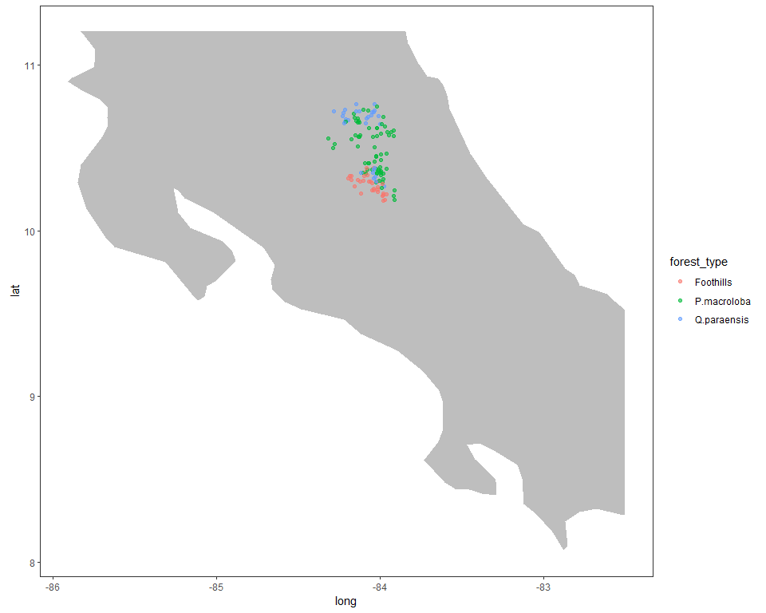
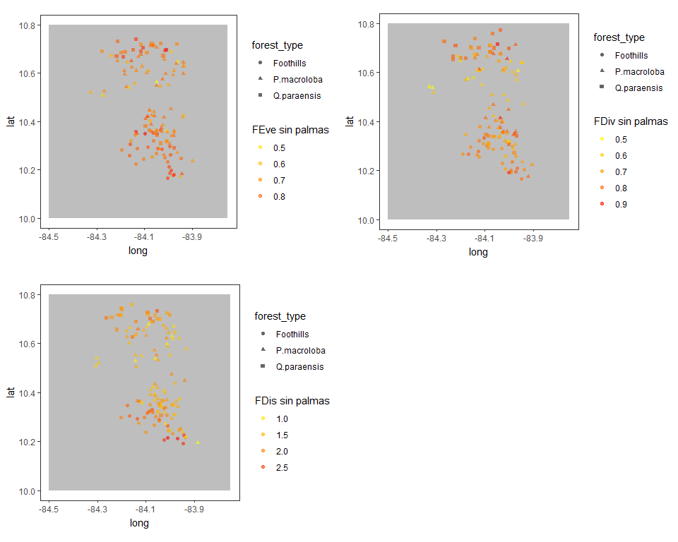
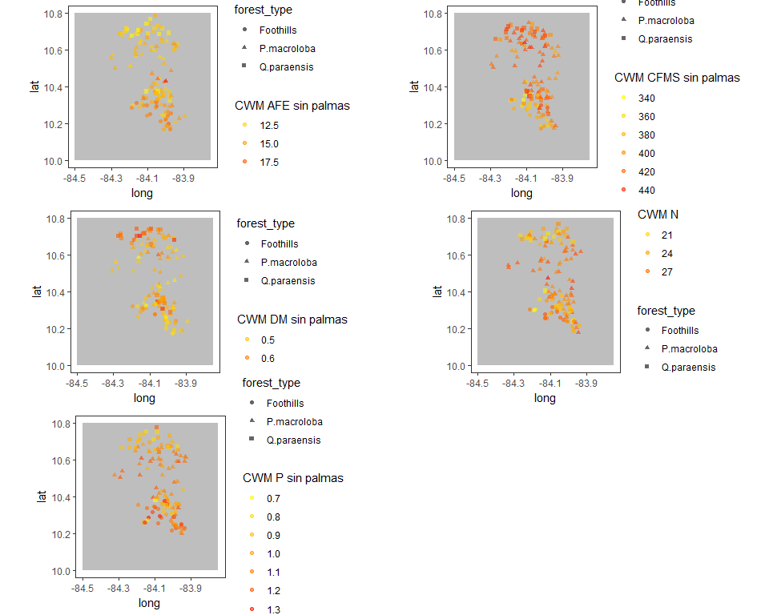

```
## [1] 127 253
```

```
## [1] 127 253
```

```
## [1] 127   4
```

```
## [1] 253   5
```


#Calculo de los indices de diversidad funcional exluyendo las palmas 


```r
#Ordenar los nombres 
#target <- colnames(dabund_relativa) 
#deff <- deff[match(target, row.names(dresp)),]
```

__Indices diversidad funcional ponderados por la abundancia relativa(w.abund=T) de las especies presentes (total de individuos presentes 4801) y los rasgos estan estandarizados con media 0 y misma varianza.__


<table class="table table-striped table-hover table-condensed" style="width: auto !important; margin-left: auto; margin-right: auto;">
<caption>Rasgos de efecto</caption>
 <thead>
  <tr>
   <th style="text-align:left;"> Rasgo </th>
   <th style="text-align:left;"> Significado </th>
   <th style="text-align:left;"> Unidades_de_medida </th>
  </tr>
 </thead>
<tbody>
  <tr>
   <td style="text-align:left;"> AFE </td>
   <td style="text-align:left;"> Area foliar especifica </td>
   <td style="text-align:left;"> mm2/Mg </td>
  </tr>
  <tr>
   <td style="text-align:left;"> CFMS </td>
   <td style="text-align:left;"> Contenido foliar de materia seca </td>
   <td style="text-align:left;"> Mg/g </td>
  </tr>
  <tr>
   <td style="text-align:left;"> DM </td>
   <td style="text-align:left;"> Densidad de madera </td>
   <td style="text-align:left;"> g/cm3 </td>
  </tr>
  <tr>
   <td style="text-align:left;"> N </td>
   <td style="text-align:left;"> Concentracion foliar de nitrogeno </td>
   <td style="text-align:left;"> Mg/g </td>
  </tr>
  <tr>
   <td style="text-align:left;"> P </td>
   <td style="text-align:left;"> Concentracion foliar de fosforo </td>
   <td style="text-align:left;"> Mg/g </td>
  </tr>
</tbody>
</table>


```r
indices_abunrelativa_sp <- dbFD(deff_sp[colnames(dabund_relativa_sp),],
     dabund_relativa_sp, w.abun = T,stand.x = T)
```

```
## Warning in is.euclid(x.dist): Zero distance(s)

## Warning in is.euclid(x.dist): Zero distance(s)
```

```
## FRic: No dimensionality reduction was required. All 5 PCoA axes were kept as 'traits'.
```


```r
#Obtener indices Feve, Fdis, Fdiv
indices_sp <-   data.frame(indices_abunrelativa_sp$FEve) %>% 
  data.frame(indices_abunrelativa_sp$FDiv ) %>% 
  data.frame(indices_abunrelativa_sp$FDis) %>% 
  rownames_to_column("plot") %>% 
  cbind() %>% 
  rename(feve_sp= indices_abunrelativa_sp.FEve, fdiv_sp = indices_abunrelativa_sp.FDiv, fdis_sp = indices_abunrelativa_sp.FDis )

#Obtener CWMs
cwm_sp <- data.frame(indices_abunrelativa_sp$CWM) 
colnames(cwm_sp) <-  paste("cwm_sp", colnames(cwm_sp), sep = "_") 
cwm_sp <- cwm_sp %>% rownames_to_column("plot")

#Guardar  archivos .csv
#write.csv(indices_sp, "C:/tesis_catie/Calderon_CATIE/data/resultados_csv/data_indices_eff_fdiver_sp.csv")
#write.csv(cwm_sp, "C:/tesis_catie/Calderon_CATIE/data/resultados_csv/data_cwm_eff_sp.csv")
```


##Medidas de resumen para FDis, FEve, FDiv sin palmas

###Medidas de resumen por indice

```r
indices_sp %>% gather("feve_sp", "fdiv_sp", "fdis_sp" , key = "rasgo", value = "valor_del_rasgo") %>% 
  group_by(rasgo) %>% 
  summarize(mean=mean(valor_del_rasgo),sd=sd(valor_del_rasgo),max=max(valor_del_rasgo),min=min(valor_del_rasgo)) %>%
  kable() %>% 
  kable_styling(bootstrap_options = c("striped", "hover", "condensed"),full_width = F)
```

<table class="table table-striped table-hover table-condensed" style="width: auto !important; margin-left: auto; margin-right: auto;">
 <thead>
  <tr>
   <th style="text-align:left;"> rasgo </th>
   <th style="text-align:right;"> mean </th>
   <th style="text-align:right;"> sd </th>
   <th style="text-align:right;"> max </th>
   <th style="text-align:right;"> min </th>
  </tr>
 </thead>
<tbody>
  <tr>
   <td style="text-align:left;"> fdis_sp </td>
   <td style="text-align:right;"> 1.7179364 </td>
   <td style="text-align:right;"> 0.4044214 </td>
   <td style="text-align:right;"> 2.6425030 </td>
   <td style="text-align:right;"> 0.7252715 </td>
  </tr>
  <tr>
   <td style="text-align:left;"> fdiv_sp </td>
   <td style="text-align:right;"> 0.7276890 </td>
   <td style="text-align:right;"> 0.0929045 </td>
   <td style="text-align:right;"> 0.9027888 </td>
   <td style="text-align:right;"> 0.4782723 </td>
  </tr>
  <tr>
   <td style="text-align:left;"> feve_sp </td>
   <td style="text-align:right;"> 0.7548526 </td>
   <td style="text-align:right;"> 0.0810114 </td>
   <td style="text-align:right;"> 0.8926810 </td>
   <td style="text-align:right;"> 0.4341210 </td>
  </tr>
</tbody>
</table>

###Mapa de Costa Rica 


```r
world <- getMap(resolution = "low")

clipper_costarica <- as(extent(-86, -82.5, 8, 11.2), "SpatialPolygons")
proj4string(clipper_costarica) <- CRS(proj4string(world))
costarica_clip <- raster::intersect(world, clipper_costarica)
costarica_clip<- fortify(costarica_clip)

ggplot()+
    
    #Mapa de la zona de estudio 
    geom_polygon(data = costarica_clip,
                 aes(x=long,y=lat,group=group),
                 fill="grey")+
    
    #Data de la especie
    geom_point(data=dparcelas,
               alpha=0.6,position = position_jitter(width=0.04, height=0.04),
               aes(x=longitude,y=latitude, 
                   colour=forest_type))+
    
    #geom_point(dfull, mapping=aes(x=longitude,y=latitude),
    #           colour=dfull$feve, alpha=0.5)+
    
    #Le da formato de mapa
    theme_bw()+
    coord_quickmap()+
    guides(colour=guide_legend(tittle="Tipo de Bosque"))+
    #labs(colour = "FEve", shape = "Tipo de Bosque")+
    #scale_color_gradient(low="yellow", high="red")+
   
    theme(panel.grid.major = element_line(linetype = "blank"), 
    panel.grid.minor = element_line(linetype = "blank"))
```

<!-- -->

###Medidas de resumen para cada indice por tipo de bosque

```r
dfull_sp <- left_join(indices_sp,dparcelas, by="plot") 
```

```
## Warning: Column `plot` joining character vector and factor, coercing into
## character vector
```

```r
dfull_sp %>% gather("feve_sp", "fdiv_sp", "fdis_sp" , key = "rasgo", value = "valor_del_rasgo") %>% 
  group_by(forest_type,rasgo) %>% 
  summarize(mean=mean(valor_del_rasgo),sd=sd(valor_del_rasgo),max=max(valor_del_rasgo),min=min(valor_del_rasgo)) %>%
  arrange(rasgo) %>% 
  kable() %>% 
  kable_styling(bootstrap_options = c("striped", "hover", "condensed"),full_width = F)
```

<table class="table table-striped table-hover table-condensed" style="width: auto !important; margin-left: auto; margin-right: auto;">
 <thead>
  <tr>
   <th style="text-align:left;"> forest_type </th>
   <th style="text-align:left;"> rasgo </th>
   <th style="text-align:right;"> mean </th>
   <th style="text-align:right;"> sd </th>
   <th style="text-align:right;"> max </th>
   <th style="text-align:right;"> min </th>
  </tr>
 </thead>
<tbody>
  <tr>
   <td style="text-align:left;"> Foothills </td>
   <td style="text-align:left;"> fdis_sp </td>
   <td style="text-align:right;"> 2.1561057 </td>
   <td style="text-align:right;"> 0.2690401 </td>
   <td style="text-align:right;"> 2.6425030 </td>
   <td style="text-align:right;"> 1.6396305 </td>
  </tr>
  <tr>
   <td style="text-align:left;"> P.macroloba </td>
   <td style="text-align:left;"> fdis_sp </td>
   <td style="text-align:right;"> 1.4766442 </td>
   <td style="text-align:right;"> 0.3100684 </td>
   <td style="text-align:right;"> 2.1621821 </td>
   <td style="text-align:right;"> 0.7252715 </td>
  </tr>
  <tr>
   <td style="text-align:left;"> Q.paraensis </td>
   <td style="text-align:left;"> fdis_sp </td>
   <td style="text-align:right;"> 1.8070167 </td>
   <td style="text-align:right;"> 0.2678289 </td>
   <td style="text-align:right;"> 2.4084871 </td>
   <td style="text-align:right;"> 1.2532089 </td>
  </tr>
  <tr>
   <td style="text-align:left;"> Foothills </td>
   <td style="text-align:left;"> fdiv_sp </td>
   <td style="text-align:right;"> 0.7554871 </td>
   <td style="text-align:right;"> 0.0551464 </td>
   <td style="text-align:right;"> 0.8880439 </td>
   <td style="text-align:right;"> 0.6424978 </td>
  </tr>
  <tr>
   <td style="text-align:left;"> P.macroloba </td>
   <td style="text-align:left;"> fdiv_sp </td>
   <td style="text-align:right;"> 0.6912230 </td>
   <td style="text-align:right;"> 0.1032864 </td>
   <td style="text-align:right;"> 0.8973494 </td>
   <td style="text-align:right;"> 0.4782723 </td>
  </tr>
  <tr>
   <td style="text-align:left;"> Q.paraensis </td>
   <td style="text-align:left;"> fdiv_sp </td>
   <td style="text-align:right;"> 0.7822229 </td>
   <td style="text-align:right;"> 0.0576058 </td>
   <td style="text-align:right;"> 0.9027888 </td>
   <td style="text-align:right;"> 0.6588182 </td>
  </tr>
  <tr>
   <td style="text-align:left;"> Foothills </td>
   <td style="text-align:left;"> feve_sp </td>
   <td style="text-align:right;"> 0.8037465 </td>
   <td style="text-align:right;"> 0.0536601 </td>
   <td style="text-align:right;"> 0.8918223 </td>
   <td style="text-align:right;"> 0.6923879 </td>
  </tr>
  <tr>
   <td style="text-align:left;"> P.macroloba </td>
   <td style="text-align:left;"> feve_sp </td>
   <td style="text-align:right;"> 0.7213124 </td>
   <td style="text-align:right;"> 0.0830429 </td>
   <td style="text-align:right;"> 0.8457694 </td>
   <td style="text-align:right;"> 0.4341210 </td>
  </tr>
  <tr>
   <td style="text-align:left;"> Q.paraensis </td>
   <td style="text-align:left;"> feve_sp </td>
   <td style="text-align:right;"> 0.7800762 </td>
   <td style="text-align:right;"> 0.0647692 </td>
   <td style="text-align:right;"> 0.8926810 </td>
   <td style="text-align:right;"> 0.6270082 </td>
  </tr>
</tbody>
</table>


```r
world <- getMap(resolution = "low")

clipper_costarica <- as(extent(-84.5, -83.75, 10, 10.80), "SpatialPolygons")
proj4string(clipper_costarica) <- CRS(proj4string(world))
costarica_clip <- raster::intersect(world, clipper_costarica)
costarica_clip<- fortify(costarica_clip)

feve_sp <- ggplot()+
    
    #Mapa de la zona de estudio 
    geom_polygon(data = costarica_clip,
                 aes(x=long,y=lat,group=group),
                 fill="grey")+
    
    #Data de la especie
    geom_point(data=dfull_sp,
               alpha=0.6,position = position_jitter(width=0.04, height=0.04),
               aes(x=longitude,y=latitude, 
                   colour=dfull_sp$feve_sp,shape=forest_type))+
    
    #Le da formato de mapa
    theme_bw()+
    coord_quickmap()+
    guides(colour=guide_legend(tittle="Tipo de Bosque"))+
    #labs(colour = "FEve", shape = "Tipo de Bosque")+
    scale_color_gradient(low="yellow", high="red")+
    labs(colour = "FEve sin palmas")+
    theme(panel.grid.major = element_line(linetype = "blank"), 
    panel.grid.minor = element_line(linetype = "blank"))


fdis_sp <- ggplot()+
    
    #Mapa de la zona de estudio 
    geom_polygon(data = costarica_clip,
                 aes(x=long,y=lat,group=group),
                 fill="grey")+
    
    #Data de la especie
    geom_point(data=dfull_sp,
               alpha=0.6,position = position_jitter(width=0.04, height=0.04),
               aes(x=longitude,y=latitude, 
                   colour=dfull_sp$fdis_sp,shape=forest_type))+
    
    #geom_point(dfull, mapping=aes(x=longitude,y=latitude),
    #           colour=dfull$feve, alpha=0.5)+
    
    #Le da formato de mapa
    theme_bw()+
    coord_quickmap()+
    guides(colour=guide_legend(tittle="Tipo de Bosque"))+
    #labs(colour = "FEve", shape = "Tipo de Bosque")+
    scale_color_gradient(low="yellow", high="red")+
    labs(colour = "FDis sin palmas")+
    theme(panel.grid.major = element_line(linetype = "blank"), 
    panel.grid.minor = element_line(linetype = "blank"))

fdiv_sp <- ggplot()+
    
    #Mapa de la zona de estudio 
    geom_polygon(data = costarica_clip,
                 aes(x=long,y=lat,group=group),
                 fill="grey")+
    
    #Data de la especie
    geom_point(data=dfull_sp,
               alpha=0.6,position = position_jitter(width=0.04, height=0.04),
               aes(x=longitude,y=latitude, 
                   colour=dfull_sp$fdiv_sp,shape=forest_type))+
    
    #geom_point(dfull, mapping=aes(x=longitude,y=latitude),
    #           colour=dfull$feve, alpha=0.5)+
    
    #Le da formato de mapa
    theme_bw()+
    coord_quickmap()+
    guides(colour=guide_legend(tittle="Tipo de Bosque"))+
    #labs(colour = "FEve", shape = "Tipo de Bosque")+
    scale_color_gradient(low="yellow", high="red")+
    labs(colour = "FDiv sin palmas")+
    theme(panel.grid.major = element_line(linetype = "blank"), 
    panel.grid.minor = element_line(linetype = "blank"))

#https://cran.r-project.org/web/packages/cowplot/vignettes/plot_grid.html
theme_set(theme_cowplot(font_size=30)) 
plot_grid(feve_sp, fdiv_sp, fdis_sp ,hjust = 2, vjust = 3)
```

<!-- -->

##Medidas de resumen para CWM sin palmas


###Medidas de resumen por CWM

```r
cwm_sp %>% gather("cwm_sp_afe","cwm_sp_cfms","cwm_sp_dm","cwm_sp_n","cwm_sp_p" , key = "rasgo", value = "valor_del_rasgo") %>% 
  group_by(rasgo) %>% 
  summarize(mean=mean(valor_del_rasgo),sd=sd(valor_del_rasgo),max=max(valor_del_rasgo),min=min(valor_del_rasgo)) %>%
  kable() %>% 
  kable_styling(bootstrap_options = c("striped", "hover", "condensed"),full_width = F)
```

<table class="table table-striped table-hover table-condensed" style="width: auto !important; margin-left: auto; margin-right: auto;">
 <thead>
  <tr>
   <th style="text-align:left;"> rasgo </th>
   <th style="text-align:right;"> mean </th>
   <th style="text-align:right;"> sd </th>
   <th style="text-align:right;"> max </th>
   <th style="text-align:right;"> min </th>
  </tr>
 </thead>
<tbody>
  <tr>
   <td style="text-align:left;"> cwm_sp_afe </td>
   <td style="text-align:right;"> 13.9596926 </td>
   <td style="text-align:right;"> 1.6392375 </td>
   <td style="text-align:right;"> 19.0608568 </td>
   <td style="text-align:right;"> 10.4837500 </td>
  </tr>
  <tr>
   <td style="text-align:left;"> cwm_sp_cfms </td>
   <td style="text-align:right;"> 407.7970233 </td>
   <td style="text-align:right;"> 22.4510353 </td>
   <td style="text-align:right;"> 443.2990507 </td>
   <td style="text-align:right;"> 336.4287500 </td>
  </tr>
  <tr>
   <td style="text-align:left;"> cwm_sp_dm </td>
   <td style="text-align:right;"> 0.5435087 </td>
   <td style="text-align:right;"> 0.0614576 </td>
   <td style="text-align:right;"> 0.6961905 </td>
   <td style="text-align:right;"> 0.4105882 </td>
  </tr>
  <tr>
   <td style="text-align:left;"> cwm_sp_n </td>
   <td style="text-align:right;"> 25.0680845 </td>
   <td style="text-align:right;"> 2.5165306 </td>
   <td style="text-align:right;"> 29.7250000 </td>
   <td style="text-align:right;"> 18.5404762 </td>
  </tr>
  <tr>
   <td style="text-align:left;"> cwm_sp_p </td>
   <td style="text-align:right;"> 1.0585566 </td>
   <td style="text-align:right;"> 0.1326639 </td>
   <td style="text-align:right;"> 1.3155000 </td>
   <td style="text-align:right;"> 0.6687500 </td>
  </tr>
</tbody>
</table>

###Medidas de resumen para cada cwm por tipo de bosque

```r
dfull_cwm_sp <- left_join(cwm_sp,dparcelas, by="plot") 
```

```
## Warning: Column `plot` joining character vector and factor, coercing into
## character vector
```

```r
dfull_cwm_sp %>% gather("cwm_sp_afe","cwm_sp_cfms","cwm_sp_dm","cwm_sp_n","cwm_sp_p", key = "rasgo", value = "valor_del_rasgo") %>% 
  group_by(forest_type,rasgo) %>% 
  summarize(mean=mean(valor_del_rasgo),sd=sd(valor_del_rasgo),max=max(valor_del_rasgo),min=min(valor_del_rasgo)) %>%
  arrange(rasgo) %>% 
  kable() %>% 
  kable_styling(bootstrap_options = c("striped", "hover", "condensed"),full_width = F)
```

<table class="table table-striped table-hover table-condensed" style="width: auto !important; margin-left: auto; margin-right: auto;">
 <thead>
  <tr>
   <th style="text-align:left;"> forest_type </th>
   <th style="text-align:left;"> rasgo </th>
   <th style="text-align:right;"> mean </th>
   <th style="text-align:right;"> sd </th>
   <th style="text-align:right;"> max </th>
   <th style="text-align:right;"> min </th>
  </tr>
 </thead>
<tbody>
  <tr>
   <td style="text-align:left;"> Foothills </td>
   <td style="text-align:left;"> cwm_sp_afe </td>
   <td style="text-align:right;"> 15.4358633 </td>
   <td style="text-align:right;"> 1.3030744 </td>
   <td style="text-align:right;"> 17.4476923 </td>
   <td style="text-align:right;"> 12.3880952 </td>
  </tr>
  <tr>
   <td style="text-align:left;"> P.macroloba </td>
   <td style="text-align:left;"> cwm_sp_afe </td>
   <td style="text-align:right;"> 13.9223570 </td>
   <td style="text-align:right;"> 1.2696137 </td>
   <td style="text-align:right;"> 19.0608568 </td>
   <td style="text-align:right;"> 12.2368180 </td>
  </tr>
  <tr>
   <td style="text-align:left;"> Q.paraensis </td>
   <td style="text-align:left;"> cwm_sp_afe </td>
   <td style="text-align:right;"> 12.4679750 </td>
   <td style="text-align:right;"> 1.3238408 </td>
   <td style="text-align:right;"> 14.6316667 </td>
   <td style="text-align:right;"> 10.4837500 </td>
  </tr>
  <tr>
   <td style="text-align:left;"> Foothills </td>
   <td style="text-align:left;"> cwm_sp_cfms </td>
   <td style="text-align:right;"> 382.1005620 </td>
   <td style="text-align:right;"> 21.6409607 </td>
   <td style="text-align:right;"> 432.8341176 </td>
   <td style="text-align:right;"> 336.4287500 </td>
  </tr>
  <tr>
   <td style="text-align:left;"> P.macroloba </td>
   <td style="text-align:left;"> cwm_sp_cfms </td>
   <td style="text-align:right;"> 415.0801050 </td>
   <td style="text-align:right;"> 16.3300792 </td>
   <td style="text-align:right;"> 443.2990507 </td>
   <td style="text-align:right;"> 365.9066667 </td>
  </tr>
  <tr>
   <td style="text-align:left;"> Q.paraensis </td>
   <td style="text-align:left;"> cwm_sp_cfms </td>
   <td style="text-align:right;"> 418.4392243 </td>
   <td style="text-align:right;"> 12.7503926 </td>
   <td style="text-align:right;"> 439.1634783 </td>
   <td style="text-align:right;"> 391.2233333 </td>
  </tr>
  <tr>
   <td style="text-align:left;"> Foothills </td>
   <td style="text-align:left;"> cwm_sp_dm </td>
   <td style="text-align:right;"> 0.5119355 </td>
   <td style="text-align:right;"> 0.0481975 </td>
   <td style="text-align:right;"> 0.6083333 </td>
   <td style="text-align:right;"> 0.4204000 </td>
  </tr>
  <tr>
   <td style="text-align:left;"> P.macroloba </td>
   <td style="text-align:left;"> cwm_sp_dm </td>
   <td style="text-align:right;"> 0.5257290 </td>
   <td style="text-align:right;"> 0.0447077 </td>
   <td style="text-align:right;"> 0.6451852 </td>
   <td style="text-align:right;"> 0.4105882 </td>
  </tr>
  <tr>
   <td style="text-align:left;"> Q.paraensis </td>
   <td style="text-align:left;"> cwm_sp_dm </td>
   <td style="text-align:right;"> 0.6183368 </td>
   <td style="text-align:right;"> 0.0462277 </td>
   <td style="text-align:right;"> 0.6961905 </td>
   <td style="text-align:right;"> 0.5177273 </td>
  </tr>
  <tr>
   <td style="text-align:left;"> Foothills </td>
   <td style="text-align:left;"> cwm_sp_n </td>
   <td style="text-align:right;"> 24.5093286 </td>
   <td style="text-align:right;"> 2.6381013 </td>
   <td style="text-align:right;"> 28.4114286 </td>
   <td style="text-align:right;"> 18.5404762 </td>
  </tr>
  <tr>
   <td style="text-align:left;"> P.macroloba </td>
   <td style="text-align:left;"> cwm_sp_n </td>
   <td style="text-align:right;"> 26.4834902 </td>
   <td style="text-align:right;"> 1.5168694 </td>
   <td style="text-align:right;"> 29.7250000 </td>
   <td style="text-align:right;"> 22.6045820 </td>
  </tr>
  <tr>
   <td style="text-align:left;"> Q.paraensis </td>
   <td style="text-align:left;"> cwm_sp_n </td>
   <td style="text-align:right;"> 22.3952999 </td>
   <td style="text-align:right;"> 1.7548749 </td>
   <td style="text-align:right;"> 27.1716667 </td>
   <td style="text-align:right;"> 19.3618750 </td>
  </tr>
  <tr>
   <td style="text-align:left;"> Foothills </td>
   <td style="text-align:left;"> cwm_sp_p </td>
   <td style="text-align:right;"> 1.1539162 </td>
   <td style="text-align:right;"> 0.1235084 </td>
   <td style="text-align:right;"> 1.3155000 </td>
   <td style="text-align:right;"> 0.7652381 </td>
  </tr>
  <tr>
   <td style="text-align:left;"> P.macroloba </td>
   <td style="text-align:left;"> cwm_sp_p </td>
   <td style="text-align:right;"> 1.0779777 </td>
   <td style="text-align:right;"> 0.0902621 </td>
   <td style="text-align:right;"> 1.2490909 </td>
   <td style="text-align:right;"> 0.8903571 </td>
  </tr>
  <tr>
   <td style="text-align:left;"> Q.paraensis </td>
   <td style="text-align:left;"> cwm_sp_p </td>
   <td style="text-align:right;"> 0.9117511 </td>
   <td style="text-align:right;"> 0.1017779 </td>
   <td style="text-align:right;"> 1.2008333 </td>
   <td style="text-align:right;"> 0.6687500 </td>
  </tr>
</tbody>
</table>


```r
world <- getMap(resolution = "low")

clipper_costarica <- as(extent(-84.5, -83.75, 10, 10.80), "SpatialPolygons")
proj4string(clipper_costarica) <- CRS(proj4string(world))
costarica_clip <- raster::intersect(world, clipper_costarica)
costarica_clip<- fortify(costarica_clip)

cwm_afe_sp <- ggplot()+
    
    #Mapa de la zona de estudio 
    geom_polygon(data = costarica_clip,
                 aes(x=long,y=lat,group=group),
                 fill="grey")+
    
    #Data de la especie
    geom_point(data=dfull_cwm_sp,
               alpha=0.6,position = position_jitter(width=0.04, height=0.04),
               aes(x=longitude,y=latitude, 
                   colour=dfull_cwm_sp$cwm_sp_afe,shape=forest_type))+
    
    #geom_point(dfull, mapping=aes(x=longitude,y=latitude),
    #           colour=dfull$feve, alpha=0.5)+
    
    #Le da formato de mapa
    theme_bw()+
    coord_quickmap()+
    guides(colour=guide_legend(tittle="Tipo de Bosque"))+
    #labs(colour = "FEve", shape = "Tipo de Bosque")+
    scale_color_gradient(low="yellow", high="red")+
    labs(colour = "CWM AFE sin palmas")+
    theme(panel.grid.major = element_line(linetype = "blank"), 
    panel.grid.minor = element_line(linetype = "blank"))

cwm_cfms_sp <- ggplot()+
    
    #Mapa de la zona de estudio 
    geom_polygon(data = costarica_clip,
                 aes(x=long,y=lat,group=group),
                 fill="grey")+
    
    #Data de la especie
    geom_point(data=dfull_cwm_sp,
               alpha=0.6,position = position_jitter(width=0.04, height=0.04),
               aes(x=longitude,y=latitude, 
                   colour=dfull_cwm_sp$cwm_sp_cfms,shape=forest_type))+
    
    #geom_point(dfull, mapping=aes(x=longitude,y=latitude),
    #           colour=dfull$feve, alpha=0.5)+
    
    #Le da formato de mapa
    theme_bw()+
    coord_quickmap()+
    guides(colour=guide_legend(tittle="Tipo de Bosque"))+
    #labs(colour = "FEve", shape = "Tipo de Bosque")+
    scale_color_gradient(low="yellow", high="red")+
    labs(colour = "CWM CFMS sin palmas")+
    theme(panel.grid.major = element_line(linetype = "blank"), 
    panel.grid.minor = element_line(linetype = "blank"))

cwm_dm_sp <- ggplot()+
    
    #Mapa de la zona de estudio 
    geom_polygon(data = costarica_clip,
                 aes(x=long,y=lat,group=group),
                 fill="grey")+
    
    #Data de la especie
    geom_point(data=dfull_cwm_sp,
               alpha=0.6,position = position_jitter(width=0.04, height=0.04),
               aes(x=longitude,y=latitude, 
                   colour=dfull_cwm_sp$cwm_sp_dm,shape=forest_type))+
  
    #Le da formato de mapa
    theme_bw()+
    coord_quickmap()+
    guides(colour=guide_legend(tittle="Tipo de Bosque"))+
    #labs(colour = "FEve", shape = "Tipo de Bosque")+
    scale_color_gradient(low="yellow", high="red")+
    labs(colour = "CWM DM sin palmas")+
    theme(panel.grid.major = element_line(linetype = "blank"), 
    panel.grid.minor = element_line(linetype = "blank"))

cwm_n_sp <- ggplot()+
    
    #Mapa de la zona de estudio 
    geom_polygon(data = costarica_clip,
                 aes(x=long,y=lat,group=group),
                 fill="grey")+
    
    #Data de la especie
    geom_point(data=dfull_cwm_sp,
               alpha=0.6,position = position_jitter(width=0.04, height=0.04),
               aes(x=longitude,y=latitude, 
                   colour=dfull_cwm_sp$cwm_sp_n,shape=forest_type))+
    
    #Le da formato de mapa
    theme_bw()+
    coord_quickmap()+
    guides(colour=guide_legend(tittle="Tipo de Bosque"))+
    #labs(colour = "FEve", shape = "Tipo de Bosque")+
    scale_color_gradient(low="yellow", high="red")+
    labs(colour = "CWM N")+
    theme(panel.grid.major = element_line(linetype = "blank"), 
    panel.grid.minor = element_line(linetype = "blank"))

cwm_p_sp <- ggplot()+
    
    #Mapa de la zona de estudio 
    geom_polygon(data = costarica_clip,
                 aes(x=long,y=lat,group=group),
                 fill="grey")+
    
    #Data de la especie
    geom_point(data=dfull_cwm_sp,
               alpha=0.6,position = position_jitter(width=0.04, height=0.04),
               aes(x=longitude,y=latitude, 
                   colour=dfull_cwm_sp$cwm_sp_p,shape=forest_type))+
    
    #Le da formato de mapa
    theme_bw()+
    coord_quickmap()+
    guides(colour=guide_legend(tittle="Tipo de Bosque"))+
    #labs(colour = "FEve", shape = "Tipo de Bosque")+
    scale_color_gradient(low="yellow", high="red")+
    labs(colour = "CWM P sin palmas")+
    theme(panel.grid.major = element_line(linetype = "blank"), 
    panel.grid.minor = element_line(linetype = "blank"))


#https://cran.r-project.org/web/packages/cowplot/vignettes/plot_grid.html
theme_set(theme_cowplot(font_size=30)) 
plot_grid(cwm_afe_sp,cwm_cfms_sp,cwm_dm_sp,cwm_n_sp,cwm_p_sp ,nrow = 3)
```

<!-- -->


