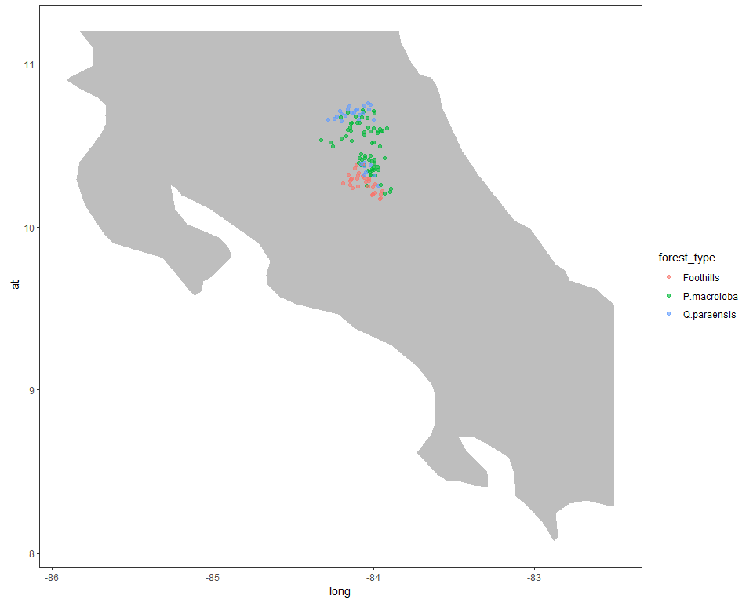
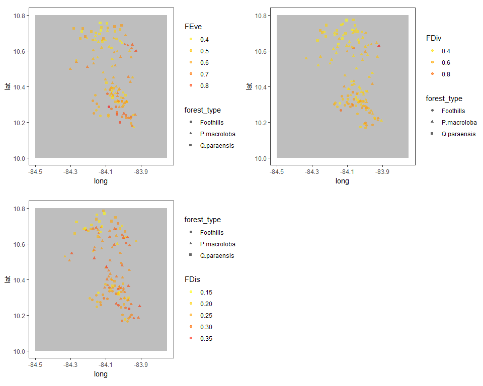

```
## [1] 127 257
```

```
## [1] 127   4
```

```
## [1] 257   5
```

```
## 'data.frame':	257 obs. of  5 variables:
##  $ fijacion_nitrogeno: Factor w/ 2 levels "NO","SI": 2 2 1 1 2 1 1 1 1 1 ...
##  $ dispersion        : Factor w/ 4 levels "DA","DANI","DVAR",..: 3 3 2 2 2 1 3 2 4 4 ...
##  $ sist_sexual       : Factor w/ 4 levels "D","H","M","P": 2 2 1 2 2 2 2 2 2 2 ...
##  $ polinizacion      : Factor w/ 5 levels "PAV","PI","PMA",..: 2 2 2 2 2 2 2 2 2 2 ...
##  $ resprout_capacity : int  NA 20 60 20 20 20 40 20 NA NA ...
```

#Calculo de los indices de diversidad funcional exluyendo las palmas 


```r
#Ordenar los nombres 
#target <- colnames(dabund_relativa) 
#deff <- deff[match(target, row.names(dresp)),]
```


<table class="table table-striped table-hover table-condensed" style="width: auto !important; margin-left: auto; margin-right: auto;">
<caption>Rasgos de respuesta</caption>
 <thead>
  <tr>
   <th style="text-align:left;">   </th>
   <th style="text-align:left;"> Abreviaturas </th>
  </tr>
 </thead>
<tbody>
  <tr grouplength="5"><td colspan="2" style="border-bottom: 1px solid;"><strong>Tipo de dispersion</strong></td></tr>
<tr>
   <td style="text-align:left; padding-left: 2em;" indentlevel="1"> Anemocoria </td>
   <td style="text-align:left;"> DW </td>
  </tr>
  <tr>
   <td style="text-align:left; padding-left: 2em;" indentlevel="1"> Hidrocoria </td>
   <td style="text-align:left;"> DH </td>
  </tr>
  <tr>
   <td style="text-align:left; padding-left: 2em;" indentlevel="1"> Zoocoria </td>
   <td style="text-align:left;"> DANI </td>
  </tr>
  <tr>
   <td style="text-align:left; padding-left: 2em;" indentlevel="1"> Dos o mas tipos de dispersion </td>
   <td style="text-align:left;"> DVAR </td>
  </tr>
  <tr>
   <td style="text-align:left; padding-left: 2em;" indentlevel="1"> Autocoria </td>
   <td style="text-align:left;"> DA </td>
  </tr>
  <tr grouplength="4"><td colspan="2" style="border-bottom: 1px solid;"><strong>Sistema sexual</strong></td></tr>
<tr>
   <td style="text-align:left; padding-left: 2em;" indentlevel="1"> Dioico </td>
   <td style="text-align:left;"> D </td>
  </tr>
  <tr>
   <td style="text-align:left; padding-left: 2em;" indentlevel="1"> Monoico </td>
   <td style="text-align:left;"> M </td>
  </tr>
  <tr>
   <td style="text-align:left; padding-left: 2em;" indentlevel="1"> Hermafrodita </td>
   <td style="text-align:left;"> H </td>
  </tr>
  <tr>
   <td style="text-align:left; padding-left: 2em;" indentlevel="1"> Poligama </td>
   <td style="text-align:left;"> P </td>
  </tr>
  <tr grouplength="5"><td colspan="2" style="border-bottom: 1px solid;"><strong>Tipo de polinizacion </strong></td></tr>
<tr>
   <td style="text-align:left; padding-left: 2em;" indentlevel="1"> Viento </td>
   <td style="text-align:left;"> PW </td>
  </tr>
  <tr>
   <td style="text-align:left; padding-left: 2em;" indentlevel="1"> Insectos </td>
   <td style="text-align:left;"> PI </td>
  </tr>
  <tr>
   <td style="text-align:left; padding-left: 2em;" indentlevel="1"> Aves </td>
   <td style="text-align:left;"> PAV </td>
  </tr>
  <tr>
   <td style="text-align:left; padding-left: 2em;" indentlevel="1"> Dos o mas tipos de polinizacion </td>
   <td style="text-align:left;"> PVAR </td>
  </tr>
  <tr>
   <td style="text-align:left; padding-left: 2em;" indentlevel="1"> Mamiferos </td>
   <td style="text-align:left;"> PMA </td>
  </tr>
  <tr grouplength="2"><td colspan="2" style="border-bottom: 1px solid;"><strong>Potencial de fijar Nitrogeno </strong></td></tr>
<tr>
   <td style="text-align:left; padding-left: 2em;" indentlevel="1"> Especie fijadora </td>
   <td style="text-align:left;"> Si </td>
  </tr>
  <tr>
   <td style="text-align:left; padding-left: 2em;" indentlevel="1"> Especie no fijadora </td>
   <td style="text-align:left;"> No </td>
  </tr>
  <tr grouplength="6"><td colspan="2" style="border-bottom: 1px solid;"><strong>Capacidad de rebrote (%)</strong></td></tr>
<tr>
   <td style="text-align:left; padding-left: 2em;" indentlevel="1"> Never resprouting </td>
   <td style="text-align:left;"> 0 </td>
  </tr>
  <tr>
   <td style="text-align:left; padding-left: 2em;" indentlevel="1"> Very poor resprouting </td>
   <td style="text-align:left;"> 20 </td>
  </tr>
  <tr>
   <td style="text-align:left; padding-left: 2em;" indentlevel="1"> Moderate resprouting </td>
   <td style="text-align:left;"> 40 </td>
  </tr>
  <tr>
   <td style="text-align:left; padding-left: 2em;" indentlevel="1"> Substantial resprouting </td>
   <td style="text-align:left;"> 60 </td>
  </tr>
  <tr>
   <td style="text-align:left; padding-left: 2em;" indentlevel="1"> Abundant resprouting </td>
   <td style="text-align:left;"> 80 </td>
  </tr>
  <tr>
   <td style="text-align:left; padding-left: 2em;" indentlevel="1"> Very abundant resprouting </td>
   <td style="text-align:left;"> 100 </td>
  </tr>
</tbody>
</table>
__Indices diversidad funcional ponderados por la abundancia relativa(w.abund=T) de las especies presentes (total de individuos presentes 4801) y los rasgos estan estandarizados con media 0 y misma varianza(stand.x = T).__

Se va aplicar la correccion de lingoes, la literatura no especifica sobre si usar lingoes o cailliez, sin embrago el libro de Numerical ecology 2018 prefiere lingoes "Lingoes correction is
preferable because it produces a test with correct type I error, whereas the Cailliez
correction produces a test with slightly inflated rate of type I error" pp184


```r
indices_resp <- dbFD(dresp[colnames(dabund_relativa),],
     dabund_relativa, w.abun = T,stand.x = T,corr="lingoes")
```

```
## Warning in is.euclid(x.dist): Zero distance(s)

## Warning in is.euclid(x.dist): Zero distance(s)
```

```
## Warning in is.euclid(distmat): Zero distance(s)
```

```
## Species x species distance matrix was not Euclidean. Lingoes correction was applied.
```

```
## Warning in dudi.pco(x.dist2, scannf = FALSE, full = TRUE): Non euclidean
## distance
```

```
## FRic: Dimensionality reduction was required. The last 39 PCoA axes (out of 44 in total) were removed.
```

```
## Warning in is.euclid(x.dist): Zero distance(s)
```

```
## Warning in is.euclid(x.dist): Zero distance(s)
```

```
## FRic: Quality of the reduced-space representation (based on corrected distance matrix) = 0.5001816
```

```
## Warning in is.euclid(x.dist): Zero distance(s)
```


```r
#Obtener indices Feve, Fdis, Fdiv
indices_resp <-   data.frame(indices_resp$FEve) %>% 
  data.frame(indices_resp$FDiv ) %>% 
  data.frame(indices_resp$FDis) %>% 
  rownames_to_column("plot") %>% 
  cbind() %>% 
  rename(feve= indices_resp.FEve, fdiv = indices_resp.FDiv, fdis = indices_resp.FDis )

#Guardar  archivos .csv
#write.csv(indices_resp, "C:/tesis_catie/Calderon_CATIE/data/resultados_csv/data_indices_resp_fdiver.csv")
```


##Medidas de resumen para FDis, FEve, FDiv sin palmas

###Medidas de resumen por indice

```r
indices_resp %>% gather("feve", "fdiv", "fdis" , key = "rasgo", value = "valor_del_rasgo") %>% 
  group_by(rasgo) %>% 
  summarize(mean=mean(valor_del_rasgo),sd=sd(valor_del_rasgo),max=max(valor_del_rasgo),min=min(valor_del_rasgo)) %>%
  kable() %>% 
  kable_styling(bootstrap_options = c("striped", "hover", "condensed"),full_width = F)
```

<table class="table table-striped table-hover table-condensed" style="width: auto !important; margin-left: auto; margin-right: auto;">
 <thead>
  <tr>
   <th style="text-align:left;"> rasgo </th>
   <th style="text-align:right;"> mean </th>
   <th style="text-align:right;"> sd </th>
   <th style="text-align:right;"> max </th>
   <th style="text-align:right;"> min </th>
  </tr>
 </thead>
<tbody>
  <tr>
   <td style="text-align:left;"> fdis </td>
   <td style="text-align:right;"> 0.2628808 </td>
   <td style="text-align:right;"> 0.0493209 </td>
   <td style="text-align:right;"> 0.3532484 </td>
   <td style="text-align:right;"> 0.1456902 </td>
  </tr>
  <tr>
   <td style="text-align:left;"> fdiv </td>
   <td style="text-align:right;"> 0.5013742 </td>
   <td style="text-align:right;"> 0.1114929 </td>
   <td style="text-align:right;"> 0.9527850 </td>
   <td style="text-align:right;"> 0.2856822 </td>
  </tr>
  <tr>
   <td style="text-align:left;"> feve </td>
   <td style="text-align:right;"> 0.5612160 </td>
   <td style="text-align:right;"> 0.1149043 </td>
   <td style="text-align:right;"> 0.8417567 </td>
   <td style="text-align:right;"> 0.3333333 </td>
  </tr>
</tbody>
</table>

###Mapa de Costa Rica 


```r
world <- getMap(resolution = "low")

clipper_costarica <- as(extent(-86, -82.5, 8, 11.2), "SpatialPolygons")
proj4string(clipper_costarica) <- CRS(proj4string(world))
costarica_clip <- raster::intersect(world, clipper_costarica)
costarica_clip<- fortify(costarica_clip)

ggplot()+
    
    #Mapa de la zona de estudio 
    geom_polygon(data = costarica_clip,
                 aes(x=long,y=lat,group=group),
                 fill="grey")+
    
    #Data de la especie
    geom_point(data=dparcelas,
               alpha=0.6,position = position_jitter(width=0.04, height=0.04),
               aes(x=longitude,y=latitude, 
                   colour=forest_type))+
    
    #Le da formato de mapa
    theme_bw()+
    coord_quickmap()+
    guides(colour=guide_legend(tittle="Tipo de Bosque"))+
    #labs(colour = "FEve", shape = "Tipo de Bosque")+
    #scale_color_gradient(low="yellow", high="red")+
   
    theme(panel.grid.major = element_line(linetype = "blank"), 
    panel.grid.minor = element_line(linetype = "blank"))
```

<!-- -->

###Medidas de resumen para cada indice por tipo de bosque

```r
dfull <- left_join(indices_resp,dparcelas, by="plot") 
```

```
## Warning: Column `plot` joining character vector and factor, coercing into
## character vector
```

```r
dfull %>% gather("feve", "fdiv", "fdis" , key = "rasgo", value = "valor_del_rasgo") %>% 
  group_by(forest_type,rasgo) %>% 
  summarize(mean=mean(valor_del_rasgo),sd=sd(valor_del_rasgo),max=max(valor_del_rasgo),min=min(valor_del_rasgo)) %>%
  arrange(rasgo) %>% 
  kable() %>% 
  kable_styling(bootstrap_options = c("striped", "hover", "condensed"),full_width = F)
```

<table class="table table-striped table-hover table-condensed" style="width: auto !important; margin-left: auto; margin-right: auto;">
 <thead>
  <tr>
   <th style="text-align:left;"> forest_type </th>
   <th style="text-align:left;"> rasgo </th>
   <th style="text-align:right;"> mean </th>
   <th style="text-align:right;"> sd </th>
   <th style="text-align:right;"> max </th>
   <th style="text-align:right;"> min </th>
  </tr>
 </thead>
<tbody>
  <tr>
   <td style="text-align:left;"> Foothills </td>
   <td style="text-align:left;"> fdis </td>
   <td style="text-align:right;"> 0.2597594 </td>
   <td style="text-align:right;"> 0.0411112 </td>
   <td style="text-align:right;"> 0.3455498 </td>
   <td style="text-align:right;"> 0.1606955 </td>
  </tr>
  <tr>
   <td style="text-align:left;"> P.macroloba </td>
   <td style="text-align:left;"> fdis </td>
   <td style="text-align:right;"> 0.2891466 </td>
   <td style="text-align:right;"> 0.0348208 </td>
   <td style="text-align:right;"> 0.3532484 </td>
   <td style="text-align:right;"> 0.1871783 </td>
  </tr>
  <tr>
   <td style="text-align:left;"> Q.paraensis </td>
   <td style="text-align:left;"> fdis </td>
   <td style="text-align:right;"> 0.2055344 </td>
   <td style="text-align:right;"> 0.0347849 </td>
   <td style="text-align:right;"> 0.2892988 </td>
   <td style="text-align:right;"> 0.1456902 </td>
  </tr>
  <tr>
   <td style="text-align:left;"> Foothills </td>
   <td style="text-align:left;"> fdiv </td>
   <td style="text-align:right;"> 0.5778630 </td>
   <td style="text-align:right;"> 0.0971834 </td>
   <td style="text-align:right;"> 0.8212806 </td>
   <td style="text-align:right;"> 0.3140530 </td>
  </tr>
  <tr>
   <td style="text-align:left;"> P.macroloba </td>
   <td style="text-align:left;"> fdiv </td>
   <td style="text-align:right;"> 0.4880846 </td>
   <td style="text-align:right;"> 0.1031612 </td>
   <td style="text-align:right;"> 0.9527850 </td>
   <td style="text-align:right;"> 0.3387336 </td>
  </tr>
  <tr>
   <td style="text-align:left;"> Q.paraensis </td>
   <td style="text-align:left;"> fdiv </td>
   <td style="text-align:right;"> 0.4503141 </td>
   <td style="text-align:right;"> 0.1055144 </td>
   <td style="text-align:right;"> 0.7326440 </td>
   <td style="text-align:right;"> 0.2856822 </td>
  </tr>
  <tr>
   <td style="text-align:left;"> Foothills </td>
   <td style="text-align:left;"> feve </td>
   <td style="text-align:right;"> 0.6509149 </td>
   <td style="text-align:right;"> 0.0981044 </td>
   <td style="text-align:right;"> 0.8417567 </td>
   <td style="text-align:right;"> 0.4545455 </td>
  </tr>
  <tr>
   <td style="text-align:left;"> P.macroloba </td>
   <td style="text-align:left;"> feve </td>
   <td style="text-align:right;"> 0.5535832 </td>
   <td style="text-align:right;"> 0.1070007 </td>
   <td style="text-align:right;"> 0.8099826 </td>
   <td style="text-align:right;"> 0.3875527 </td>
  </tr>
  <tr>
   <td style="text-align:left;"> Q.paraensis </td>
   <td style="text-align:left;"> feve </td>
   <td style="text-align:right;"> 0.4829654 </td>
   <td style="text-align:right;"> 0.0820066 </td>
   <td style="text-align:right;"> 0.6383512 </td>
   <td style="text-align:right;"> 0.3333333 </td>
  </tr>
</tbody>
</table>


```r
world <- getMap(resolution = "low")

clipper_costarica <- as(extent(-84.5, -83.75, 10, 10.80), "SpatialPolygons")
proj4string(clipper_costarica) <- CRS(proj4string(world))
costarica_clip <- raster::intersect(world, clipper_costarica)
costarica_clip<- fortify(costarica_clip)

feve <- ggplot()+
    
    #Mapa de la zona de estudio 
    geom_polygon(data = costarica_clip,
                 aes(x=long,y=lat,group=group),
                 fill="grey")+
    
    #Data de la especie
    geom_point(data=dfull,
               alpha=0.6,position = position_jitter(width=0.04, height=0.04),
               aes(x=longitude,y=latitude, 
                   colour=dfull$feve,shape=forest_type))+
    
    #Le da formato de mapa
    theme_bw()+
    coord_quickmap()+
    guides(colour=guide_legend(tittle="Tipo de Bosque"))+
    #labs(colour = "FEve", shape = "Tipo de Bosque")+
    scale_color_gradient(low="yellow", high="red")+
    labs(colour = "FEve")+
    theme(panel.grid.major = element_line(linetype = "blank"), 
    panel.grid.minor = element_line(linetype = "blank"))


fdis <- ggplot()+
    
    #Mapa de la zona de estudio 
    geom_polygon(data = costarica_clip,
                 aes(x=long,y=lat,group=group),
                 fill="grey")+
    
    #Data de la especie
    geom_point(data=dfull,
               alpha=0.6,position = position_jitter(width=0.04, height=0.04),
               aes(x=longitude,y=latitude, 
                   colour=dfull$fdis,shape=forest_type))+
    
    #geom_point(dfull, mapping=aes(x=longitude,y=latitude),
    #           colour=dfull$feve, alpha=0.5)+
    
    #Le da formato de mapa
    theme_bw()+
    coord_quickmap()+
    guides(colour=guide_legend(tittle="Tipo de Bosque"))+
    #labs(colour = "FEve", shape = "Tipo de Bosque")+
    scale_color_gradient(low="yellow", high="red")+
    labs(colour = "FDis")+
    theme(panel.grid.major = element_line(linetype = "blank"), 
    panel.grid.minor = element_line(linetype = "blank"))

fdiv <- ggplot()+
    
    #Mapa de la zona de estudio 
    geom_polygon(data = costarica_clip,
                 aes(x=long,y=lat,group=group),
                 fill="grey")+
    
    #Data de la especie
    geom_point(data=dfull,
               alpha=0.6,position = position_jitter(width=0.04, height=0.04),
               aes(x=longitude,y=latitude, 
                   colour=dfull$fdiv,shape=forest_type))+
    
    #geom_point(dfull, mapping=aes(x=longitude,y=latitude),
    #           colour=dfull$feve, alpha=0.5)+
    
    #Le da formato de mapa
    theme_bw()+
    coord_quickmap()+
    guides(colour=guide_legend(tittle="Tipo de Bosque"))+
    #labs(colour = "FEve", shape = "Tipo de Bosque")+
    scale_color_gradient(low="yellow", high="red")+
    labs(colour = "FDiv")+
    theme(panel.grid.major = element_line(linetype = "blank"), 
    panel.grid.minor = element_line(linetype = "blank"))

#https://cran.r-project.org/web/packages/cowplot/vignettes/plot_grid.html
theme_set(theme_cowplot(font_size=30)) 
plot_grid(feve, fdiv, fdis ,hjust = 2, vjust = 3)
```

<!-- -->

