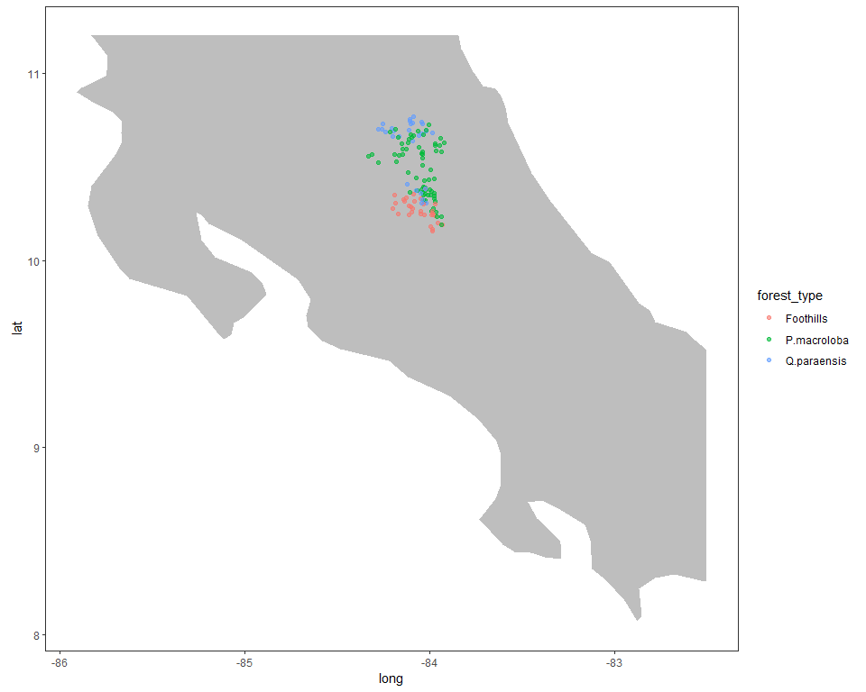

```
## [1] 127 257
```

```
## [1] 127 257
```

```
## [1] 127   4
```

```
## [1] 257   5
```

```
## 'data.frame':	257 obs. of  5 variables:
##  $ fijacion_nitrogeno: Factor w/ 2 levels "NO","SI": 2 2 1 1 2 1 1 1 1 1 ...
##  $ dispersion        : Factor w/ 4 levels "DA","DANI","DVAR",..: 3 3 2 2 2 1 3 2 4 4 ...
##  $ sist_sexual       : Factor w/ 4 levels "D","H","M","P": 2 2 1 2 2 2 2 2 2 2 ...
##  $ polinizacion      : Factor w/ 5 levels "PAV","PI","PMA",..: 2 2 2 2 2 2 2 2 2 2 ...
##  $ resprout_capacity : int  NA 20 60 20 20 20 40 20 NA NA ...
```


#Calculo de los indices de redundancia funcional 


```r
#Ordenar los nombres 
#target <- colnames(dabund_relativa) 
#deff <- deff[match(target, row.names(dresp)),]
```

__Indices redundancia funcional ponderados por la abundancia relativa(w.abund=T) de las especies presentes (total de individuos presentes 4801). Los rasgos estan estandarizados con media 0 y misma varianza.__

 0,never resprouting; 20, very poor resprouting; 40, moderateresprouting; 60, substantial resprouting; 80, abundantresprouting; and 100, very abundant resprouting

<table class="table table-striped table-hover table-condensed" style="width: auto !important; margin-left: auto; margin-right: auto;">
<caption>Rasgos de respuesta</caption>
 <thead>
  <tr>
   <th style="text-align:left;">   </th>
   <th style="text-align:left;"> Abreviaturas </th>
  </tr>
 </thead>
<tbody>
  <tr grouplength="5"><td colspan="2" style="border-bottom: 1px solid;"><strong>Tipo de dispersion</strong></td></tr>
<tr>
   <td style="text-align:left; padding-left: 2em;" indentlevel="1"> Anemocoria </td>
   <td style="text-align:left;"> DW </td>
  </tr>
  <tr>
   <td style="text-align:left; padding-left: 2em;" indentlevel="1"> Hidrocoria </td>
   <td style="text-align:left;"> DH </td>
  </tr>
  <tr>
   <td style="text-align:left; padding-left: 2em;" indentlevel="1"> Zoocoria </td>
   <td style="text-align:left;"> DANI </td>
  </tr>
  <tr>
   <td style="text-align:left; padding-left: 2em;" indentlevel="1"> Dos o mas tipos de dispersion </td>
   <td style="text-align:left;"> DVAR </td>
  </tr>
  <tr>
   <td style="text-align:left; padding-left: 2em;" indentlevel="1"> Autocoria </td>
   <td style="text-align:left;"> DA </td>
  </tr>
  <tr grouplength="4"><td colspan="2" style="border-bottom: 1px solid;"><strong>Sistema sexual</strong></td></tr>
<tr>
   <td style="text-align:left; padding-left: 2em;" indentlevel="1"> Dioico </td>
   <td style="text-align:left;"> D </td>
  </tr>
  <tr>
   <td style="text-align:left; padding-left: 2em;" indentlevel="1"> Monoico </td>
   <td style="text-align:left;"> M </td>
  </tr>
  <tr>
   <td style="text-align:left; padding-left: 2em;" indentlevel="1"> Hermafrodita </td>
   <td style="text-align:left;"> H </td>
  </tr>
  <tr>
   <td style="text-align:left; padding-left: 2em;" indentlevel="1"> Poligama </td>
   <td style="text-align:left;"> P </td>
  </tr>
  <tr grouplength="5"><td colspan="2" style="border-bottom: 1px solid;"><strong>Tipo de polinizacion </strong></td></tr>
<tr>
   <td style="text-align:left; padding-left: 2em;" indentlevel="1"> Viento </td>
   <td style="text-align:left;"> PW </td>
  </tr>
  <tr>
   <td style="text-align:left; padding-left: 2em;" indentlevel="1"> Insectos </td>
   <td style="text-align:left;"> PI </td>
  </tr>
  <tr>
   <td style="text-align:left; padding-left: 2em;" indentlevel="1"> Aves </td>
   <td style="text-align:left;"> PAV </td>
  </tr>
  <tr>
   <td style="text-align:left; padding-left: 2em;" indentlevel="1"> Dos o mas tipos de polinizacion </td>
   <td style="text-align:left;"> PVAR </td>
  </tr>
  <tr>
   <td style="text-align:left; padding-left: 2em;" indentlevel="1"> Mamiferos </td>
   <td style="text-align:left;"> PMA </td>
  </tr>
  <tr grouplength="2"><td colspan="2" style="border-bottom: 1px solid;"><strong>Potencial de fijar Nitrogeno </strong></td></tr>
<tr>
   <td style="text-align:left; padding-left: 2em;" indentlevel="1"> Especie fijadora </td>
   <td style="text-align:left;"> Si </td>
  </tr>
  <tr>
   <td style="text-align:left; padding-left: 2em;" indentlevel="1"> Especie no fijadora </td>
   <td style="text-align:left;"> No </td>
  </tr>
  <tr grouplength="6"><td colspan="2" style="border-bottom: 1px solid;"><strong>Capacidad de rebrote (%)</strong></td></tr>
<tr>
   <td style="text-align:left; padding-left: 2em;" indentlevel="1"> Never resprouting </td>
   <td style="text-align:left;"> 0 </td>
  </tr>
  <tr>
   <td style="text-align:left; padding-left: 2em;" indentlevel="1"> Very poor resprouting </td>
   <td style="text-align:left;"> 20 </td>
  </tr>
  <tr>
   <td style="text-align:left; padding-left: 2em;" indentlevel="1"> Moderate resprouting </td>
   <td style="text-align:left;"> 40 </td>
  </tr>
  <tr>
   <td style="text-align:left; padding-left: 2em;" indentlevel="1"> Substantial resprouting </td>
   <td style="text-align:left;"> 60 </td>
  </tr>
  <tr>
   <td style="text-align:left; padding-left: 2em;" indentlevel="1"> Abundant resprouting </td>
   <td style="text-align:left;"> 80 </td>
  </tr>
  <tr>
   <td style="text-align:left; padding-left: 2em;" indentlevel="1"> Very abundant resprouting </td>
   <td style="text-align:left;"> 100 </td>
  </tr>
</tbody>
</table>

#Objetivo 
El objetivo de este script es calcular el uniqueness y redundancy para los 
datos de response traits de las 127 parcelas


Argumentos de la funcion 

__comm:__ A matrix or a data frame of N plots × S species containing the 
abundance or incidence (0/1) of all species in the in plots. 
Columns are species and plots are rows

__dis:__ An object of class 'dist' containing the functional distances 
among species

__tol:__ A tolerance threshold (a value less than tol is considered as null)

__abundance:__ A logical. If TRUE abundance data are used when available; 
if FALSE incidence (0/1) data are used.


```r
# comm --------------------------------------------------------------------
#Data parcelas por especies
#En las Columnas deben ir las especies y las parcelas en las filas 

comm<- dabund_relativa

# dis ---------------------------------------------------------------------
#Data rasgos: se deben convertir objeto dis
#dis: An object of class 'dist' containing the functional distances among 
#species

#Transformar traits a distancias
dist <-gowdis(dresp_redun) 

#Transformar distancias a un rango de entre 0 y 1
dist_rescaled <- dist / max(dist)

# Funcion -----------------------------------------------------------------
unique <- uniqueness(comm, dist_rescaled, abundance=TRUE)
```


```r
#Obtener indices Redundancy, Uniqueness, Rao
indices_redun_resp <-   data.frame(unique$red) %>% 
  rownames_to_column("plot") %>% 
  mutate(redundancy= 1-U)
  
#Guardar  archivos .csv
#write.csv(indices_redun_resp, "C:/tesis_catie/Calderon_CATIE/data/resultados_csv/data_indices_resp_redundancy.csv")
```


##Medidas de resumen para Redundancy, Uniqueness, Rao

###Medidas de resumen por indice

```r
indices_redun_resp %>% gather("D", "Q", "U","redundancy" , key = "rasgo", value = "valor_del_rasgo") %>% 
  group_by(rasgo) %>% 
  summarize(mean=mean(valor_del_rasgo),sd=sd(valor_del_rasgo),max=max(valor_del_rasgo),min=min(valor_del_rasgo)) %>%
  kable() %>% 
  kable_styling(bootstrap_options = c("striped", "hover", "condensed"),full_width = F)
```

<table class="table table-striped table-hover table-condensed" style="width: auto !important; margin-left: auto; margin-right: auto;">
 <thead>
  <tr>
   <th style="text-align:left;"> rasgo </th>
   <th style="text-align:right;"> mean </th>
   <th style="text-align:right;"> sd </th>
   <th style="text-align:right;"> max </th>
   <th style="text-align:right;"> min </th>
  </tr>
 </thead>
<tbody>
  <tr>
   <td style="text-align:left;"> D </td>
   <td style="text-align:right;"> 0.8360976 </td>
   <td style="text-align:right;"> 0.0838429 </td>
   <td style="text-align:right;"> 0.9464923 </td>
   <td style="text-align:right;"> 0.4791667 </td>
  </tr>
  <tr>
   <td style="text-align:left;"> Q </td>
   <td style="text-align:right;"> 0.3221746 </td>
   <td style="text-align:right;"> 0.0583179 </td>
   <td style="text-align:right;"> 0.4288426 </td>
   <td style="text-align:right;"> 0.1733600 </td>
  </tr>
  <tr>
   <td style="text-align:left;"> redundancy </td>
   <td style="text-align:right;"> 0.6114962 </td>
   <td style="text-align:right;"> 0.0762559 </td>
   <td style="text-align:right;"> 0.7779713 </td>
   <td style="text-align:right;"> 0.4427397 </td>
  </tr>
  <tr>
   <td style="text-align:left;"> U </td>
   <td style="text-align:right;"> 0.3885038 </td>
   <td style="text-align:right;"> 0.0762559 </td>
   <td style="text-align:right;"> 0.5572603 </td>
   <td style="text-align:right;"> 0.2220287 </td>
  </tr>
</tbody>
</table>


###Medidas de resumen para cada indice por tipo de bosque

```r
dfull_redundancy_resp <- left_join(indices_redun_resp,dparcelas, by="plot") 
```

```
## Warning: Column `plot` joining character vector and factor, coercing into
## character vector
```

```r
dfull_redundancy_resp %>% gather("D", "Q", "U","redundancy" , key = "rasgo", value = "valor_del_rasgo") %>% 
  group_by(forest_type,rasgo) %>% 
  summarize(mean=mean(valor_del_rasgo),sd=sd(valor_del_rasgo),max=max(valor_del_rasgo),min=min(valor_del_rasgo)) %>%
  arrange(rasgo) %>% 
  kable() %>% 
  kable_styling(bootstrap_options = c("striped", "hover", "condensed"),full_width = F)
```

<table class="table table-striped table-hover table-condensed" style="width: auto !important; margin-left: auto; margin-right: auto;">
 <thead>
  <tr>
   <th style="text-align:left;"> forest_type </th>
   <th style="text-align:left;"> rasgo </th>
   <th style="text-align:right;"> mean </th>
   <th style="text-align:right;"> sd </th>
   <th style="text-align:right;"> max </th>
   <th style="text-align:right;"> min </th>
  </tr>
 </thead>
<tbody>
  <tr>
   <td style="text-align:left;"> Foothills </td>
   <td style="text-align:left;"> D </td>
   <td style="text-align:right;"> 0.8880520 </td>
   <td style="text-align:right;"> 0.0596885 </td>
   <td style="text-align:right;"> 0.9464923 </td>
   <td style="text-align:right;"> 0.6758495 </td>
  </tr>
  <tr>
   <td style="text-align:left;"> P.macroloba </td>
   <td style="text-align:left;"> D </td>
   <td style="text-align:right;"> 0.8036586 </td>
   <td style="text-align:right;"> 0.0911169 </td>
   <td style="text-align:right;"> 0.9243918 </td>
   <td style="text-align:right;"> 0.4791667 </td>
  </tr>
  <tr>
   <td style="text-align:left;"> Q.paraensis </td>
   <td style="text-align:left;"> D </td>
   <td style="text-align:right;"> 0.8555055 </td>
   <td style="text-align:right;"> 0.0484759 </td>
   <td style="text-align:right;"> 0.9393579 </td>
   <td style="text-align:right;"> 0.7312501 </td>
  </tr>
  <tr>
   <td style="text-align:left;"> Foothills </td>
   <td style="text-align:left;"> Q </td>
   <td style="text-align:right;"> 0.3378099 </td>
   <td style="text-align:right;"> 0.0546688 </td>
   <td style="text-align:right;"> 0.4288426 </td>
   <td style="text-align:right;"> 0.1939000 </td>
  </tr>
  <tr>
   <td style="text-align:left;"> P.macroloba </td>
   <td style="text-align:left;"> Q </td>
   <td style="text-align:right;"> 0.3444294 </td>
   <td style="text-align:right;"> 0.0413428 </td>
   <td style="text-align:right;"> 0.4248662 </td>
   <td style="text-align:right;"> 0.2340307 </td>
  </tr>
  <tr>
   <td style="text-align:left;"> Q.paraensis </td>
   <td style="text-align:left;"> Q </td>
   <td style="text-align:right;"> 0.2540447 </td>
   <td style="text-align:right;"> 0.0425454 </td>
   <td style="text-align:right;"> 0.3594838 </td>
   <td style="text-align:right;"> 0.1733600 </td>
  </tr>
  <tr>
   <td style="text-align:left;"> Foothills </td>
   <td style="text-align:left;"> redundancy </td>
   <td style="text-align:right;"> 0.6198487 </td>
   <td style="text-align:right;"> 0.0560140 </td>
   <td style="text-align:right;"> 0.7613538 </td>
   <td style="text-align:right;"> 0.4811441 </td>
  </tr>
  <tr>
   <td style="text-align:left;"> P.macroloba </td>
   <td style="text-align:left;"> redundancy </td>
   <td style="text-align:right;"> 0.5682079 </td>
   <td style="text-align:right;"> 0.0551819 </td>
   <td style="text-align:right;"> 0.6952504 </td>
   <td style="text-align:right;"> 0.4427397 </td>
  </tr>
  <tr>
   <td style="text-align:left;"> Q.paraensis </td>
   <td style="text-align:left;"> redundancy </td>
   <td style="text-align:right;"> 0.7025785 </td>
   <td style="text-align:right;"> 0.0497457 </td>
   <td style="text-align:right;"> 0.7779713 </td>
   <td style="text-align:right;"> 0.5905713 </td>
  </tr>
  <tr>
   <td style="text-align:left;"> Foothills </td>
   <td style="text-align:left;"> U </td>
   <td style="text-align:right;"> 0.3801513 </td>
   <td style="text-align:right;"> 0.0560140 </td>
   <td style="text-align:right;"> 0.5188559 </td>
   <td style="text-align:right;"> 0.2386462 </td>
  </tr>
  <tr>
   <td style="text-align:left;"> P.macroloba </td>
   <td style="text-align:left;"> U </td>
   <td style="text-align:right;"> 0.4317921 </td>
   <td style="text-align:right;"> 0.0551819 </td>
   <td style="text-align:right;"> 0.5572603 </td>
   <td style="text-align:right;"> 0.3047496 </td>
  </tr>
  <tr>
   <td style="text-align:left;"> Q.paraensis </td>
   <td style="text-align:left;"> U </td>
   <td style="text-align:right;"> 0.2974215 </td>
   <td style="text-align:right;"> 0.0497457 </td>
   <td style="text-align:right;"> 0.4094287 </td>
   <td style="text-align:right;"> 0.2220287 </td>
  </tr>
</tbody>
</table>


###Mapa de Costa Rica 


```r
world <- getMap(resolution = "low")

clipper_costarica <- as(extent(-86, -82.5, 8, 11.2), "SpatialPolygons")
proj4string(clipper_costarica) <- CRS(proj4string(world))
costarica_clip <- raster::intersect(world, clipper_costarica)
costarica_clip<- fortify(costarica_clip)

ggplot()+
    
    #Mapa de la zona de estudio 
    geom_polygon(data = costarica_clip,
                 aes(x=long,y=lat,group=group),
                 fill="grey")+
    
    #Data de la especie
    geom_point(data=dfull_redundancy_resp,
               alpha=0.6,position = position_jitter(width=0.04, height=0.04),
               aes(x=longitude,y=latitude, 
                   colour=forest_type))+
    
    #geom_point(dfull, mapping=aes(x=longitude,y=latitude),
    #           colour=dfull$feve, alpha=0.5)+
    
    #Le da formato de mapa
    theme_bw()+
    coord_quickmap()+
    guides(colour=guide_legend(tittle="Tipo de Bosque"))+
    #labs(colour = "FEve", shape = "Tipo de Bosque")+
    #scale_color_gradient(low="yellow", high="red")+
   
    theme(panel.grid.major = element_line(linetype = "blank"), 
    panel.grid.minor = element_line(linetype = "blank"))
```

<!-- -->


```r
world <- getMap(resolution = "low")

clipper_costarica <- as(extent(-84.5, -83.75, 10, 10.80), "SpatialPolygons")
proj4string(clipper_costarica) <- CRS(proj4string(world))
costarica_clip <- raster::intersect(world, clipper_costarica)
costarica_clip<- fortify(costarica_clip)

Q <- ggplot()+
    
    #Mapa de la zona de estudio 
    geom_polygon(data = costarica_clip,
                 aes(x=long,y=lat,group=group),
                 fill="grey")+
    
    #Data de la especie
    geom_point(data=dfull_redundancy_resp,
               alpha=0.6,position = position_jitter(width=0.04, height=0.04),
               aes(x=longitude,y=latitude, 
                   colour=dfull_redundancy_resp$Q,shape=forest_type))+

    #Le da formato de mapa
    theme_bw()+
    coord_quickmap()+
    guides(colour=guide_legend(tittle="Tipo de Bosque"))+
    #labs(colour = "FEve", shape = "Tipo de Bosque")+
    scale_color_gradient(low="yellow", high="red")+
    labs(colour = "Rao Q response traits")+
    theme(panel.grid.major = element_line(linetype = "blank"), 
    panel.grid.minor = element_line(linetype = "blank"))


U <- ggplot()+
    
    #Mapa de la zona de estudio 
    geom_polygon(data = costarica_clip,
                 aes(x=long,y=lat,group=group),
                 fill="grey")+
    
    #Data de la especie
    geom_point(data=dfull_redundancy_resp,
               alpha=0.6,position = position_jitter(width=0.04, height=0.04),
               aes(x=longitude,y=latitude, 
                   colour=dfull_redundancy_resp$U,shape=forest_type))+
    
    #Le da formato de mapa
    theme_bw()+
    coord_quickmap()+
    guides(colour=guide_legend(tittle="Tipo de Bosque"))+
    #labs(colour = "FEve", shape = "Tipo de Bosque")+
    scale_color_gradient(low="yellow", high="red")+
    labs(colour = "Uniqueness response traits")+
    theme(panel.grid.major = element_line(linetype = "blank"), 
    panel.grid.minor = element_line(linetype = "blank"))

redundancy <- ggplot()+
    
    #Mapa de la zona de estudio 
    geom_polygon(data = costarica_clip,
                 aes(x=long,y=lat,group=group),
                 fill="grey")+
    
    #Data de la especie
    geom_point(data=dfull_redundancy_resp,
               alpha=0.6,position = position_jitter(width=0.04, height=0.04),
               aes(x=longitude,y=latitude, 
                   colour=dfull_redundancy_resp$redundancy,shape=forest_type))+
    
    #Le da formato de mapa
    theme_bw()+
    coord_quickmap()+
    guides(colour=guide_legend(tittle="Tipo de Bosque"))+
    #labs(colour = "FEve", shape = "Tipo de Bosque")+
    scale_color_gradient(low="yellow", high="red")+
    labs(colour = "Redundancy response traits")+
    theme(panel.grid.major = element_line(linetype = "blank"), 
    panel.grid.minor = element_line(linetype = "blank"))

#https://cran.r-project.org/web/packages/cowplot/vignettes/plot_grid.html
theme_set(theme_cowplot(font_size=30)) 
plot_grid(Q, U,redundancy,hjust = 2, vjust = 3)
```

<!-- -->


