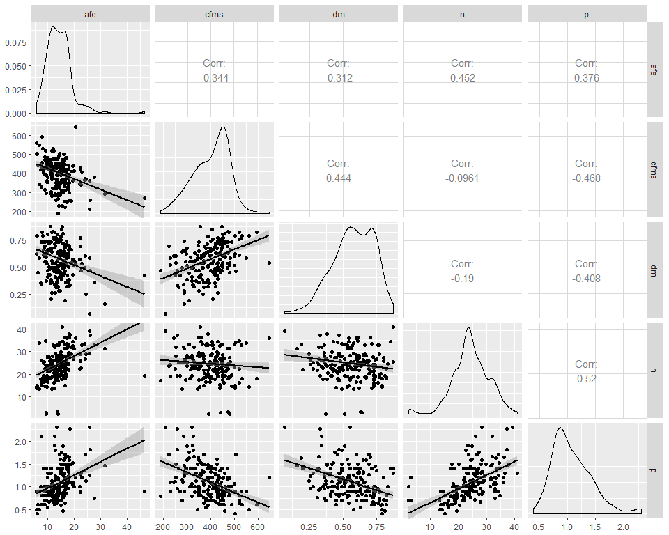
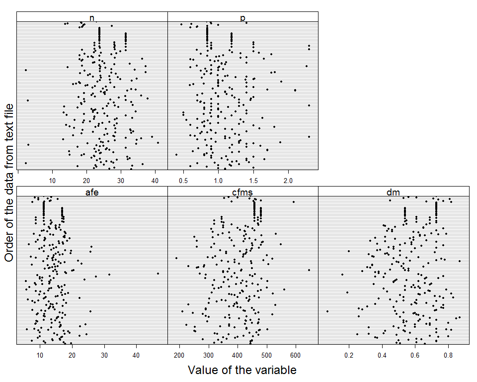

#Objetivo

El objetivo de este Rmartkdown es mostrar las medias de resumen para lo datos de rasgos funcionales efecto sin palmas 

#Rasgos efecto sin palmas

###Significado de las variables 

<table class="table table-striped table-hover table-condensed" style="width: auto !important; margin-left: auto; margin-right: auto;">
<caption>Rasgos de efecto</caption>
 <thead>
  <tr>
   <th style="text-align:left;"> Rasgo </th>
   <th style="text-align:left;"> Significado </th>
   <th style="text-align:left;"> Unidades_de_medida </th>
  </tr>
 </thead>
<tbody>
  <tr>
   <td style="text-align:left;"> AFE </td>
   <td style="text-align:left;"> Area foliar especifica </td>
   <td style="text-align:left;"> mm2/Mg </td>
  </tr>
  <tr>
   <td style="text-align:left;"> CFMS </td>
   <td style="text-align:left;"> Contenido foliar de materia seca </td>
   <td style="text-align:left;"> Mg/g </td>
  </tr>
  <tr>
   <td style="text-align:left;"> DM </td>
   <td style="text-align:left;"> Densidad de madera </td>
   <td style="text-align:left;"> g/cm3 </td>
  </tr>
  <tr>
   <td style="text-align:left;"> N </td>
   <td style="text-align:left;"> Concentracion foliar de nitrogeno </td>
   <td style="text-align:left;"> Mg/g </td>
  </tr>
  <tr>
   <td style="text-align:left;"> P </td>
   <td style="text-align:left;"> Concentracion foliar de fosforo </td>
   <td style="text-align:left;"> Mg/g </td>
  </tr>
</tbody>
</table>


```r
#Load data
deff_sp <- read.csv("C:/tesis_catie/Calderon_CATIE/data/clean/deff_clean_sin_palmas.csv",header = T)
despecies_sp <- read.csv("C:/tesis_catie/Calderon_CATIE/data/clean/despecies_por_parcela.csv",header = T)
despecies_sp <- rename(despecies_sp, coespec=code) %>% filter(!coespec %in% c("EUTEPR","IRIADE","SOCREX","WELFRE"))
dparcelas <- read.csv("C:/tesis_catie/Calderon_CATIE/data/clean/data_posicion_parcelas.csv",header = T)

length(unique(despecies_sp$coespec))
```

```
## [1] 253
```

```r
dim(deff_sp)
```

```
## [1] 253   8
```

```r
dim(dparcelas)
```

```
## [1] 127   6
```


##Medidas de resumen sin palmas

###Medidas de resumen por rasgo

```r
deff_sp %>% gather("afe", "cfms", "dm","n","p"  , key = "rasgo", value = "valor_del_rasgo") %>% 
  group_by(rasgo) %>% 
  summarize(mean=mean(valor_del_rasgo),sd=sd(valor_del_rasgo),max=max(valor_del_rasgo),min=min(valor_del_rasgo)) %>%
  kable() %>% 
  kable_styling(bootstrap_options = c("striped", "hover", "condensed"),full_width = F)
```

<table class="table table-striped table-hover table-condensed" style="width: auto !important; margin-left: auto; margin-right: auto;">
 <thead>
  <tr>
   <th style="text-align:left;"> rasgo </th>
   <th style="text-align:right;"> mean </th>
   <th style="text-align:right;"> sd </th>
   <th style="text-align:right;"> max </th>
   <th style="text-align:right;"> min </th>
  </tr>
 </thead>
<tbody>
  <tr>
   <td style="text-align:left;"> afe </td>
   <td style="text-align:right;"> 14.1082213 </td>
   <td style="text-align:right;"> 4.6072573 </td>
   <td style="text-align:right;"> 46.75 </td>
   <td style="text-align:right;"> 5.69 </td>
  </tr>
  <tr>
   <td style="text-align:left;"> cfms </td>
   <td style="text-align:right;"> 403.0428063 </td>
   <td style="text-align:right;"> 74.5851357 </td>
   <td style="text-align:right;"> 645.35 </td>
   <td style="text-align:right;"> 190.00 </td>
  </tr>
  <tr>
   <td style="text-align:left;"> dm </td>
   <td style="text-align:right;"> 0.5764822 </td>
   <td style="text-align:right;"> 0.1493421 </td>
   <td style="text-align:right;"> 0.87 </td>
   <td style="text-align:right;"> 0.07 </td>
  </tr>
  <tr>
   <td style="text-align:left;"> n </td>
   <td style="text-align:right;"> 24.5325296 </td>
   <td style="text-align:right;"> 6.1570231 </td>
   <td style="text-align:right;"> 40.90 </td>
   <td style="text-align:right;"> 2.30 </td>
  </tr>
  <tr>
   <td style="text-align:left;"> p </td>
   <td style="text-align:right;"> 1.0883794 </td>
   <td style="text-align:right;"> 0.3549728 </td>
   <td style="text-align:right;"> 2.30 </td>
   <td style="text-align:right;"> 0.40 </td>
  </tr>
</tbody>
</table>
###Medidas de resumen para cada rasgo por tipo de bosque

```r
dfull <- left_join(despecies_sp, dparcelas, by="plot" )
dfull <- left_join(dfull, deff_sp, by="coespec" ) %>% select(-c(CRTM_90_X,CRTM_90_Y))
```

```
## Warning: Column `coespec` joining factors with different levels, coercing
## to character vector
```

```r
dfull %>% gather("afe", "cfms", "dm","n","p"  , key = "rasgo", value = "valor_del_rasgo") %>% 
  group_by(forest_type,rasgo) %>% 
  summarize(mean=mean(valor_del_rasgo),sd=sd(valor_del_rasgo),max=max(valor_del_rasgo),min=min(valor_del_rasgo)) %>%
  arrange(rasgo) %>% 
  kable() %>% 
  kable_styling(bootstrap_options = c("striped", "hover", "condensed"),full_width = F)
```

<table class="table table-striped table-hover table-condensed" style="width: auto !important; margin-left: auto; margin-right: auto;">
 <thead>
  <tr>
   <th style="text-align:left;"> forest_type </th>
   <th style="text-align:left;"> rasgo </th>
   <th style="text-align:right;"> mean </th>
   <th style="text-align:right;"> sd </th>
   <th style="text-align:right;"> max </th>
   <th style="text-align:right;"> min </th>
  </tr>
 </thead>
<tbody>
  <tr>
   <td style="text-align:left;"> Foothills </td>
   <td style="text-align:left;"> afe </td>
   <td style="text-align:right;"> 15.5378808 </td>
   <td style="text-align:right;"> 5.2733686 </td>
   <td style="text-align:right;"> 46.75 </td>
   <td style="text-align:right;"> 5.69 </td>
  </tr>
  <tr>
   <td style="text-align:left;"> P. macroloba </td>
   <td style="text-align:left;"> afe </td>
   <td style="text-align:right;"> 14.5541310 </td>
   <td style="text-align:right;"> 5.3015420 </td>
   <td style="text-align:right;"> 46.75 </td>
   <td style="text-align:right;"> 5.69 </td>
  </tr>
  <tr>
   <td style="text-align:left;"> Q. paraensis </td>
   <td style="text-align:left;"> afe </td>
   <td style="text-align:right;"> 12.7091892 </td>
   <td style="text-align:right;"> 4.6997550 </td>
   <td style="text-align:right;"> 46.75 </td>
   <td style="text-align:right;"> 5.69 </td>
  </tr>
  <tr>
   <td style="text-align:left;"> Foothills </td>
   <td style="text-align:left;"> cfms </td>
   <td style="text-align:right;"> 384.4186093 </td>
   <td style="text-align:right;"> 66.9636332 </td>
   <td style="text-align:right;"> 531.27 </td>
   <td style="text-align:right;"> 190.00 </td>
  </tr>
  <tr>
   <td style="text-align:left;"> P. macroloba </td>
   <td style="text-align:left;"> cfms </td>
   <td style="text-align:right;"> 404.5765241 </td>
   <td style="text-align:right;"> 68.4590071 </td>
   <td style="text-align:right;"> 645.35 </td>
   <td style="text-align:right;"> 210.00 </td>
  </tr>
  <tr>
   <td style="text-align:left;"> Q. paraensis </td>
   <td style="text-align:left;"> cfms </td>
   <td style="text-align:right;"> 418.0535627 </td>
   <td style="text-align:right;"> 67.1990632 </td>
   <td style="text-align:right;"> 593.45 </td>
   <td style="text-align:right;"> 252.61 </td>
  </tr>
  <tr>
   <td style="text-align:left;"> Foothills </td>
   <td style="text-align:left;"> dm </td>
   <td style="text-align:right;"> 0.5218102 </td>
   <td style="text-align:right;"> 0.1475457 </td>
   <td style="text-align:right;"> 0.87 </td>
   <td style="text-align:right;"> 0.16 </td>
  </tr>
  <tr>
   <td style="text-align:left;"> P. macroloba </td>
   <td style="text-align:left;"> dm </td>
   <td style="text-align:right;"> 0.5678075 </td>
   <td style="text-align:right;"> 0.1623464 </td>
   <td style="text-align:right;"> 0.87 </td>
   <td style="text-align:right;"> 0.07 </td>
  </tr>
  <tr>
   <td style="text-align:left;"> Q. paraensis </td>
   <td style="text-align:left;"> dm </td>
   <td style="text-align:right;"> 0.6242998 </td>
   <td style="text-align:right;"> 0.1571715 </td>
   <td style="text-align:right;"> 0.87 </td>
   <td style="text-align:right;"> 0.16 </td>
  </tr>
  <tr>
   <td style="text-align:left;"> Foothills </td>
   <td style="text-align:left;"> n </td>
   <td style="text-align:right;"> 24.6694481 </td>
   <td style="text-align:right;"> 8.0198278 </td>
   <td style="text-align:right;"> 40.90 </td>
   <td style="text-align:right;"> 2.30 </td>
  </tr>
  <tr>
   <td style="text-align:left;"> P. macroloba </td>
   <td style="text-align:left;"> n </td>
   <td style="text-align:right;"> 24.5475668 </td>
   <td style="text-align:right;"> 6.1023505 </td>
   <td style="text-align:right;"> 40.90 </td>
   <td style="text-align:right;"> 2.30 </td>
  </tr>
  <tr>
   <td style="text-align:left;"> Q. paraensis </td>
   <td style="text-align:left;"> n </td>
   <td style="text-align:right;"> 22.3686978 </td>
   <td style="text-align:right;"> 6.1573427 </td>
   <td style="text-align:right;"> 40.90 </td>
   <td style="text-align:right;"> 2.30 </td>
  </tr>
  <tr>
   <td style="text-align:left;"> Foothills </td>
   <td style="text-align:left;"> p </td>
   <td style="text-align:right;"> 1.1622958 </td>
   <td style="text-align:right;"> 0.3923043 </td>
   <td style="text-align:right;"> 2.30 </td>
   <td style="text-align:right;"> 0.47 </td>
  </tr>
  <tr>
   <td style="text-align:left;"> P. macroloba </td>
   <td style="text-align:left;"> p </td>
   <td style="text-align:right;"> 1.0375535 </td>
   <td style="text-align:right;"> 0.3369761 </td>
   <td style="text-align:right;"> 2.30 </td>
   <td style="text-align:right;"> 0.40 </td>
  </tr>
  <tr>
   <td style="text-align:left;"> Q. paraensis </td>
   <td style="text-align:left;"> p </td>
   <td style="text-align:right;"> 0.9101720 </td>
   <td style="text-align:right;"> 0.2960274 </td>
   <td style="text-align:right;"> 2.30 </td>
   <td style="text-align:right;"> 0.40 </td>
  </tr>
</tbody>
</table>


##Correlaciones entre rasgos funcionales efecto sin palmas


```r
#CORRER ESTE POR TIPO DE BOSQUE
#p_ <- GGally::print_if_interactive
#data(flea)
#flea
#ggpairs(flea, columns = 2:4)
#pm <- ggpairs(flea, columns = 2:4, ggplot2::aes(colour=species))
#p_(pm)
```


```r
ggpairs(deff_sp[,4:8], lower=list(continuous="smooth"))
```

<!-- -->

##Outliers
Cleveland plot:  row number of an observation is plotted vs. the observation value,

```r
Mydotplot(deff_sp[,4:8])
```

<!-- -->


###Posibles outliers

### Grafico N

```r
kable(deff_sp[deff_sp$n < 10,]) %>% kable_styling(bootstrap_options = c("striped", "hover", "condensed"),full_width = F) %>% 
  column_spec(8, background = "yellow")
```

<table class="table table-striped table-hover table-condensed" style="width: auto !important; margin-left: auto; margin-right: auto;">
 <thead>
  <tr>
   <th style="text-align:left;">   </th>
   <th style="text-align:left;"> familia </th>
   <th style="text-align:left;"> especie </th>
   <th style="text-align:left;"> coespec </th>
   <th style="text-align:right;"> afe </th>
   <th style="text-align:right;"> cfms </th>
   <th style="text-align:right;"> dm </th>
   <th style="text-align:right;"> n </th>
   <th style="text-align:right;"> p </th>
  </tr>
 </thead>
<tbody>
  <tr>
   <td style="text-align:left;"> 11 </td>
   <td style="text-align:left;"> VOCHYSIACEAE </td>
   <td style="text-align:left;"> Vochysia_allenii </td>
   <td style="text-align:left;"> VOCHAL </td>
   <td style="text-align:right;"> 9.30 </td>
   <td style="text-align:right;"> 391.14 </td>
   <td style="text-align:right;"> 0.37 </td>
   <td style="text-align:right;background-color: yellow !important;"> 2.3 </td>
   <td style="text-align:right;"> 0.7 </td>
  </tr>
  <tr>
   <td style="text-align:left;"> 43 </td>
   <td style="text-align:left;"> FABACEAE/MIM. </td>
   <td style="text-align:left;"> Inga_chocoensis </td>
   <td style="text-align:left;"> INGACH </td>
   <td style="text-align:right;"> 13.47 </td>
   <td style="text-align:right;"> 473.40 </td>
   <td style="text-align:right;"> 0.63 </td>
   <td style="text-align:right;background-color: yellow !important;"> 3.0 </td>
   <td style="text-align:right;"> 1.2 </td>
  </tr>
  <tr>
   <td style="text-align:left;"> 118 </td>
   <td style="text-align:left;"> SAPOTACEAE </td>
   <td style="text-align:left;"> Micropholis_melinoniana </td>
   <td style="text-align:left;"> MICRME </td>
   <td style="text-align:right;"> 9.25 </td>
   <td style="text-align:right;"> 442.03 </td>
   <td style="text-align:right;"> 0.64 </td>
   <td style="text-align:right;background-color: yellow !important;"> 2.9 </td>
   <td style="text-align:right;"> 0.7 </td>
  </tr>
  <tr>
   <td style="text-align:left;"> 170 </td>
   <td style="text-align:left;"> BURSERACEAE </td>
   <td style="text-align:left;"> Protium_schippii </td>
   <td style="text-align:left;"> PROTSC </td>
   <td style="text-align:right;"> 13.94 </td>
   <td style="text-align:right;"> 480.49 </td>
   <td style="text-align:right;"> 0.51 </td>
   <td style="text-align:right;background-color: yellow !important;"> 2.3 </td>
   <td style="text-align:right;"> 1.0 </td>
  </tr>
</tbody>
</table>

### Grafico de afe

```r
kable(deff_sp[deff_sp$afe > 40,]) %>% kable_styling(bootstrap_options = c("striped", "hover", "condensed"),full_width = F) %>% 
  column_spec(5, background = "yellow")
```

<table class="table table-striped table-hover table-condensed" style="width: auto !important; margin-left: auto; margin-right: auto;">
 <thead>
  <tr>
   <th style="text-align:left;">   </th>
   <th style="text-align:left;"> familia </th>
   <th style="text-align:left;"> especie </th>
   <th style="text-align:left;"> coespec </th>
   <th style="text-align:right;"> afe </th>
   <th style="text-align:right;"> cfms </th>
   <th style="text-align:right;"> dm </th>
   <th style="text-align:right;"> n </th>
   <th style="text-align:right;"> p </th>
  </tr>
 </thead>
<tbody>
  <tr>
   <td style="text-align:left;"> 121 </td>
   <td style="text-align:left;"> CLETHRACEAE </td>
   <td style="text-align:left;"> Clethra_mexicana </td>
   <td style="text-align:left;"> CLETCO </td>
   <td style="text-align:right;background-color: yellow !important;"> 46.75 </td>
   <td style="text-align:right;"> 270.21 </td>
   <td style="text-align:right;"> 0.42 </td>
   <td style="text-align:right;"> 19.2 </td>
   <td style="text-align:right;"> 0.9 </td>
  </tr>
</tbody>
</table>

###Grafico de cfms

```r
kable(deff_sp[deff_sp$cfms > 550,]) %>% kable_styling(bootstrap_options = c("striped", "hover", "condensed"),full_width = F) %>% 
  column_spec(6, background = "yellow")
```

<table class="table table-striped table-hover table-condensed" style="width: auto !important; margin-left: auto; margin-right: auto;">
 <thead>
  <tr>
   <th style="text-align:left;">   </th>
   <th style="text-align:left;"> familia </th>
   <th style="text-align:left;"> especie </th>
   <th style="text-align:left;"> coespec </th>
   <th style="text-align:right;"> afe </th>
   <th style="text-align:right;"> cfms </th>
   <th style="text-align:right;"> dm </th>
   <th style="text-align:right;"> n </th>
   <th style="text-align:right;"> p </th>
  </tr>
 </thead>
<tbody>
  <tr>
   <td style="text-align:left;"> 94 </td>
   <td style="text-align:left;"> CHRYSOBALANACEAE </td>
   <td style="text-align:left;"> Licania_kallunkiae </td>
   <td style="text-align:left;"> LICNKA </td>
   <td style="text-align:right;"> 5.78 </td>
   <td style="text-align:right;background-color: yellow !important;"> 561.06 </td>
   <td style="text-align:right;"> 0.79 </td>
   <td style="text-align:right;"> 14.2 </td>
   <td style="text-align:right;"> 0.5 </td>
  </tr>
  <tr>
   <td style="text-align:left;"> 127 </td>
   <td style="text-align:left;"> FABACEAE/MIM. </td>
   <td style="text-align:left;"> Inga_mortoniana </td>
   <td style="text-align:left;"> INGAMO </td>
   <td style="text-align:right;"> 20.54 </td>
   <td style="text-align:right;background-color: yellow !important;"> 645.35 </td>
   <td style="text-align:right;"> 0.54 </td>
   <td style="text-align:right;"> 35.9 </td>
   <td style="text-align:right;"> 1.2 </td>
  </tr>
  <tr>
   <td style="text-align:left;"> 243 </td>
   <td style="text-align:left;"> CHRYSOBALANACEAE </td>
   <td style="text-align:left;"> Licania_sparsipilis </td>
   <td style="text-align:left;"> LICNSA </td>
   <td style="text-align:right;"> 7.73 </td>
   <td style="text-align:right;background-color: yellow !important;"> 593.45 </td>
   <td style="text-align:right;"> 0.82 </td>
   <td style="text-align:right;"> 17.9 </td>
   <td style="text-align:right;"> 0.6 </td>
  </tr>
</tbody>
</table>

###Grafico de DM

```r
kable(deff_sp[deff_sp$dm <0.2,]) %>% kable_styling(bootstrap_options = c("striped", "hover", "condensed"),full_width = F) %>% 
  column_spec(7, background = "yellow")
```

<table class="table table-striped table-hover table-condensed" style="width: auto !important; margin-left: auto; margin-right: auto;">
 <thead>
  <tr>
   <th style="text-align:left;">   </th>
   <th style="text-align:left;"> familia </th>
   <th style="text-align:left;"> especie </th>
   <th style="text-align:left;"> coespec </th>
   <th style="text-align:right;"> afe </th>
   <th style="text-align:right;"> cfms </th>
   <th style="text-align:right;"> dm </th>
   <th style="text-align:right;"> n </th>
   <th style="text-align:right;"> p </th>
  </tr>
 </thead>
<tbody>
  <tr>
   <td style="text-align:left;"> 56 </td>
   <td style="text-align:left;"> CARICACEAE </td>
   <td style="text-align:left;"> Jacaratia_costaricensis </td>
   <td style="text-align:left;"> JACTCO </td>
   <td style="text-align:right;"> 25.66 </td>
   <td style="text-align:right;"> 210 </td>
   <td style="text-align:right;background-color: yellow !important;"> 0.07 </td>
   <td style="text-align:right;"> 39.15 </td>
   <td style="text-align:right;"> 2.30 </td>
  </tr>
  <tr>
   <td style="text-align:left;"> 89 </td>
   <td style="text-align:left;"> CECROPIACEAE </td>
   <td style="text-align:left;"> Cecropia_insignis </td>
   <td style="text-align:left;"> CECRIN </td>
   <td style="text-align:right;"> 16.59 </td>
   <td style="text-align:right;"> 310 </td>
   <td style="text-align:right;background-color: yellow !important;"> 0.19 </td>
   <td style="text-align:right;"> 33.38 </td>
   <td style="text-align:right;"> 1.63 </td>
  </tr>
  <tr>
   <td style="text-align:left;"> 119 </td>
   <td style="text-align:left;"> TILIACEAE </td>
   <td style="text-align:left;"> Apeiba_membranacea </td>
   <td style="text-align:left;"> APEIME </td>
   <td style="text-align:right;"> 31.65 </td>
   <td style="text-align:right;"> 290 </td>
   <td style="text-align:right;background-color: yellow !important;"> 0.16 </td>
   <td style="text-align:right;"> 31.40 </td>
   <td style="text-align:right;"> 1.46 </td>
  </tr>
</tbody>
</table>

##Collinearidad entre rasgos efecto 

```r
corvif(deff_sp[,4:8])
```

```
## 
## 
## Variance inflation factors
## 
##          GVIF
## afe  1.442888
## cfms 1.566562
## dm   1.354023
## n    1.662602
## p    1.877892
```
