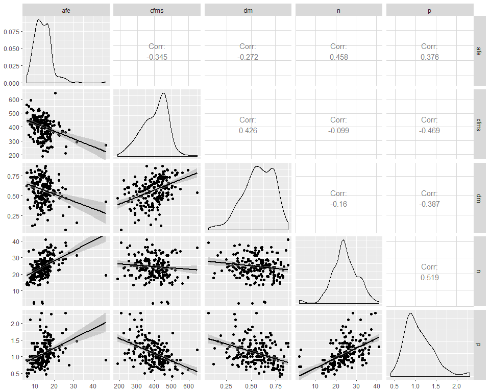
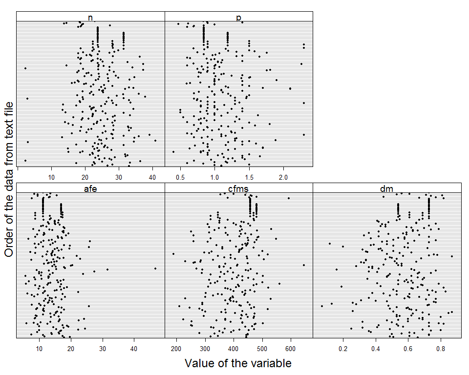

#Objetivo

El objetivo de este Rmartkdown es mostrar las medias de resumen para lo datos de rasgos funcionales efecto con palmas 

#Rasgos efecto incluyendo palmas

###Significado de las variables 

<table class="table table-striped table-hover table-condensed" style="width: auto !important; margin-left: auto; margin-right: auto;">
<caption>Rasgos de efecto</caption>
 <thead>
  <tr>
   <th style="text-align:left;"> Rasgo </th>
   <th style="text-align:left;"> Significado </th>
   <th style="text-align:left;"> Unidades_de_medida </th>
  </tr>
 </thead>
<tbody>
  <tr>
   <td style="text-align:left;"> AFE </td>
   <td style="text-align:left;"> Area foliar especifica </td>
   <td style="text-align:left;"> mm2/Mg </td>
  </tr>
  <tr>
   <td style="text-align:left;"> CFMS </td>
   <td style="text-align:left;"> Contenido foliar de materia seca </td>
   <td style="text-align:left;"> Mg/g </td>
  </tr>
  <tr>
   <td style="text-align:left;"> DM </td>
   <td style="text-align:left;"> Densidad de madera </td>
   <td style="text-align:left;"> g/cm3 </td>
  </tr>
  <tr>
   <td style="text-align:left;"> N </td>
   <td style="text-align:left;"> Concentracion foliar de nitrogeno </td>
   <td style="text-align:left;"> Mg/g </td>
  </tr>
  <tr>
   <td style="text-align:left;"> P </td>
   <td style="text-align:left;"> Concentracion foliar de fosforo </td>
   <td style="text-align:left;"> Mg/g </td>
  </tr>
</tbody>
</table>


```r
#Load data
deff <- read.csv("C:/tesis_catie/Calderon_CATIE/data/clean/deff_clean.csv",header = T)
despecies <- read.csv("C:/tesis_catie/Calderon_CATIE/data/clean/despecies_por_parcela.csv",header = T)
despecies <- rename(despecies, coespec=code)
dparcelas <- read.csv("C:/tesis_catie/Calderon_CATIE/data/clean/data_posicion_parcelas.csv",header = T)
```


```r
#Dimensiones de los datos
dim(deff)
```

```
## [1] 257   9
```

```r
#Especies
length(unique(despecies$coespec))
```

```
## [1] 257
```

```r
#Parcelas
length(unique(despecies$plot))
```

```
## [1] 127
```

##Medidas de resumen

###Medidas de resumen por rasgo

```r
deff %>% gather("afe", "cfms", "dm","n","p"  , key = "rasgo", value = "valor_del_rasgo") %>% 
  select(-af) %>% 
  group_by(rasgo) %>% 
  summarize(mean=mean(valor_del_rasgo),sd=sd(valor_del_rasgo),max=max(valor_del_rasgo),min=min(valor_del_rasgo)) %>%
  kable() %>% 
  kable_styling(bootstrap_options = c("striped", "hover", "condensed"),full_width = F)
```

<table class="table table-striped table-hover table-condensed" style="width: auto !important; margin-left: auto; margin-right: auto;">
 <thead>
  <tr>
   <th style="text-align:left;"> rasgo </th>
   <th style="text-align:right;"> mean </th>
   <th style="text-align:right;"> sd </th>
   <th style="text-align:right;"> max </th>
   <th style="text-align:right;"> min </th>
  </tr>
 </thead>
<tbody>
  <tr>
   <td style="text-align:left;"> afe </td>
   <td style="text-align:right;"> 14.0403891 </td>
   <td style="text-align:right;"> 4.6050141 </td>
   <td style="text-align:right;"> 46.75 </td>
   <td style="text-align:right;"> 5.69 </td>
  </tr>
  <tr>
   <td style="text-align:left;"> cfms </td>
   <td style="text-align:right;"> 403.3067315 </td>
   <td style="text-align:right;"> 74.1723549 </td>
   <td style="text-align:right;"> 645.35 </td>
   <td style="text-align:right;"> 190.00 </td>
  </tr>
  <tr>
   <td style="text-align:left;"> dm </td>
   <td style="text-align:right;"> 0.5723735 </td>
   <td style="text-align:right;"> 0.1537989 </td>
   <td style="text-align:right;"> 0.87 </td>
   <td style="text-align:right;"> 0.07 </td>
  </tr>
  <tr>
   <td style="text-align:left;"> n </td>
   <td style="text-align:right;"> 24.4575097 </td>
   <td style="text-align:right;"> 6.1398713 </td>
   <td style="text-align:right;"> 40.90 </td>
   <td style="text-align:right;"> 2.30 </td>
  </tr>
  <tr>
   <td style="text-align:left;"> p </td>
   <td style="text-align:right;"> 1.0873541 </td>
   <td style="text-align:right;"> 0.3529319 </td>
   <td style="text-align:right;"> 2.30 </td>
   <td style="text-align:right;"> 0.40 </td>
  </tr>
</tbody>
</table>

```r
#Medidas de resumen de cantidad de especies por parcela
#despecies %>%  group_by(plot) %>% 
# summarize(especies=n()) %>% 
#  arrange(especies) %>% 
#  kable() %>% 
#  kable_styling(bootstrap_options = c("striped", "hover", "condensed"),full_width = F)
```

###Medidas de resumen para cada rasgo por tipo de bosque

```r
dfull <- left_join(despecies, dparcelas, by="plot" )
dfull <- left_join(dfull, deff, by="coespec" ) %>% select(-c(CRTM_90_X,CRTM_90_Y))

dfull %>% gather("afe", "cfms", "dm","n","p"  , key = "rasgo", value = "valor_del_rasgo") %>% 
  group_by(forest_type,rasgo) %>% 
  summarize(mean=mean(valor_del_rasgo),sd=sd(valor_del_rasgo),max=max(valor_del_rasgo),min=min(valor_del_rasgo)) %>%
  arrange(rasgo) %>% 
  kable() %>% 
  kable_styling(bootstrap_options = c("striped", "hover", "condensed"),full_width = F)
```

<table class="table table-striped table-hover table-condensed" style="width: auto !important; margin-left: auto; margin-right: auto;">
 <thead>
  <tr>
   <th style="text-align:left;"> forest_type </th>
   <th style="text-align:left;"> rasgo </th>
   <th style="text-align:right;"> mean </th>
   <th style="text-align:right;"> sd </th>
   <th style="text-align:right;"> max </th>
   <th style="text-align:right;"> min </th>
  </tr>
 </thead>
<tbody>
  <tr>
   <td style="text-align:left;"> Foothills </td>
   <td style="text-align:left;"> afe </td>
   <td style="text-align:right;"> 14.9888200 </td>
   <td style="text-align:right;"> 5.3079987 </td>
   <td style="text-align:right;"> 46.75 </td>
   <td style="text-align:right;"> 5.69 </td>
  </tr>
  <tr>
   <td style="text-align:left;"> P.macroloba </td>
   <td style="text-align:left;"> afe </td>
   <td style="text-align:right;"> 13.5927447 </td>
   <td style="text-align:right;"> 5.1211327 </td>
   <td style="text-align:right;"> 46.75 </td>
   <td style="text-align:right;"> 5.69 </td>
  </tr>
  <tr>
   <td style="text-align:left;"> Q.paraensis </td>
   <td style="text-align:left;"> afe </td>
   <td style="text-align:right;"> 12.1317913 </td>
   <td style="text-align:right;"> 4.3904606 </td>
   <td style="text-align:right;"> 46.75 </td>
   <td style="text-align:right;"> 5.69 </td>
  </tr>
  <tr>
   <td style="text-align:left;"> Foothills </td>
   <td style="text-align:left;"> cfms </td>
   <td style="text-align:right;"> 387.6232600 </td>
   <td style="text-align:right;"> 65.7150176 </td>
   <td style="text-align:right;"> 531.27 </td>
   <td style="text-align:right;"> 190.00 </td>
  </tr>
  <tr>
   <td style="text-align:left;"> P.macroloba </td>
   <td style="text-align:left;"> cfms </td>
   <td style="text-align:right;"> 406.8757872 </td>
   <td style="text-align:right;"> 63.2703305 </td>
   <td style="text-align:right;"> 645.35 </td>
   <td style="text-align:right;"> 210.00 </td>
  </tr>
  <tr>
   <td style="text-align:left;"> Q.paraensis </td>
   <td style="text-align:left;"> cfms </td>
   <td style="text-align:right;"> 418.4602362 </td>
   <td style="text-align:right;"> 62.4360420 </td>
   <td style="text-align:right;"> 593.45 </td>
   <td style="text-align:right;"> 252.61 </td>
  </tr>
  <tr>
   <td style="text-align:left;"> Foothills </td>
   <td style="text-align:left;"> dm </td>
   <td style="text-align:right;"> 0.5037000 </td>
   <td style="text-align:right;"> 0.1650994 </td>
   <td style="text-align:right;"> 0.87 </td>
   <td style="text-align:right;"> 0.12 </td>
  </tr>
  <tr>
   <td style="text-align:left;"> P.macroloba </td>
   <td style="text-align:left;"> dm </td>
   <td style="text-align:right;"> 0.5121489 </td>
   <td style="text-align:right;"> 0.2010983 </td>
   <td style="text-align:right;"> 0.87 </td>
   <td style="text-align:right;"> 0.07 </td>
  </tr>
  <tr>
   <td style="text-align:left;"> Q.paraensis </td>
   <td style="text-align:left;"> dm </td>
   <td style="text-align:right;"> 0.5658661 </td>
   <td style="text-align:right;"> 0.2040938 </td>
   <td style="text-align:right;"> 0.87 </td>
   <td style="text-align:right;"> 0.12 </td>
  </tr>
  <tr>
   <td style="text-align:left;"> Foothills </td>
   <td style="text-align:left;"> n </td>
   <td style="text-align:right;"> 24.2283000 </td>
   <td style="text-align:right;"> 7.7596970 </td>
   <td style="text-align:right;"> 40.90 </td>
   <td style="text-align:right;"> 2.30 </td>
  </tr>
  <tr>
   <td style="text-align:left;"> P.macroloba </td>
   <td style="text-align:left;"> n </td>
   <td style="text-align:right;"> 23.5659468 </td>
   <td style="text-align:right;"> 5.8067995 </td>
   <td style="text-align:right;"> 40.90 </td>
   <td style="text-align:right;"> 2.30 </td>
  </tr>
  <tr>
   <td style="text-align:left;"> Q.paraensis </td>
   <td style="text-align:left;"> n </td>
   <td style="text-align:right;"> 21.8619488 </td>
   <td style="text-align:right;"> 5.6278853 </td>
   <td style="text-align:right;"> 40.90 </td>
   <td style="text-align:right;"> 2.30 </td>
  </tr>
  <tr>
   <td style="text-align:left;"> Foothills </td>
   <td style="text-align:left;"> p </td>
   <td style="text-align:right;"> 1.1554000 </td>
   <td style="text-align:right;"> 0.3769411 </td>
   <td style="text-align:right;"> 2.30 </td>
   <td style="text-align:right;"> 0.47 </td>
  </tr>
  <tr>
   <td style="text-align:left;"> P.macroloba </td>
   <td style="text-align:left;"> p </td>
   <td style="text-align:right;"> 1.0348511 </td>
   <td style="text-align:right;"> 0.3108079 </td>
   <td style="text-align:right;"> 2.30 </td>
   <td style="text-align:right;"> 0.40 </td>
  </tr>
  <tr>
   <td style="text-align:left;"> Q.paraensis </td>
   <td style="text-align:left;"> p </td>
   <td style="text-align:right;"> 0.9345669 </td>
   <td style="text-align:right;"> 0.2789852 </td>
   <td style="text-align:right;"> 2.30 </td>
   <td style="text-align:right;"> 0.40 </td>
  </tr>
</tbody>
</table>


##Correlaciones entre rasgos funcionales efecto


```r
#CORRER ESTE POR TIPO DE BOSQUE
#p_ <- GGally::print_if_interactive
#data(flea)
#flea
#ggpairs(flea, columns = 2:4)
#pm <- ggpairs(flea, columns = 2:4, ggplot2::aes(colour=species))
#p_(pm)
```


```r
ggpairs(deff[,5:9], lower=list(continuous="smooth"))
```

<!-- -->

##Outliers
Cleveland plot:  row number of an observation is plotted vs. the observation value,

```r
Mydotplot(deff[,5:9])
```

<!-- -->


###Posibles outliers

### Grafico N

```r
kable(deff[deff$n < 10,]) %>% kable_styling(bootstrap_options = c("striped", "hover", "condensed"),full_width = F) %>% 
  column_spec(9, background = "yellow")
```

<table class="table table-striped table-hover table-condensed" style="width: auto !important; margin-left: auto; margin-right: auto;">
 <thead>
  <tr>
   <th style="text-align:left;">   </th>
   <th style="text-align:left;"> familia </th>
   <th style="text-align:left;"> especie </th>
   <th style="text-align:left;"> coespec </th>
   <th style="text-align:right;"> af </th>
   <th style="text-align:right;"> afe </th>
   <th style="text-align:right;"> cfms </th>
   <th style="text-align:right;"> dm </th>
   <th style="text-align:right;"> n </th>
   <th style="text-align:right;"> p </th>
  </tr>
 </thead>
<tbody>
  <tr>
   <td style="text-align:left;"> 11 </td>
   <td style="text-align:left;"> VOCHYSIACEAE </td>
   <td style="text-align:left;"> Vochysia_allenii </td>
   <td style="text-align:left;"> VOCHAL </td>
   <td style="text-align:right;"> 3400.96 </td>
   <td style="text-align:right;"> 9.30 </td>
   <td style="text-align:right;"> 391.14 </td>
   <td style="text-align:right;"> 0.37 </td>
   <td style="text-align:right;background-color: yellow !important;"> 2.3 </td>
   <td style="text-align:right;"> 0.7 </td>
  </tr>
  <tr>
   <td style="text-align:left;"> 43 </td>
   <td style="text-align:left;"> FABACEAE/MIM. </td>
   <td style="text-align:left;"> Inga_chocoensis </td>
   <td style="text-align:left;"> INGACH </td>
   <td style="text-align:right;"> 46600.14 </td>
   <td style="text-align:right;"> 13.47 </td>
   <td style="text-align:right;"> 473.40 </td>
   <td style="text-align:right;"> 0.63 </td>
   <td style="text-align:right;background-color: yellow !important;"> 3.0 </td>
   <td style="text-align:right;"> 1.2 </td>
  </tr>
  <tr>
   <td style="text-align:left;"> 120 </td>
   <td style="text-align:left;"> SAPOTACEAE </td>
   <td style="text-align:left;"> Micropholis_melinoniana </td>
   <td style="text-align:left;"> MICRME </td>
   <td style="text-align:right;"> 7202.36 </td>
   <td style="text-align:right;"> 9.25 </td>
   <td style="text-align:right;"> 442.03 </td>
   <td style="text-align:right;"> 0.64 </td>
   <td style="text-align:right;background-color: yellow !important;"> 2.9 </td>
   <td style="text-align:right;"> 0.7 </td>
  </tr>
  <tr>
   <td style="text-align:left;"> 174 </td>
   <td style="text-align:left;"> BURSERACEAE </td>
   <td style="text-align:left;"> Protium_schippii </td>
   <td style="text-align:left;"> PROTSC </td>
   <td style="text-align:right;"> 12438.36 </td>
   <td style="text-align:right;"> 13.94 </td>
   <td style="text-align:right;"> 480.49 </td>
   <td style="text-align:right;"> 0.51 </td>
   <td style="text-align:right;background-color: yellow !important;"> 2.3 </td>
   <td style="text-align:right;"> 1.0 </td>
  </tr>
</tbody>
</table>

### Grafico de afe

```r
kable(deff[deff$afe > 40,]) %>% kable_styling(bootstrap_options = c("striped", "hover", "condensed"),full_width = F) %>% 
  column_spec(6, background = "yellow")
```

<table class="table table-striped table-hover table-condensed" style="width: auto !important; margin-left: auto; margin-right: auto;">
 <thead>
  <tr>
   <th style="text-align:left;">   </th>
   <th style="text-align:left;"> familia </th>
   <th style="text-align:left;"> especie </th>
   <th style="text-align:left;"> coespec </th>
   <th style="text-align:right;"> af </th>
   <th style="text-align:right;"> afe </th>
   <th style="text-align:right;"> cfms </th>
   <th style="text-align:right;"> dm </th>
   <th style="text-align:right;"> n </th>
   <th style="text-align:right;"> p </th>
  </tr>
 </thead>
<tbody>
  <tr>
   <td style="text-align:left;"> 123 </td>
   <td style="text-align:left;"> CLETHRACEAE </td>
   <td style="text-align:left;"> Clethra_mexicana </td>
   <td style="text-align:left;"> CLETCO </td>
   <td style="text-align:right;"> 18510.92 </td>
   <td style="text-align:right;background-color: yellow !important;"> 46.75 </td>
   <td style="text-align:right;"> 270.21 </td>
   <td style="text-align:right;"> 0.42 </td>
   <td style="text-align:right;"> 19.2 </td>
   <td style="text-align:right;"> 0.9 </td>
  </tr>
</tbody>
</table>

###Grafico de cfms

```r
kable(deff[deff$cfms > 550,]) %>% kable_styling(bootstrap_options = c("striped", "hover", "condensed"),full_width = F) %>% 
  column_spec(7, background = "yellow")
```

<table class="table table-striped table-hover table-condensed" style="width: auto !important; margin-left: auto; margin-right: auto;">
 <thead>
  <tr>
   <th style="text-align:left;">   </th>
   <th style="text-align:left;"> familia </th>
   <th style="text-align:left;"> especie </th>
   <th style="text-align:left;"> coespec </th>
   <th style="text-align:right;"> af </th>
   <th style="text-align:right;"> afe </th>
   <th style="text-align:right;"> cfms </th>
   <th style="text-align:right;"> dm </th>
   <th style="text-align:right;"> n </th>
   <th style="text-align:right;"> p </th>
  </tr>
 </thead>
<tbody>
  <tr>
   <td style="text-align:left;"> 96 </td>
   <td style="text-align:left;"> CHRYSOBALANACEAE </td>
   <td style="text-align:left;"> Licania_kallunkiae </td>
   <td style="text-align:left;"> LICNKA </td>
   <td style="text-align:right;"> 6947.60 </td>
   <td style="text-align:right;"> 5.78 </td>
   <td style="text-align:right;background-color: yellow !important;"> 561.06 </td>
   <td style="text-align:right;"> 0.79 </td>
   <td style="text-align:right;"> 14.2 </td>
   <td style="text-align:right;"> 0.5 </td>
  </tr>
  <tr>
   <td style="text-align:left;"> 129 </td>
   <td style="text-align:left;"> FABACEAE/MIM. </td>
   <td style="text-align:left;"> Inga_mortoniana </td>
   <td style="text-align:left;"> INGAMO </td>
   <td style="text-align:right;"> 29073.25 </td>
   <td style="text-align:right;"> 20.54 </td>
   <td style="text-align:right;background-color: yellow !important;"> 645.35 </td>
   <td style="text-align:right;"> 0.54 </td>
   <td style="text-align:right;"> 35.9 </td>
   <td style="text-align:right;"> 1.2 </td>
  </tr>
  <tr>
   <td style="text-align:left;"> 247 </td>
   <td style="text-align:left;"> CHRYSOBALANACEAE </td>
   <td style="text-align:left;"> Licania_sparsipilis </td>
   <td style="text-align:left;"> LICNSA </td>
   <td style="text-align:right;"> 2409.04 </td>
   <td style="text-align:right;"> 7.73 </td>
   <td style="text-align:right;background-color: yellow !important;"> 593.45 </td>
   <td style="text-align:right;"> 0.82 </td>
   <td style="text-align:right;"> 17.9 </td>
   <td style="text-align:right;"> 0.6 </td>
  </tr>
</tbody>
</table>

###Grafico de DM

```r
kable(deff[deff$dm <0.2,]) %>% kable_styling(bootstrap_options = c("striped", "hover", "condensed"),full_width = F) %>% 
  column_spec(8, background = "yellow")
```

<table class="table table-striped table-hover table-condensed" style="width: auto !important; margin-left: auto; margin-right: auto;">
 <thead>
  <tr>
   <th style="text-align:left;">   </th>
   <th style="text-align:left;"> familia </th>
   <th style="text-align:left;"> especie </th>
   <th style="text-align:left;"> coespec </th>
   <th style="text-align:right;"> af </th>
   <th style="text-align:right;"> afe </th>
   <th style="text-align:right;"> cfms </th>
   <th style="text-align:right;"> dm </th>
   <th style="text-align:right;"> n </th>
   <th style="text-align:right;"> p </th>
  </tr>
 </thead>
<tbody>
  <tr>
   <td style="text-align:left;"> 56 </td>
   <td style="text-align:left;"> CARICACEAE </td>
   <td style="text-align:left;"> Jacaratia_costaricensis </td>
   <td style="text-align:left;"> JACTCO </td>
   <td style="text-align:right;"> 30331.06 </td>
   <td style="text-align:right;"> 25.66 </td>
   <td style="text-align:right;"> 210 </td>
   <td style="text-align:right;background-color: yellow !important;"> 0.07 </td>
   <td style="text-align:right;"> 39.15 </td>
   <td style="text-align:right;"> 2.30 </td>
  </tr>
  <tr>
   <td style="text-align:left;"> 61 </td>
   <td style="text-align:left;"> ARECACEAE </td>
   <td style="text-align:left;"> Iriartea_deltoidea </td>
   <td style="text-align:left;"> IRIADE </td>
   <td style="text-align:right;"> 3157269.86 </td>
   <td style="text-align:right;"> 9.94 </td>
   <td style="text-align:right;"> 380 </td>
   <td style="text-align:right;background-color: yellow !important;"> 0.13 </td>
   <td style="text-align:right;"> 20.36 </td>
   <td style="text-align:right;"> 1.25 </td>
  </tr>
  <tr>
   <td style="text-align:left;"> 91 </td>
   <td style="text-align:left;"> CECROPIACEAE </td>
   <td style="text-align:left;"> Cecropia_insignis </td>
   <td style="text-align:left;"> CECRIN </td>
   <td style="text-align:right;"> 352125.03 </td>
   <td style="text-align:right;"> 16.59 </td>
   <td style="text-align:right;"> 310 </td>
   <td style="text-align:right;background-color: yellow !important;"> 0.19 </td>
   <td style="text-align:right;"> 33.38 </td>
   <td style="text-align:right;"> 1.63 </td>
  </tr>
  <tr>
   <td style="text-align:left;"> 121 </td>
   <td style="text-align:left;"> TILIACEAE </td>
   <td style="text-align:left;"> Apeiba_membranacea </td>
   <td style="text-align:left;"> APEIME </td>
   <td style="text-align:right;"> 12612.94 </td>
   <td style="text-align:right;"> 31.65 </td>
   <td style="text-align:right;"> 290 </td>
   <td style="text-align:right;background-color: yellow !important;"> 0.16 </td>
   <td style="text-align:right;"> 31.40 </td>
   <td style="text-align:right;"> 1.46 </td>
  </tr>
  <tr>
   <td style="text-align:left;"> 167 </td>
   <td style="text-align:left;"> ARECACEAE </td>
   <td style="text-align:left;"> Welfia_regia </td>
   <td style="text-align:left;"> WELFRE </td>
   <td style="text-align:right;"> 3553833.17 </td>
   <td style="text-align:right;"> 8.63 </td>
   <td style="text-align:right;"> 440 </td>
   <td style="text-align:right;background-color: yellow !important;"> 0.12 </td>
   <td style="text-align:right;"> 17.70 </td>
   <td style="text-align:right;"> 0.77 </td>
  </tr>
</tbody>
</table>

##Collinearidad entre rasgos efecto 

```r
corvif(deff[,5:9])
```

```
## 
## 
## Variance inflation factors
## 
##          GVIF
## afe  1.444158
## cfms 1.558498
## dm   1.304609
## n    1.673125
## p    1.875167
```
