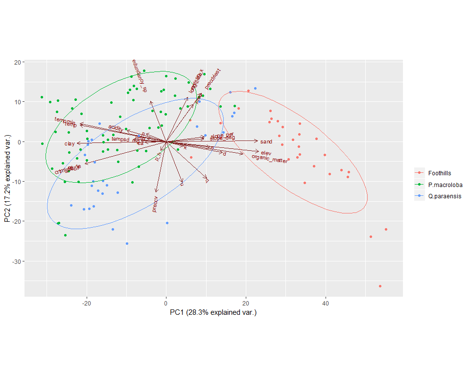
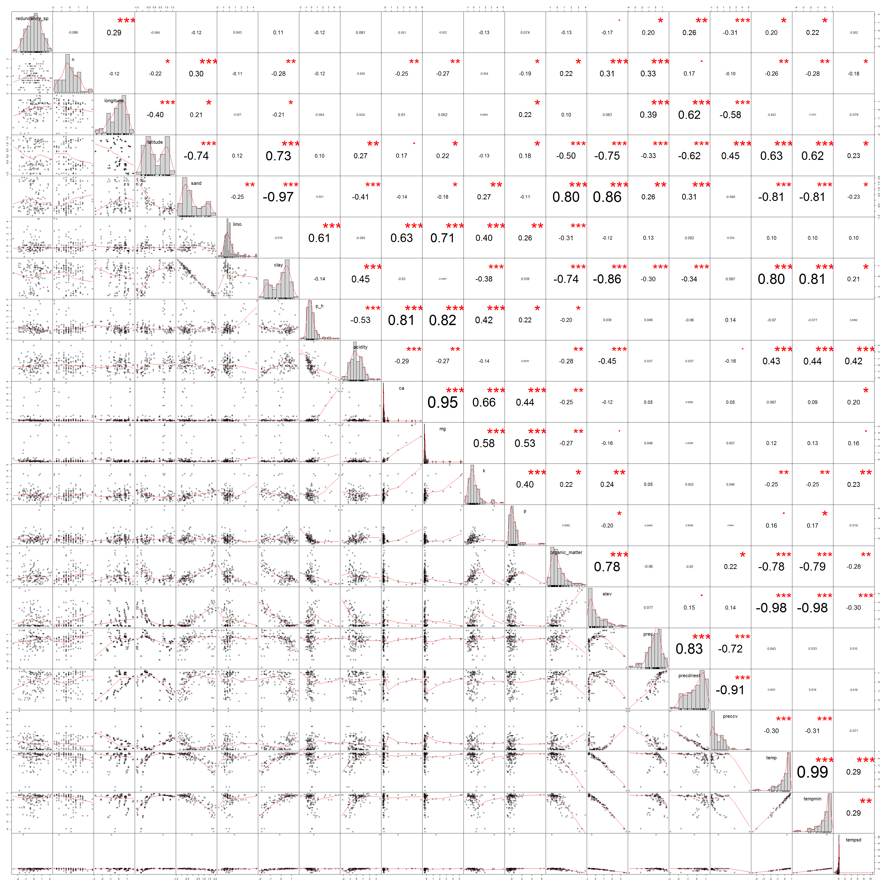
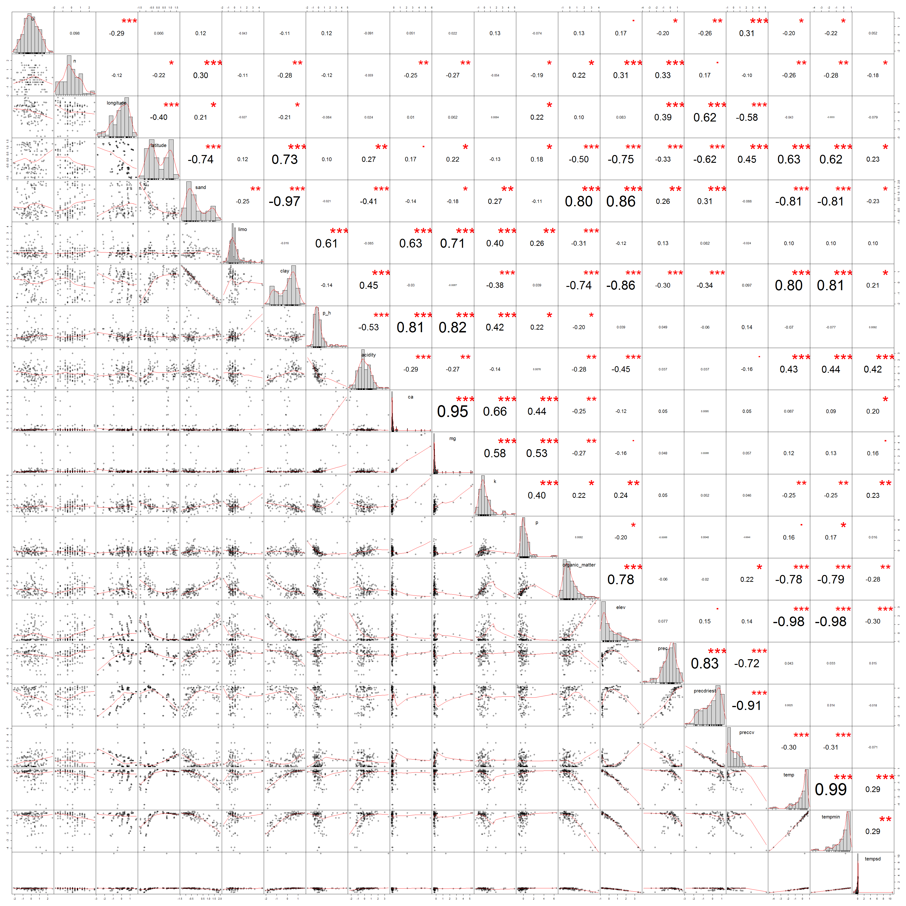
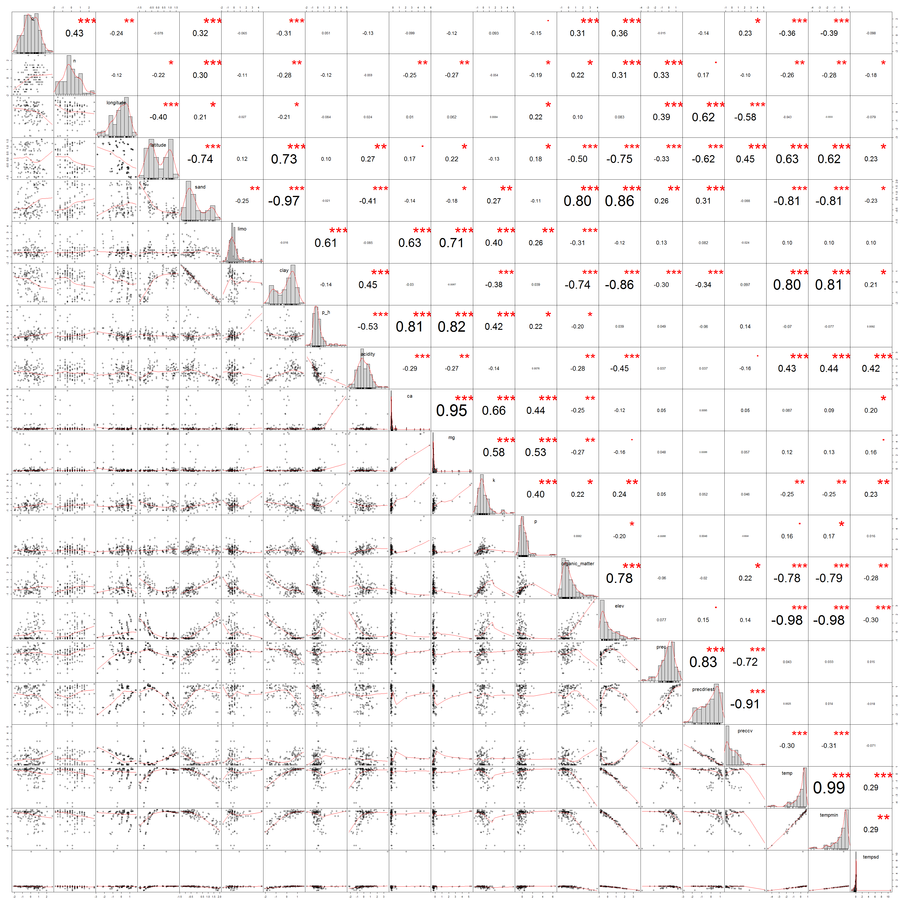
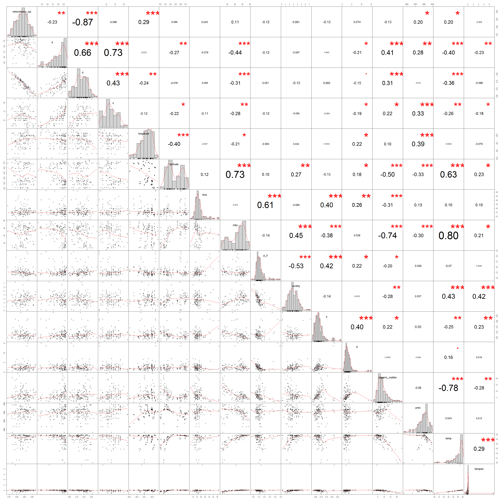

```r
#Paquetes
library(tidyverse)
library(PerformanceAnalytics)
library(janitor)
library(GGally)
source("C:/tesis_catie/Calderon_CATIE/scripts/functions/HighstatLibV10.R")
library(ggbiplot)
```


#Objetivo
Ver la correlacion existente entre las variables ambientales y los indices de redundancia, uniqueness y diversidad de Rao sin palmas


```r
#Cargar datos
dredundancy_sp <- read.csv("C:/tesis_catie/Calderon_CATIE/data/resultados_csv/data_indices_eff_redundancy_sp.csv", header=T)
dredundancy_sp <- clean_names(dredundancy_sp)

dparcelas <- read.csv("C:/tesis_catie/Calderon_CATIE/data/clean/data_posicion_parcelas.csv", header = T)
dparcelas <- clean_names(dparcelas)

denvi <- read.csv("C:/tesis_catie/Calderon_CATIE/data/clean/data_enviroment_worldclim_clean.csv", header = T)
denvi <- denvi %>%
  clean_names() %>% 
    select(-c(crtm_90_x,crtm_90_y)) 
```


```r
#Summary de los datos 
summary(dredundancy_sp)
```

```
##       plot           n               d                q          
##  F10P1  :  1   Min.   : 6.00   Min.   :0.4260   Min.   :0.04399  
##  F10P2  :  1   1st Qu.:10.00   1st Qu.:0.7283   1st Qu.:0.10161  
##  F10P3  :  1   Median :12.00   Median :0.8512   Median :0.12894  
##  F10P4  :  1   Mean   :12.66   Mean   :0.8057   Mean   :0.12914  
##  F11P1  :  1   3rd Qu.:15.00   3rd Qu.:0.9070   3rd Qu.:0.16015  
##  F11P2  :  1   Max.   :22.00   Max.   :0.9492   Max.   :0.23659  
##  (Other):121                                                     
##        u          redundancy_sp   
##  Min.   :0.0750   Min.   :0.7410  
##  1st Qu.:0.1312   1st Qu.:0.8137  
##  Median :0.1574   Median :0.8426  
##  Mean   :0.1589   Mean   :0.8411  
##  3rd Qu.:0.1863   3rd Qu.:0.8688  
##  Max.   :0.2590   Max.   :0.9250  
## 
```

```r
glimpse(dredundancy_sp)
```

```
## Observations: 127
## Variables: 6
## $ plot          <fct> F10P1, F10P2, F10P3, F10P4, F11P1, F11P2, F11P3,...
## $ n             <int> 8, 15, 11, 12, 17, 16, 13, 11, 10, 12, 11, 13, 2...
## $ d             <dbl> 0.6297579, 0.8288890, 0.7029479, 0.8595041, 0.92...
## $ q             <dbl> 0.13217657, 0.09192079, 0.12285195, 0.17717124, ...
## $ u             <dbl> 0.20988474, 0.11089639, 0.17476678, 0.20613193, ...
## $ redundancy_sp <dbl> 0.7901153, 0.8891036, 0.8252332, 0.7938681, 0.84...
```

```r
summary(dparcelas)
```

```
##       plot          forest_type   crtm_90_x        crtm_90_y      
##  F10P1  :  1   Foothills  :31   Min.   :467729   Min.   :1127367  
##  F10P2  :  1   P.macroloba:67   1st Qu.:487859   1st Qu.:1141309  
##  F10P3  :  1   Q.paraensis:29   Median :493739   Median :1151185  
##  F10P4  :  1                    Mean   :492837   Mean   :1156939  
##  F11P1  :  1                    3rd Qu.:499705   3rd Qu.:1176467  
##  F11P2  :  1                    Max.   :508230   Max.   :1188872  
##  (Other):121                                                      
##    longitude         latitude    
##  Min.   :-84.29   Min.   :10.20  
##  1st Qu.:-84.11   1st Qu.:10.32  
##  Median :-84.06   Median :10.41  
##  Mean   :-84.07   Mean   :10.46  
##  3rd Qu.:-84.00   3rd Qu.:10.64  
##  Max.   :-83.92   Max.   :10.75  
## 
```

```r
glimpse(dparcelas)
```

```
## Observations: 127
## Variables: 6
## $ plot        <fct> F10P1, F10P2, F10P3, F10P4, F11P1, F11P2, F11P3, F...
## $ forest_type <fct> P.macroloba, P.macroloba, P.macroloba, P.macroloba...
## $ crtm_90_x   <dbl> 484782.4, 484435.9, 483925.3, 483869.0, 479984.1, ...
## $ crtm_90_y   <dbl> 1170464, 1170880, 1170445, 1170614, 1183586, 11834...
## $ longitude   <dbl> -84.13907, -84.14223, -84.14690, -84.14741, -84.18...
## $ latitude    <dbl> 10.58515, 10.58890, 10.58497, 10.58649, 10.70377, ...
```

```r
summary(denvi)
```

```
##       plot          forest_type      sand            limo      
##  F10P1  :  1   Foothills  :31   Min.   : 8.02   Min.   : 7.00  
##  F10P2  :  1   P.macroloba:67   1st Qu.:21.51   1st Qu.:13.60  
##  F10P3  :  1   Q.paraensis:29   Median :30.41   Median :15.60  
##  F10P4  :  1                    Mean   :37.38   Mean   :16.89  
##  F11P1  :  1                    3rd Qu.:52.26   3rd Qu.:17.50  
##  F11P2  :  1                    Max.   :80.50   Max.   :41.99  
##  (Other):121                                                   
##       clay            p_h           acidity            ca         
##  Min.   : 3.50   Min.   :3.830   Min.   :0.100   Min.   : 0.0610  
##  1st Qu.:30.00   1st Qu.:4.340   1st Qu.:2.087   1st Qu.: 0.1535  
##  Median :51.99   Median :4.500   Median :2.750   Median : 0.2340  
##  Mean   :45.73   Mean   :4.567   Mean   :2.880   Mean   : 0.7287  
##  3rd Qu.:61.99   3rd Qu.:4.635   3rd Qu.:3.720   3rd Qu.: 0.3760  
##  Max.   :78.38   Max.   :6.400   Max.   :7.260   Max.   :11.0200  
##                                                                   
##        mg               k                 p          organic_matter  
##  Min.   :0.0830   Min.   :0.02000   Min.   : 0.470   Min.   : 1.650  
##  1st Qu.:0.1590   1st Qu.:0.05700   1st Qu.: 1.675   1st Qu.: 4.630  
##  Median :0.2090   Median :0.07200   Median : 2.320   Median : 6.720  
##  Mean   :0.4637   Mean   :0.07954   Mean   : 2.703   Mean   : 7.512  
##  3rd Qu.:0.3000   3rd Qu.:0.09000   3rd Qu.: 3.315   3rd Qu.: 9.220  
##  Max.   :5.5900   Max.   :0.28000   Max.   :15.100   Max.   :23.880  
##                                                                      
##       elev          slope_per        slope_deg           prec     
##  Min.   :  30.0   Min.   : 0.000   Min.   : 0.000   Min.   :2839  
##  1st Qu.:  60.0   1st Qu.: 0.000   1st Qu.: 0.000   1st Qu.:3802  
##  Median : 160.0   Median : 3.620   Median : 0.000   Median :4041  
##  Mean   : 253.4   Mean   : 8.599   Mean   : 4.789   Mean   :3980  
##  3rd Qu.: 379.0   3rd Qu.:14.010   3rd Qu.: 8.110   3rd Qu.:4173  
##  Max.   :1203.0   Max.   :61.320   Max.   :28.120   Max.   :4490  
##                                                                   
##    precdriest        preccv          temp          tempmin     
##  Min.   : 50.0   Min.   :27.0   Min.   :20.00   Min.   :14.50  
##  1st Qu.:115.0   1st Qu.:27.0   1st Qu.:24.85   1st Qu.:19.30  
##  Median :152.0   Median :32.0   Median :25.60   Median :20.20  
##  Mean   :144.3   Mean   :32.2   Mean   :25.08   Mean   :19.64  
##  3rd Qu.:172.0   3rd Qu.:35.0   3rd Qu.:25.80   3rd Qu.:20.40  
##  Max.   :186.0   Max.   :60.0   Max.   :26.00   Max.   :20.70  
##                                                                
##      tempsd     
##  Min.   :1.450  
##  1st Qu.:1.930  
##  Median :2.020  
##  Mean   :2.001  
##  3rd Qu.:2.040  
##  Max.   :6.750  
## 
```

```r
glimpse(denvi)
```

```
## Observations: 127
## Variables: 21
## $ plot           <fct> F10P1, F10P2, F10P3, F10P4, F11P1, F11P2, F11P3...
## $ forest_type    <fct> P.macroloba, P.macroloba, P.macroloba, P.macrol...
## $ sand           <dbl> 35.21, 29.20, 39.21, 25.21, 23.21, 22.81, 26.82...
## $ limo           <dbl> 21.60, 19.60, 27.59, 29.59, 13.20, 13.60, 11.60...
## $ clay           <dbl> 43.19, 51.20, 33.19, 45.19, 63.59, 63.59, 61.59...
## $ p_h            <dbl> 4.70, 4.40, 5.70, 5.90, 4.50, 4.60, 4.20, 4.50,...
## $ acidity        <dbl> 7.260, 3.400, 0.220, 1.570, 2.540, 2.280, 2.760...
## $ ca             <dbl> 4.470, 0.620, 11.020, 6.810, 0.150, 0.140, 0.13...
## $ mg             <dbl> 1.830, 0.470, 3.780, 2.890, 0.300, 0.460, 0.150...
## $ k              <dbl> 0.220, 0.060, 0.280, 0.100, 0.050, 0.060, 0.060...
## $ p              <dbl> 2.00, 3.20, 1.80, 1.30, 3.00, 2.70, 4.60, 2.40,...
## $ organic_matter <dbl> 4.39, 6.80, 4.60, 1.90, 6.60, 7.02, 7.89, 6.19,...
## $ elev           <int> 133, 228, 187, 220, 40, 44, 40, 60, 60, 60, 60,...
## $ slope_per      <dbl> 11.10, 27.66, 17.16, 18.12, 16.93, 8.44, 0.00, ...
## $ slope_deg      <dbl> 5.71, 14.72, 10.32, 10.02, 8.59, 5.05, 0.00, 0....
## $ prec           <int> 4001, 4301, 4181, 4088, 3658, 3658, 3623, 3553,...
## $ precdriest     <int> 136, 151, 145, 145, 83, 84, 85, 89, 91, 89, 91,...
## $ preccv         <int> 33, 32, 33, 33, 39, 39, 40, 39, 39, 39, 39, 38,...
## $ temp           <dbl> 25.4, 25.0, 25.1, 25.2, 25.8, 25.8, 25.8, 25.9,...
## $ tempmin        <dbl> 19.9, 19.6, 19.7, 19.7, 20.4, 20.4, 20.3, 20.4,...
## $ tempsd         <dbl> 6.75, 1.96, 1.97, 1.97, 2.04, 2.04, 2.03, 2.04,...
```


```r
dfull  <- left_join(dredundancy_sp, dparcelas,by=c("plot") ) %>% 
  left_join(.,denvi, by=c("plot","forest_type") )

#Ordenar columnas
dfull <- dfull %>% select(plot, forest_type,n,longitude,latitude,crtm_90_x,crtm_90_y, everything()) 
glimpse(dfull)
```

```
## Observations: 127
## Variables: 30
## $ plot           <fct> F10P1, F10P2, F10P3, F10P4, F11P1, F11P2, F11P3...
## $ forest_type    <fct> P.macroloba, P.macroloba, P.macroloba, P.macrol...
## $ n              <int> 8, 15, 11, 12, 17, 16, 13, 11, 10, 12, 11, 13, ...
## $ longitude      <dbl> -84.13907, -84.14223, -84.14690, -84.14741, -84...
## $ latitude       <dbl> 10.58515, 10.58890, 10.58497, 10.58649, 10.7037...
## $ crtm_90_x      <dbl> 484782.4, 484435.9, 483925.3, 483869.0, 479984....
## $ crtm_90_y      <dbl> 1170464, 1170880, 1170445, 1170614, 1183586, 11...
## $ d              <dbl> 0.6297579, 0.8288890, 0.7029479, 0.8595041, 0.9...
## $ q              <dbl> 0.13217657, 0.09192079, 0.12285195, 0.17717124,...
## $ u              <dbl> 0.20988474, 0.11089639, 0.17476678, 0.20613193,...
## $ redundancy_sp  <dbl> 0.7901153, 0.8891036, 0.8252332, 0.7938681, 0.8...
## $ sand           <dbl> 35.21, 29.20, 39.21, 25.21, 23.21, 22.81, 26.82...
## $ limo           <dbl> 21.60, 19.60, 27.59, 29.59, 13.20, 13.60, 11.60...
## $ clay           <dbl> 43.19, 51.20, 33.19, 45.19, 63.59, 63.59, 61.59...
## $ p_h            <dbl> 4.70, 4.40, 5.70, 5.90, 4.50, 4.60, 4.20, 4.50,...
## $ acidity        <dbl> 7.260, 3.400, 0.220, 1.570, 2.540, 2.280, 2.760...
## $ ca             <dbl> 4.470, 0.620, 11.020, 6.810, 0.150, 0.140, 0.13...
## $ mg             <dbl> 1.830, 0.470, 3.780, 2.890, 0.300, 0.460, 0.150...
## $ k              <dbl> 0.220, 0.060, 0.280, 0.100, 0.050, 0.060, 0.060...
## $ p              <dbl> 2.00, 3.20, 1.80, 1.30, 3.00, 2.70, 4.60, 2.40,...
## $ organic_matter <dbl> 4.39, 6.80, 4.60, 1.90, 6.60, 7.02, 7.89, 6.19,...
## $ elev           <int> 133, 228, 187, 220, 40, 44, 40, 60, 60, 60, 60,...
## $ slope_per      <dbl> 11.10, 27.66, 17.16, 18.12, 16.93, 8.44, 0.00, ...
## $ slope_deg      <dbl> 5.71, 14.72, 10.32, 10.02, 8.59, 5.05, 0.00, 0....
## $ prec           <int> 4001, 4301, 4181, 4088, 3658, 3658, 3623, 3553,...
## $ precdriest     <int> 136, 151, 145, 145, 83, 84, 85, 89, 91, 89, 91,...
## $ preccv         <int> 33, 32, 33, 33, 39, 39, 40, 39, 39, 39, 39, 38,...
## $ temp           <dbl> 25.4, 25.0, 25.1, 25.2, 25.8, 25.8, 25.8, 25.9,...
## $ tempmin        <dbl> 19.9, 19.6, 19.7, 19.7, 20.4, 20.4, 20.3, 20.4,...
## $ tempsd         <dbl> 6.75, 1.96, 1.97, 1.97, 2.04, 2.04, 2.03, 2.04,...
```


#PCA con todas las variables

```r
pca_full_sp <- prcomp(dfull[,3:30], scale. = TRUE)
ggbiplot(pca_full_sp, obs.scale = 3, var.scale = 3,
  groups = dfull$forest_type, ellipse = TRUE) +
  scale_color_discrete(name = '') +
  theme(legend.direction = 'horizontal', legend.position = 'top')+
  theme_grey()
```

<!-- -->


```r
dfull2  <- dfull %>% 
  select(-c(forest_type, plot,u, crtm_90_x,crtm_90_y, slope_deg, slope_per))

corvif(dfull2)
```

```
## 
## 
## Variance inflation factors
## 
##                        GVIF
## n              2.601492e+00
## longitude      3.171977e+00
## latitude       1.820233e+01
## d              1.820194e+01
## q              7.482932e+01
## redundancy_sp  4.545883e+01
## sand           3.001165e+07
## limo           2.046575e+06
## clay           2.820916e+07
## p_h            6.993729e+00
## acidity        3.135870e+00
## ca             1.975521e+01
## mg             2.434431e+01
## k              3.846400e+00
## p              2.435725e+00
## organic_matter 6.387340e+00
## elev           1.712680e+02
## prec           9.497439e+00
## precdriest     2.964352e+01
## preccv         2.252264e+01
## temp           1.191227e+02
## tempmin        1.742103e+02
## tempsd         1.776124e+00
```


##Variables independcientes que se van a eliminar

__Se excluyeron debido a que tienen un alto VIF, en el PCA tienen la misma direccion y por su correlacion__

+ sand        
+ elev 
+ mg
+ preccv
+ precdriest
+ tempmin
+ ca


```r
dfull_sin_variables <- dfull %>% 
  select(-c(forest_type, plot,u, crtm_90_x,crtm_90_y, slope_deg, slope_per,"sand","elev","mg","preccv","precdriest","tempmin","ca" ))
  
corvif(scale(dfull_sin_variables))
```

```
## 
## 
## Variance inflation factors
## 
##                     GVIF
## n               2.571663
## longitude       1.822343
## latitude        3.669280
## d              17.388116
## q              67.289779
## redundancy_sp  40.046441
## limo            2.231380
## clay            8.500779
## p_h             3.811313
## acidity         2.767010
## k               2.225387
## p               1.774021
## organic_matter  5.880011
## prec            2.396594
## temp            5.715975
## tempsd          1.702227
```

#Correlaciones para redundancia

```r
dredundancia <- dfull %>% 
  select(-c(forest_type, plot,d,q,u, crtm_90_x,crtm_90_y, slope_deg, slope_per )) %>% 
  select(redundancy_sp, everything())
  
dredundancia_est <- scale(dredundancia)

#ggpairs(dredundancia, lower=list(continuous="smooth"))
chart.Correlation(dredundancia_est, histogram=TRUE, pch="+") 
```

<!-- -->

#Correlaciones para uniqueness

```r
duniqueness <- dfull %>% 
  select(-c(forest_type, plot,d,q,redundancy_sp, crtm_90_x,crtm_90_y, slope_deg, slope_per )) %>% 
  select(u , everything())
  
duniqueness_est <- scale(duniqueness)

#ggpairs(dredundancia, lower=list(continuous="smooth"))
chart.Correlation(duniqueness_est, histogram=TRUE, pch="+") 
```

<!-- -->


#Correlaciones para Rao

```r
drao <- dfull %>% 
  select(-c(forest_type, plot, d, u, redundancy_sp, crtm_90_x,crtm_90_y, slope_deg, slope_per)) %>% 
  select(q , everything())
  
drao_est <- scale(drao)

#ggpairs(dredundancia, lower=list(continuous="smooth"))
chart.Correlation(drao_est, histogram=TRUE, pch="+") 
```

<!-- -->


```r
dfull_sin_variables <- dfull_sin_variables %>% 
  select(redundancy_sp, d, q, everything())

chart.Correlation(dfull_sin_variables, histogram=TRUE, pch="+") 
```

<!-- -->


