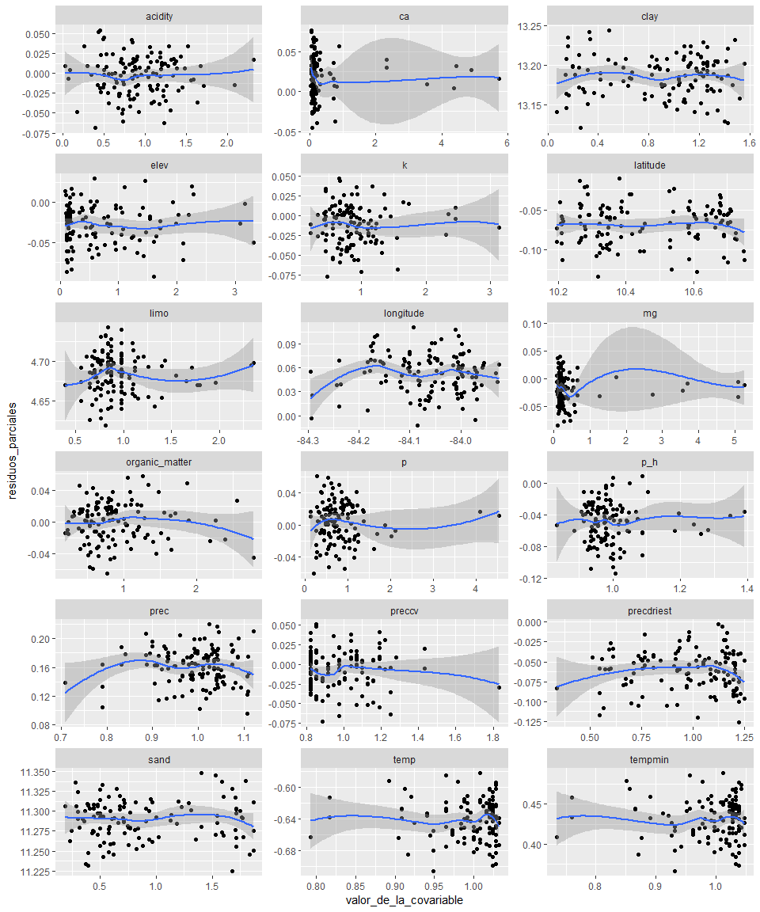

```r
#Paquetes
library(kableExtra)
library(lattice)
library(tidyverse)
library(PerformanceAnalytics)
library(janitor)
library(ggbiplot)
library(sp)
library(raster)
library(dismo)
library(splancs)
library(INLA)
library(reshape)
library(gstat)
library(ggmap)
source("C:/tesis_catie/Calderon_CATIE/scripts/functions/HighstatLibV10.R")
```


```r
#Load data
dredun_eff <- read.csv("C:/tesis_catie/Calderon_CATIE/data/resultados_csv/data_indices_eff_redundancy.csv", header=T)
dredun_eff <- clean_names(dredun_eff) %>% 
  dplyr::select(-c(d, x))

dparcelas <- read.csv("C:/tesis_catie/Calderon_CATIE/data/clean/data_posicion_parcelas.csv", header = T)
dparcelas <- clean_names(dparcelas)

denvi_est <- read.csv("C:/tesis_catie/Calderon_CATIE/data/clean/data_enviroment_worldclim_clean.csv", header = T, row.names = 1)
denvi_est <- denvi_est %>%
  clean_names() %>% 
    dplyr::select(-c(crtm_90_x,crtm_90_y,forest_type, slope_per,slope_deg))

#Standarize data
denvi_est <-  scale(denvi_est,center = F, scale = T )

#scale(denvi_est,center = F, scale = T )
denvi_est <- rownames_to_column(as.data.frame(denvi_est),var= "plot") %>% 
  dplyr::select(-tempsd )
```

#Join Data sets


```r
dfull  <- left_join(dredun_eff, dparcelas,by=c("plot") ) %>% 
  left_join(.,denvi_est, by=c("plot") )

#Ordenar columnas
dfull_est <- dfull %>% dplyr::select(plot, forest_type,longitude,latitude,crtm_90_x,crtm_90_y,n,redundancy,u , q, everything()) 
glimpse(dfull_est)
```

```
## Observations: 127
## Variables: 26
## $ plot           <chr> "F10P1", "F10P2", "F10P3", "F10P4", "F11P1", "F...
## $ forest_type    <fct> P.macroloba, P.macroloba, P.macroloba, P.macrol...
## $ longitude      <dbl> -84.13907, -84.14223, -84.14690, -84.14741, -84...
## $ latitude       <dbl> 10.58515, 10.58890, 10.58497, 10.58649, 10.7037...
## $ crtm_90_x      <dbl> 484782.4, 484435.9, 483925.3, 483869.0, 479984....
## $ crtm_90_y      <dbl> 1170464, 1170880, 1170445, 1170614, 1183586, 11...
## $ n              <int> 12, 19, 13, 15, 21, 20, 17, 15, 13, 16, 15, 16,...
## $ redundancy     <dbl> 0.8725523, 0.8979476, 0.8711145, 0.8523120, 0.8...
## $ u              <dbl> 0.12744773, 0.10205244, 0.12888546, 0.14768803,...
## $ q              <dbl> 0.10335379, 0.09021181, 0.09405633, 0.09045544,...
## $ sand           <dbl> 0.8160510, 0.6767592, 0.9087578, 0.5842842, 0.5...
## $ limo           <dbl> 1.2102600, 1.0981989, 1.5458830, 1.6579441, 0.7...
## $ clay           <dbl> 0.8581029, 1.0172463, 0.6594220, 0.8978391, 1.2...
## $ p_h            <dbl> 1.0214836, 0.9562825, 1.2388205, 1.2822879, 0.9...
## $ acidity        <dbl> 2.31038300, 1.08199755, 0.07001161, 0.49962828,...
## $ ca             <dbl> 2.32213037, 0.32208520, 5.72480464, 3.53774225,...
## $ mg             <dbl> 1.7259923, 0.4432876, 3.5651645, 2.7257474, 0.2...
## $ k              <dbl> 2.4588529, 0.6705962, 3.1294491, 1.1176604, 0.5...
## $ p              <dbl> 0.6014830, 0.9623727, 0.5413347, 0.3909639, 0.9...
## $ organic_matter <dbl> 0.5100446, 0.7900463, 0.5344431, 0.2207482, 0.7...
## $ elev           <dbl> 0.3662337, 0.6278292, 0.5149301, 0.6058001, 0.1...
## $ prec           <dbl> 0.9986238, 1.0735019, 1.0435506, 1.0203384, 0.9...
## $ precdriest     <dbl> 0.9154796, 1.0164516, 0.9760628, 0.9760628, 0.5...
## $ preccv         <dbl> 1.0069702, 0.9764559, 1.0069702, 1.0069702, 1.1...
## $ temp           <dbl> 1.0078616, 0.9919898, 0.9959578, 0.9999257, 1.0...
## $ tempmin        <dbl> 1.0075683, 0.9923789, 0.9974420, 0.9974420, 1.0...
```


```r
#Data sets que se van a utilizar
dredundancy_eff <- dfull_est %>%
  dplyr::select(-u,-q)
  
duniqueness_eff <- dfull_est %>%
  dplyr::select(-redundancy,-q)

drao_eff <- dfull_est %>%
  dplyr::select(-u,-redundancy )
```

#Modelo lineal con componente espacial: redundancy 


```r
pca_envi <- prcomp(denvi_est[,2:17], scale. = TRUE)
pca_envi$rotation
```

```
##                         PC1          PC2          PC3          PC4
## sand            0.393545515 -0.010648600 -0.127434166 -0.062165161
## limo           -0.076501109  0.369738400 -0.046259626  0.116201791
## clay           -0.385315347 -0.088629718  0.143909352  0.032804714
## p_h             0.009805039  0.429382201  0.060508588  0.350247216
## acidity        -0.203672967 -0.193852808 -0.087377922 -0.458242147
## ca             -0.053873106  0.467663293  0.014774775 -0.003198134
## mg             -0.071473835  0.473245265  0.016962542 -0.021687794
## k               0.113815815  0.343590365 -0.006979468 -0.409062964
## p              -0.065129853  0.250825131 -0.001256333 -0.618840292
## organic_matter  0.360352707 -0.075550656  0.075534465 -0.290993398
## elev            0.407882959  0.002696737  0.007802263  0.058969202
## prec            0.040832874  0.049041417 -0.530257734  0.081153925
## precdriest      0.058952497  0.021891194 -0.572204282  0.020419308
## preccv          0.054613659  0.025805511  0.560617459 -0.005651417
## temp           -0.399187951 -0.015723878 -0.099108380 -0.032968198
## tempmin        -0.400396107 -0.015055382 -0.102890390 -0.042951518
##                         PC5          PC6          PC7         PC8
## sand           -0.117899925 -0.130679639  0.007675524  0.22376983
## limo            0.497806938  0.526665740 -0.453140242  0.24049847
## clay           -0.012459137 -0.007010558  0.114144761 -0.29561436
## p_h            -0.075470180 -0.017075081  0.260803010  0.06047829
## acidity         0.610151497  0.025086542  0.353790764 -0.09242962
## ca             -0.006110828 -0.270256584  0.165420598 -0.18145441
## mg             -0.035385097  0.022684843  0.140850905 -0.11477837
## k               0.239346291 -0.574434378 -0.201236640  0.09357364
## p              -0.461677823  0.475404925  0.056918089 -0.13149965
## organic_matter -0.106619348  0.061027392 -0.080501505  0.33286649
## elev            0.127525820  0.093799962  0.015692065 -0.32482350
## prec            0.039219967  0.116393247  0.565060328  0.39755153
## precdriest     -0.014838798  0.040096661 -0.089196375 -0.32774844
## preccv          0.102281528  0.116300927  0.356921940  0.24290258
## temp           -0.155847914 -0.132303886 -0.117772475  0.33340395
## tempmin        -0.155854191 -0.127788652 -0.149035339  0.26156138
##                         PC9          PC10        PC11        PC12
## sand            0.346951962  0.2712134211 -0.22154405  0.04418912
## limo           -0.065121167 -0.0210206952 -0.04382398  0.05641115
## clay           -0.340332332 -0.2740438772  0.24028709 -0.06087769
## p_h             0.268552317  0.2142471203  0.69032520  0.12698515
## acidity         0.418101824  0.0549300693  0.12274684  0.01277598
## ca              0.101817742 -0.3050416773 -0.34051315  0.30123127
## mg              0.250566584 -0.2674529268 -0.25562735 -0.50295063
## k              -0.415745671  0.1793286358  0.18173992 -0.02186529
## p              -0.089614148  0.2557468851  0.05624600  0.05547813
## organic_matter  0.115484482 -0.7114900103  0.34396036  0.02489042
## elev           -0.107271320  0.0572951517  0.02972542 -0.15730774
## prec           -0.415265907 -0.0442766688 -0.06228446 -0.16408673
## precdriest      0.005308574 -0.1675921876  0.02695378  0.57901562
## preccv         -0.176258065  0.0169331893 -0.23869759  0.48153989
## temp            0.100001788  0.0004986624 -0.01222072  0.08340524
## tempmin         0.142187717  0.0004306944 -0.03510695  0.03505879
##                        PC13          PC14         PC15          PC16
## sand            0.014864931  0.0208074129 -0.014029901 -7.056753e-01
## limo           -0.098138846  0.0062992189  0.004643001 -1.842723e-01
## clay            0.011171127 -0.0229739085  0.013443615 -6.841536e-01
## p_h             0.007209883 -0.0082612277  0.026846293 -2.737942e-05
## acidity        -0.042098100 -0.0408662690  0.013912543  1.021714e-05
## ca             -0.574490227 -0.0493897845  0.047004612 -6.367722e-05
## mg              0.528845971 -0.0018603714 -0.055602827  4.506698e-05
## k               0.159877074  0.0309063513 -0.008372191 -8.194870e-06
## p              -0.101286849 -0.0149027729  0.005672018  1.505925e-05
## organic_matter -0.035013038 -0.0258559032  0.036130076 -2.732084e-05
## elev           -0.030494791 -0.7021317916  0.406115721 -3.926121e-06
## prec           -0.091527275  0.0009939587  0.046412980  1.333644e-05
## precdriest      0.431754695  0.0081992610 -0.020675131 -2.378756e-05
## preccv          0.368999213 -0.0885301651  0.086234269 -3.057826e-06
## temp            0.043690142 -0.7008588121 -0.390451803 -1.669024e-04
## tempmin         0.087450190  0.0295753805  0.815216089  1.165644e-04
```

```r
summary(pca_envi)
```

```
## Importance of components:
##                           PC1    PC2    PC3    PC4     PC5    PC6     PC7
## Standard deviation     2.3840 2.0223 1.6850 1.0733 0.85528 0.6811 0.54251
## Proportion of Variance 0.3552 0.2556 0.1774 0.0720 0.04572 0.0290 0.01839
## Cumulative Proportion  0.3552 0.6108 0.7883 0.8603 0.90598 0.9350 0.95337
##                            PC8     PC9   PC10    PC11    PC12    PC13
## Standard deviation     0.49554 0.43715 0.3752 0.31670 0.16779 0.16579
## Proportion of Variance 0.01535 0.01194 0.0088 0.00627 0.00176 0.00172
## Cumulative Proportion  0.96872 0.98067 0.9895 0.99573 0.99749 0.99921
##                           PC14    PC15      PC16
## Standard deviation     0.09148 0.06528 0.0001335
## Proportion of Variance 0.00052 0.00027 0.0000000
## Cumulative Proportion  0.99973 1.00000 1.0000000
```

```r
ggbiplot(pca_envi, obs.scale = 3, var.scale = 3,
  groups = dfull_est$forest_type, ellipse = TRUE) +
  scale_color_discrete(name = '') +
  theme(legend.direction = 'horizontal', legend.position = 'top')+
  theme_grey()
```

<!-- -->


##Outliers

```r
MyVar <- c("longitude", "latitude", "sand","clay","limo",
           "p_h","acidity","ca","mg","k","p","organic_matter",
           "elev","prec","precdriest","preccv","temp","tempmin")

Mydotplot(dredundancy_eff[,MyVar])
```

<!-- -->

```r
dredundancy_eff[dredundancy_eff$preccv>50,]
```

```
##  [1] plot           forest_type    longitude      latitude      
##  [5] crtm_90_x      crtm_90_y      n              redundancy    
##  [9] sand           limo           clay           p_h           
## [13] acidity        ca             mg             k             
## [17] p              organic_matter elev           prec          
## [21] precdriest     preccv         temp           tempmin       
## <0 rows> (or 0-length row.names)
```

```r
dredundancy_eff[dredundancy_eff$p>10,]
```

```
##  [1] plot           forest_type    longitude      latitude      
##  [5] crtm_90_x      crtm_90_y      n              redundancy    
##  [9] sand           limo           clay           p_h           
## [13] acidity        ca             mg             k             
## [17] p              organic_matter elev           prec          
## [21] precdriest     preccv         temp           tempmin       
## <0 rows> (or 0-length row.names)
```


##Collinearity


```r
corvif(dredundancy_eff[,MyVar])
```

```
## 
## 
## Variance inflation factors
## 
##                        GVIF
## longitude      3.001447e+00
## latitude       1.730230e+01
## sand           2.806971e+07
## clay           2.638356e+07
## limo           1.914008e+06
## p_h            6.825858e+00
## acidity        2.647557e+00
## ca             1.947792e+01
## mg             2.398472e+01
## k              3.728954e+00
## p              2.320407e+00
## organic_matter 6.038993e+00
## elev           1.655010e+02
## prec           8.508189e+00
## precdriest     2.717060e+01
## preccv         1.948573e+01
## temp           1.159692e+02
## tempmin        1.662056e+02
```


##Relationships

```r
MyMultipanel.ggp2(Z = dredundancy_eff, 
                  varx = MyVar, 
                  vary = "redundancy", 
                  ylab = "Response variable: Redundancia",
                              addSmoother = TRUE,
                              addRegressionLine = FALSE,
                              addHorizontalLine = FALSE)
```

<!-- -->


```r
MyVar2 <- c("longitude", "latitude",
           "p_h","acidity","k","p","organic_matter"
           ,"prec","temp")
corvif(dredundancy_eff[,MyVar2])
```

```
## 
## 
## Variance inflation factors
## 
##                    GVIF
## longitude      1.595394
## latitude       2.828128
## p_h            2.881416
## acidity        2.119771
## k              1.792470
## p              1.641178
## organic_matter 3.945150
## prec           1.409227
## temp           4.826962
```


##Modelo inicial 


```r
I1 <- inla(redundancy ~
             longitude +
             latitude +
             sand +
             limo +
             clay +
             p_h + 
             acidity + 
             ca +
             mg + 
             k +
             p + 
             organic_matter + 
             elev +
             prec +
             precdriest +
             preccv +
             tempmin +
             temp, 
          family = "gaussian",
           control.compute = list(
                               dic = TRUE,
                               waic = TRUE),
          control.predictor = list(compute = TRUE),
          data = dredundancy_eff 
          )
```


##Pearson residuals
Ver falta de hetereogenidad

```r
ExpY <- I1$summary.fitted.values[,"mean"]
E1   <- (dredundancy_eff$redundancy - ExpY) / sqrt(ExpY)

dredundancy_eff$E1 <- E1
MyMultipanel.ggp2(Z = dredundancy_eff, 
                  varx = MyVar, 
                  vary = "E1", 
                  ylab = "Pearson residuals",
                  addSmoother = TRUE,
                  addRegressionLine = FALSE,
                  addHorizontalLine = TRUE)
```

<!-- -->


#Partial residuals

```r
#obtener betas
betas <- I1$summary.fixed[,c("mean", "sd")]

betas <- (betas %>% rownames_to_column("variable") %>% 
            filter(!variable %in% "(Intercept)") %>% 
            dplyr::select(-sd))


# 1-Separar el ser de datos en una lista por variable
betas_list <- split(betas, betas$variable)

## 2-Crear una lista para almacenar 
partial_resid <- list()


##Loop
for (i in seq_along(names(betas_list))){
  
#  #Residuos de pearson + Betas = residuos parciales
  residuos_parciales <-  E1 + as.numeric(betas_list[[i]][2]) 
  
  name_var <- names(betas_list[i])
  
#  #Resultado
    data <- data.frame(residuos_parciales, name_var)
    partial_resid[[i]] <- data 

}


residuos_parciales  <-  do.call("rbind", partial_resid)


covariables <- dredundancy_eff %>% 
  dplyr::select(
    -c(plot,forest_type,crtm_90_x,crtm_90_y,n, redundancy,E1)) %>%
  gather(colnames(.),  key = "name_var", value = "valor_de_la_covariable") %>% 
  arrange(name_var)

dpart_resid <- cbind(residuos_parciales, covariables) 
dpart_resid2 <- dpart_resid[,-2]


ggplot(data = dpart_resid2) + 
  geom_point(aes(x=valor_de_la_covariable,y= residuos_parciales)) +
  facet_wrap(~name_var,scales = "free", ncol = 6) + 
  geom_smooth(data = dpart_resid2, 
              aes(x=valor_de_la_covariable,y= residuos_parciales), method = loess)
```

<!-- -->


```r
#Xkm <- dredundancy_eff$crtm_90_x / 1000
#Ykm <- dredundancy_eff$crtm_90_y / 1000
#
#
#Loc <- cbind(Xkm, Ykm)
#D <- dist(Loc)
#par(mfrow = c(1,2), mar = c(5,5,2,2), cex.lab = 1.5)
#hist(D, 
#     freq = TRUE,
#     main = "", 
#     xlab = "Distance between sites (km)",
#     ylab = "Frequency");text(2, 35000, "A", cex = 1.5)
#
#plot(x = sort(D), 
#     y = (1:length(D))/length(D), 
#     type = "l",
#     xlab = "Distance between sites (km)",
#     ylab = "Cumulative proportion")
#text(2, 1, "B", cex = 1.5)
```


```r
#MyData      <- data.frame(E1 = E1, 
#                          Xkm = Xkm, 
#                          Ykm = Ykm)
#
#coordinates(MyData)    <- c("Xkm", "Ykm")
#Vario <- variogram(object = E1 ~ Xkm + Ykm, 
#                    data = MyData, 
#                    cressie = TRUE, 
#                    cutoff = 2.9,
#                    width = 0.2)
#
#p <- ggplot(data = Vario, aes(x = dist, y = gamma))
#p <- p + geom_point()
#p <- p + geom_smooth(method = "gam", 
#                     formula = y ~ s(x, bs = "cs"),
#                     colour = "black") 
##p <- p + ylim(0,1)
#p <- p + theme(text = element_text(size = 15)) 
#p <- p + xlab("Distance (km)") + ylab("Sample variogram") 
#p
```


```r
# We need a grid on top of our sampling points
#ConvHull <- inla.nonconvex.hull(Loc)
#mesh0 <- inla.mesh.2d(boundary = ConvHull, 
#                      max.edge = c(200))
#
#mesh0$n
```

##Mesh


```r
#Xkm <- dredundancy_eff$crtm_90_x / 1000
#Ykm <- dredundancy_eff$crtm_90_y / 1000
#Loc <- cbind(Xkm, Ykm)
#
#ConvHull <- inla.nonconvex.hull(Loc)
#mesh1 <- inla.mesh.2d(boundary = ConvHull, 
#                      max.edge = c(1,1),
#                      cutoff = 0)
#
#mesh2 <- inla.mesh.2d(boundary = ConvHull, 
#                      max.edge = c(2,2),
#                      cutoff = 0)
#
#mesh3 <- inla.mesh.2d(boundary = ConvHull, 
#                      max.edge = c(4,4),
#                      cutoff = 0)
#
#
#mesh4 <- inla.mesh.2d(boundary = ConvHull, 
#                      max.edge = c(8,8),
#                      cutoff = 0)
#
#mesh5 <- inla.mesh.2d(boundary = ConvHull, 
#                      max.edge = c(16,16),
#                      cutoff = 0)
#
#mesh1$n
#mesh2$n
#mesh3$n
#mesh4$n
#mesh5$n
```


##Projector matrix


```r
#A2 <- inla.spde.make.A(mesh1,loc=Loc)
#dim(A2)
```

##SPDE


```r
#spde <- inla.spde2.matern(mesh1, alpha = 2)
```


##Spatial field

```r
#w_index <- inla.spde.make.index(
#                   name    = 'w', 
#                   n.spde  = spde$n.spde,
#                   n.group = 1,
#                   n.repl  = 1)
```

##Stack 

```r
#N <- nrow(dredundancy_eff)
#X <- data.frame(Intercept       = rep(1, N), 
#                p_h             = dredundancy_eff$p_h  ,   
#                acidity         = dredundancy_eff$acidity,
#                k               = dredundancy_eff$k,
#                p               = dredundancy_eff$p,
#                organic_matter  = dredundancy_eff$organic_matter, 
#                prec            = dredundancy_eff$prec,
#                temp            = dredundancy_eff$temp
#                )
```

###Tell INLA at which mesh points the covariates are sampled

```r
#stk2 <- inla.stack(
#             tag  = "Fit",
#             data = list(y = dredundancy_eff$redundancy),  
#	           A    = list(A2, 1),                      
#	           effects = list(                 
#	              w = w_index,           #Spatial field  
#	              X = as.data.frame(X)))  #Covariates
```


###Modelo sin componente espacial

```r
#f2 <- y  ~ -1 + Intercept + p_h + acidity + k + p + organic_matter + prec + temp
#I2 <- inla(f2,
#             family = "gaussian", 
#             data=inla.stack.data(stk2),
#             control.compute = list(dic = TRUE, waic = TRUE),
#             control.predictor = list(A = inla.stack.A(stk2)))
```

###Modelo con componente espacial

```r
#f3 <- y  ~ -1 + Intercept + p_h + acidity + k + p + organic_matter + prec + temp +f(w, model=spde)
#
#
#I3 <- inla(f3,
#             family = "gaussian", 
#             data=inla.stack.data(stk2),
#             control.compute = list(dic = TRUE, waic = TRUE),
#             control.predictor = list(A = inla.stack.A(stk2)))
```


```r
#f4 <- y  ~ -1 + Intercept + f(w, model=spde)
#
#I4 <- inla(f4,
#             family = "gaussian", 
#             data=inla.stack.data(stk2),
#             control.compute = list(dic = TRUE, waic = TRUE),
#             control.predictor = list(A = inla.stack.A(stk2)))
```


```r
#dic2  <- c(I2$dic$dic, 
#           I3$dic$dic,
#           I4$dic$dic)
#
#waic2 <- c(I2$waic$waic, 
#           I3$waic$waic,
#           I4$waic$waic)
#
#Z     <- cbind(dic2, waic2)
#rownames(Z) <- c("Gaussian GLM",  "Gaussian GLM + SPDE","Sin Covariables")
#Z
```


```r
#Combined <- rbind(I2$summary.fixed[, c("mean", "0.025quant", "0.975quant")],
#                  I3$summary.fixed[, c("mean", "0.025quant", "0.975quant")]
#                 )
#
#Combined$WhichModel <- rep(c("GLM", "spatial GLM"), each = 8)
#Combined$WhichVariable <- rep(rownames(I2$summary.fixed), 2)
#colnames(Combined) <- c("Mean", "Lo", "Up", "WhichModel", "WhichVariable")
#Combined
```


```r
# Fitted values and Pearson residuals I2
#IndexFit <- inla.stack.index(stk2, tag = "Fit")$data
#
#mu2 <- I2$summary.fitted.values[IndexFit, "mean"]
#E2 <- (dredundancy_eff$redundancy - mu2) / sqrt(mu2)
#Dispersion2 <- sum(E2^2) / (N - 8)
#Dispersion2
```


```r
# Fitted values and Pearson residuals I3
#mu3 <- I3$summary.fitted.values[IndexFit, "mean"]
#E3 <- (dredundancy_eff$redundancy - mu3) / sqrt(mu3)
#sum(E3^2) / (N - 8)
#Dispersion3 <- sum(E3^2) / (N - 10)
#Dispersion3
```


```r
# Variogram model I3
#MyData3 <- data.frame(E3 = E3, 
#                      Xkm , 
#                      Ykm )
#
#coordinates(MyData3) <- c("Xkm", "Ykm")
#
#Vario3 <- variogram(E3 ~ 1, 
#                MyData3, 
#                cressie = TRUE, 
#                cutoff = 3,
#                width = 0.2)
#
#VarioComb <- rbind(Vario, Vario3)
#
#p <- ggplot(data = Vario3, aes(x = dist, y = gamma))
#p <- p + geom_point()
#p <- p + geom_smooth(method = "gam", 
#                     formula = y ~ s(x, bs = "cs"),
#                     colour = "black") 
##p <- p + ylim(0,1)
#p <- p + theme(text = element_text(size = 15)) 
#p <- p + xlab("Distance (km)") + ylab("Sample variogram") 
##p <- p + facet_grid(~ID)
#p
```


```r
#w.pm <- I4$summary.random$w$mean  
#w.sd <- I4$summary.random$w$sd
#length(w.pm)
#
#wproj <- inla.mesh.projector(mesh1) 
#w.pm100_100 <- inla.mesh.project(wproj, w.pm)
#w.sd100_100 <- inla.mesh.project(wproj, w.sd)
#
#
#Grid <- expand.grid(Xkm = wproj$x, 
#                    Ykm = wproj$y)
#Grid$w.pm <- as.vector(w.pm100_100)     
#Grid$w.sd <- as.vector(w.sd100_100)               
#
#col.l <- colorRampPalette(c('red', 'green'))(50) 
#col.r <- rev(rainbow(30, alpha = 0.35))
#
#plot.wpm <- levelplot(w.pm ~ Xkm * Ykm,
#          data = Grid, 
#          aspect = "iso",
#          col.regions = col.r,
#          scales = list(draw = TRUE),
#          xlab = list("X-coordinates (km)", cex = 1.5),
#          ylab = list("Y-coordinates (km)", cex = 1.5),
#          main = list("Posterior mean spatial random field", cex = 1.5))
#plot.wpm
```


```r
#levelplot(w.sd ~ Xkm * Ykm,
#          col.regions = col.l,
#          data = Grid, 
#          scales = list(draw = TRUE),
#          xlab = list("X-coordinates (km)", cex = 1.5),
#          ylab = list("Y-coordinates (km)", cex = 1.5),
#          main = list("Posterior sd spatial random field", cex = 1.5))
#
```


```r
# Alternative code
#GridNoNA  <- na.exclude(Grid)  
#col.y <- colorRampPalette(c('red', 'yellow'))(50) 
#
#glgmap <- ggplot(GridNoNA, aes(x = Xkm, y = Ykm)) +
#    geom_raster(aes(fill = w.pm)) + 
#    scale_fill_gradientn(colours = col.y) +
#    coord_fixed()
#glgmap
#
#  
#u.proj <- inla.mesh.projector(mesh = mesh1, loc = Loc)
#u.mean <- inla.mesh.project(u.proj, I3$summary.random$w$mean)
#dredundancy_eff$u.mean <- u.mean
#dredundancy_eff$Col    <- abs(u.mean)  #c(0,1)[as.numeric(u.mean > 0) + 1]
#
#glgmap +
#  geom_point(data = dredundancy_eff, 
#             aes(Xkm, Ykm, 
#               colour = Col
#                ),
#             size = 2.5,
#             show.legend = FALSE) +
#             scale_shape_manual(values=c(16, 1)) +
#             #scale_color_gradient(low="black", high="green") +
#xlab("X-coordinates (km)") + ylab("Y-coordinates (km)")+
#theme(text = element_text(size=15))#, legend.position="none") 
```

