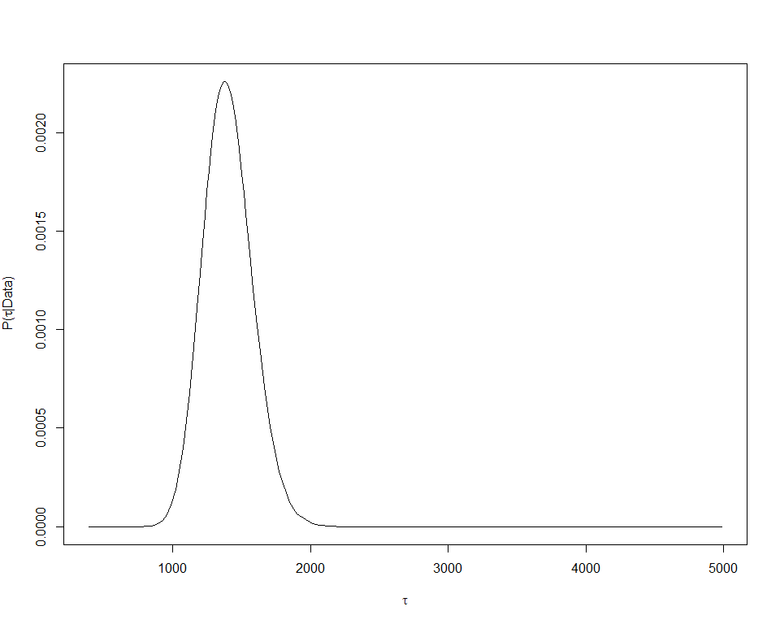
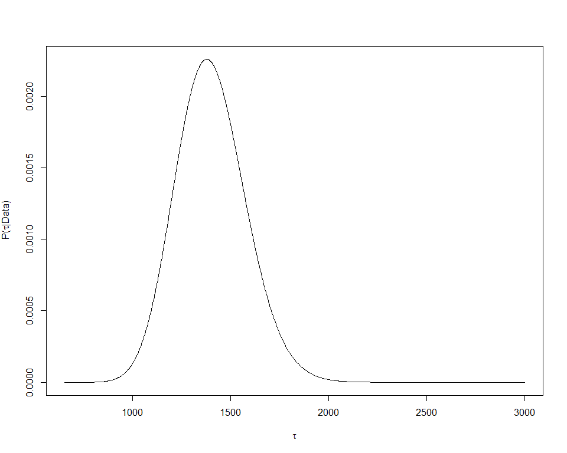

```r
#Paquetes
library(kableExtra)
library(lattice)
library(tidyverse)
library(PerformanceAnalytics)
library(janitor)
source("C:/tesis_catie/Calderon_CATIE/scripts/functions/HighstatLibV10.R")
library(ggbiplot)
library(GGally)
library(INLA)
```

#Objetivo 
Realizar un modelo linear multiple para los datos de Redundancia funcional
Ref: Capitulo 8 Zuur et al.


```r
#Load data
dredun_eff <- read.csv("C:/tesis_catie/Calderon_CATIE/data/resultados_csv/data_indices_eff_redundancy.csv", header=T)
dredun_eff <- clean_names(dredun_eff) %>% 
  select(-c(d))

dparcelas <- read.csv("C:/tesis_catie/Calderon_CATIE/data/clean/data_posicion_parcelas.csv", header = T)
dparcelas <- clean_names(dparcelas)

denv <- read.csv("C:/tesis_catie/Calderon_CATIE/data/clean/data_enviroment_worldclim_clean.csv", header = T, row.names = 1)
denv <- denv %>%
  clean_names() %>% 
    select(-c(crtm_90_x,crtm_90_y,forest_type, slope_per,slope_deg))

#Standarize data
denvi_est <-  scale(denv,center = F, scale = T )
denvi_est <- rownames_to_column(as.data.frame(denvi_est),var= "plot")
```


#Join Data sets


```r
dfull  <- left_join(dredun_eff, dparcelas,by=c("plot") ) %>% 
  left_join(.,denvi_est, by=c("plot") )
```

```
## Warning: Column `plot` joining factor and character vector, coercing into
## character vector
```

```r
#Ordenar columnas
dfull_est <- dfull %>% select(plot, forest_type,longitude,latitude,crtm_90_x,crtm_90_y,n,redundancy,u , q, everything()) 
glimpse(dfull_est)
```

```
## Observations: 127
## Variables: 27
## $ plot           <chr> "F10P1", "F10P2", "F10P3", "F10P4", "F11P1", "F...
## $ forest_type    <fct> P.macroloba, P.macroloba, P.macroloba, P.macrol...
## $ longitude      <dbl> -84.13907, -84.14223, -84.14690, -84.14741, -84...
## $ latitude       <dbl> 10.58515, 10.58890, 10.58497, 10.58649, 10.7037...
## $ crtm_90_x      <dbl> 484782.4, 484435.9, 483925.3, 483869.0, 479984....
## $ crtm_90_y      <dbl> 1170464, 1170880, 1170445, 1170614, 1183586, 11...
## $ n              <int> 12, 19, 13, 15, 21, 20, 17, 15, 13, 16, 15, 16,...
## $ redundancy     <dbl> 0.8725523, 0.8979476, 0.8711145, 0.8523120, 0.8...
## $ u              <dbl> 0.12744773, 0.10205244, 0.12888546, 0.14768803,...
## $ q              <dbl> 0.10335379, 0.09021181, 0.09405633, 0.09045544,...
## $ sand           <dbl> 0.8160510, 0.6767592, 0.9087578, 0.5842842, 0.5...
## $ limo           <dbl> 1.2102600, 1.0981989, 1.5458830, 1.6579441, 0.7...
## $ clay           <dbl> 0.8581029, 1.0172463, 0.6594220, 0.8978391, 1.2...
## $ p_h            <dbl> 1.0214836, 0.9562825, 1.2388205, 1.2822879, 0.9...
## $ acidity        <dbl> 2.31038300, 1.08199755, 0.07001161, 0.49962828,...
## $ ca             <dbl> 2.32213037, 0.32208520, 5.72480464, 3.53774225,...
## $ mg             <dbl> 1.7259923, 0.4432876, 3.5651645, 2.7257474, 0.2...
## $ k              <dbl> 2.4588529, 0.6705962, 3.1294491, 1.1176604, 0.5...
## $ p              <dbl> 0.6014830, 0.9623727, 0.5413347, 0.3909639, 0.9...
## $ organic_matter <dbl> 0.5100446, 0.7900463, 0.5344431, 0.2207482, 0.7...
## $ elev           <dbl> 0.3662337, 0.6278292, 0.5149301, 0.6058001, 0.1...
## $ prec           <dbl> 0.9986238, 1.0735019, 1.0435506, 1.0203384, 0.9...
## $ precdriest     <dbl> 0.9154796, 1.0164516, 0.9760628, 0.9760628, 0.5...
## $ preccv         <dbl> 1.0069702, 0.9764559, 1.0069702, 1.0069702, 1.1...
## $ temp           <dbl> 1.0078616, 0.9919898, 0.9959578, 0.9999257, 1.0...
## $ tempmin        <dbl> 1.0075683, 0.9923789, 0.9974420, 0.9974420, 1.0...
## $ tempsd         <dbl> 3.2815711, 0.9528710, 0.9577326, 0.9577326, 0.9...
```


#Data exploration
##PCA sin variables de respuesta


```r
ncol(denvi_est)
```

```
## [1] 18
```

```r
pca_envi <- prcomp(denvi_est[,2:18], scale. = TRUE)
ggbiplot(pca_envi, obs.scale = 3, var.scale = 3,
  groups = dfull_est$forest_type, ellipse = TRUE) +
  scale_color_discrete(name = '') +
  theme(legend.direction = 'horizontal', legend.position = 'top')+
  theme_grey()
```

<!-- -->


##Correlaciones Redundancy vrs Environment


```r
chart.Correlation(dfull_est[,c(8,3,4, 11:27)], histogram=TRUE, pch="+") 
```

<!-- -->

##VIFs

```r
corvif(dfull_est[,c(3,4,11:27)])
```

```
## 
## 
## Variance inflation factors
## 
##                        GVIF
## longitude      3.003471e+00
## latitude       1.730260e+01
## sand           2.809900e+07
## limo           1.915980e+06
## clay           2.641092e+07
## p_h            6.828257e+00
## acidity        3.075751e+00
## ca             1.956259e+01
## mg             2.402243e+01
## k              3.826313e+00
## p              2.402285e+00
## organic_matter 6.139815e+00
## elev           1.663644e+02
## prec           8.514604e+00
## precdriest     2.724207e+01
## preccv         1.958862e+01
## temp           1.164389e+02
## tempmin        1.680260e+02
## tempsd         1.662627e+00
```

##Covariables que se van a eliminar 


```r
dredundancy_eff <- dfull_est %>% 
  select(-c(tempsd, mg, ca, p, elev, sand, prec, preccv, tempmin, limo, p_h, u,q, crtm_90_x,crtm_90_y ))
```

+ __tempsd__. Debido a que no tiene relacion con redundancy
+ __mg__. Debido a que no tiene relacion con redundancy
+ __ca__. Debido a que no tiene relacion con redundancy
+ __p__. Debido a que no tiene relacion con redundancy
+ __elev__. Debido a que tiene alto VIF, alta correlacion con Latitude y en el pca tiene la misma direccion que organic matter y sand 
+ __sand__. Debido a que tiene alto VIF  y en el pca tiene la misma direccion que organic matter.
+ __prec__. alta correlacion con predriest y en el pca tiene la misma direccion que prec.
+ __preccv__. Alta correlacion con predriest, en el pca tiene la misma direccion que prec y tiene poca relacion con redundancia.
+ __limo__. Tiene poca relacion con redundancia.
+ __pH__. Tiene poca relacion con redundancia.


###VIFs sin variables eliminadas 

```r
ncol(dredundancy_eff)
```

```
## [1] 12
```

```r
corvif(dredundancy_eff[,c(3,4,7:12)])
```

```
## 
## 
## Variance inflation factors
## 
##                    GVIF
## longitude      1.730507
## latitude       4.888690
## clay           6.824637
## acidity        1.420020
## k              1.273537
## organic_matter 3.456373
## precdriest     4.690756
## temp           5.962413
```


##Cleveland plot


```r
Mydotplot(dredundancy_eff[, 8:12])
```

<!-- -->


#Model formulation


$$redundancia \sim N(\mu_i, \sigma^2)$$

$$E(redundancia)=\mu_i ,var(redundancia)=\sigma^2$$

$$\mu_i= \beta_1*foresttype+\beta_2*long+\beta_3*lat+\beta_4*clay+\beta_5*acidity$$  $$+\beta_6*k+\beta_7*organicmatter+\beta_8*precdriest+\beta_9*temp + \beta_{10}*n $$


```r
glimpse(dredundancy_eff)
```

```
## Observations: 127
## Variables: 12
## $ plot           <chr> "F10P1", "F10P2", "F10P3", "F10P4", "F11P1", "F...
## $ forest_type    <fct> P.macroloba, P.macroloba, P.macroloba, P.macrol...
## $ longitude      <dbl> -84.13907, -84.14223, -84.14690, -84.14741, -84...
## $ latitude       <dbl> 10.58515, 10.58890, 10.58497, 10.58649, 10.7037...
## $ n              <int> 12, 19, 13, 15, 21, 20, 17, 15, 13, 16, 15, 16,...
## $ redundancy     <dbl> 0.8725523, 0.8979476, 0.8711145, 0.8523120, 0.8...
## $ clay           <dbl> 0.8581029, 1.0172463, 0.6594220, 0.8978391, 1.2...
## $ acidity        <dbl> 2.31038300, 1.08199755, 0.07001161, 0.49962828,...
## $ k              <dbl> 2.4588529, 0.6705962, 3.1294491, 1.1176604, 0.5...
## $ organic_matter <dbl> 0.5100446, 0.7900463, 0.5344431, 0.2207482, 0.7...
## $ precdriest     <dbl> 0.9154796, 1.0164516, 0.9760628, 0.9760628, 0.5...
## $ temp           <dbl> 1.0078616, 0.9919898, 0.9959578, 0.9999257, 1.0...
```

##Model R-INLA

```r
mnull <- inla(redundancy ~ longitude + latitude,
           family = "gaussian",
           control.predictor = list(
             compute = TRUE,
             quantiles = c(0.025, 0.975)
           ),
           control.compute = list(dic = TRUE,
                                  waic =TRUE),
           data = dredundancy_eff)
 
m1 <- inla(redundancy ~ forest_type ,
           family = "gaussian",
           control.predictor = list(
             compute = TRUE,
             quantiles = c(0.025, 0.975)
           ),
           control.compute = list(dic = TRUE,
                                  waic =TRUE),
           data = dredundancy_eff)
 


m2 <- inla(redundancy ~ forest_type + clay ,
           family = "gaussian",
           control.predictor = list(
             compute = TRUE,
             quantiles = c(0.025, 0.975)
           ),
           control.compute = list(dic = TRUE,
                                  waic =TRUE),
           data = dredundancy_eff)

mcompleto <- inla(redundancy ~ forest_type + longitude + latitude + clay + acidity +
             k + organic_matter + precdriest + temp,
           family = "gaussian",
           control.predictor = list(
             compute = TRUE,
             quantiles = c(0.025, 0.975)
           ),
           control.compute = list(dic = TRUE,
                                  waic =TRUE),
           data = dredundancy_eff)

mcompleto_interac <- inla(redundancy ~ forest_type * longitude +  forest_type*latitude + forest_type*clay + forest_type*acidity +
             forest_type*k + forest_type*organic_matter + forest_type*precdriest + forest_type*temp,
           family = "gaussian",
           control.predictor = list(
             compute = TRUE,
             quantiles = c(0.025, 0.975)
           ),
           control.compute = list(dic = TRUE,
                                  waic =TRUE),
           data = dredundancy_eff)
```

#Model selection

####DIC

```r
mnull$dic$dic
```

```
## [1] -527.7513
```

```r
m1$dic$dic
```

```
## [1] -551.5865
```

```r
m2$dic$dic
```

```
## [1] -550.5398
```

```r
#m3$dic$dic
mcompleto$dic$dic 
```

```
## [1] -547.639
```

```r
mcompleto_interac$dic$dic 
```

```
## [1] -545.284
```

####WAIC

```r
mnull$waic$waic
```

```
## [1] -527.7029
```

```r
m1$waic$waic
```

```
## [1] -551.0271
```

```r
m2$waic$waic
```

```
## [1] -549.5509
```

```r
#m3$waic$waic
mcompleto$waic$waic
```

```
## [1] -546.1092
```

```r
mcompleto_interac$waic$waic
```

```
## [1] -543.5125
```
##Numerical outputs for the Betas

```r
betanull <- mnull$summary.fixed[,c("mean","sd", "0.025quant","0.975quant")]
kable(betanull,digits = 3) %>% 
  kable_styling(bootstrap_options = c("striped", "hover", "condensed"),full_width = F)
```

<table class="table table-striped table-hover table-condensed" style="width: auto !important; margin-left: auto; margin-right: auto;">
 <thead>
  <tr>
   <th style="text-align:left;">   </th>
   <th style="text-align:right;"> mean </th>
   <th style="text-align:right;"> sd </th>
   <th style="text-align:right;"> 0.025quant </th>
   <th style="text-align:right;"> 0.975quant </th>
  </tr>
 </thead>
<tbody>
  <tr>
   <td style="text-align:left;"> (Intercept) </td>
   <td style="text-align:right;"> 9.329 </td>
   <td style="text-align:right;"> 2.931 </td>
   <td style="text-align:right;"> 3.564 </td>
   <td style="text-align:right;"> 15.088 </td>
  </tr>
  <tr>
   <td style="text-align:left;"> longitude </td>
   <td style="text-align:right;"> 0.109 </td>
   <td style="text-align:right;"> 0.036 </td>
   <td style="text-align:right;"> 0.039 </td>
   <td style="text-align:right;"> 0.179 </td>
  </tr>
  <tr>
   <td style="text-align:left;"> latitude </td>
   <td style="text-align:right;"> 0.066 </td>
   <td style="text-align:right;"> 0.016 </td>
   <td style="text-align:right;"> 0.034 </td>
   <td style="text-align:right;"> 0.099 </td>
  </tr>
</tbody>
</table>


```r
beta1 <- m1$summary.fixed[,c("mean","sd", "0.025quant","0.975quant")]
kable(beta1,digits = 3) %>% 
  kable_styling(bootstrap_options = c("striped", "hover", "condensed"),full_width = F)
```

<table class="table table-striped table-hover table-condensed" style="width: auto !important; margin-left: auto; margin-right: auto;">
 <thead>
  <tr>
   <th style="text-align:left;">   </th>
   <th style="text-align:right;"> mean </th>
   <th style="text-align:right;"> sd </th>
   <th style="text-align:right;"> 0.025quant </th>
   <th style="text-align:right;"> 0.975quant </th>
  </tr>
 </thead>
<tbody>
  <tr>
   <td style="text-align:left;"> (Intercept) </td>
   <td style="text-align:right;"> 0.834 </td>
   <td style="text-align:right;"> 0.005 </td>
   <td style="text-align:right;"> 0.824 </td>
   <td style="text-align:right;"> 0.843 </td>
  </tr>
  <tr>
   <td style="text-align:left;"> forest_typeP.macroloba </td>
   <td style="text-align:right;"> 0.041 </td>
   <td style="text-align:right;"> 0.006 </td>
   <td style="text-align:right;"> 0.029 </td>
   <td style="text-align:right;"> 0.052 </td>
  </tr>
  <tr>
   <td style="text-align:left;"> forest_typeQ.paraensis </td>
   <td style="text-align:right;"> 0.027 </td>
   <td style="text-align:right;"> 0.007 </td>
   <td style="text-align:right;"> 0.014 </td>
   <td style="text-align:right;"> 0.041 </td>
  </tr>
</tbody>
</table>


```r
beta2 <- m2$summary.fixed[,c("mean","sd", "0.025quant","0.975quant")]
kable(beta2,digits = 3) %>% 
  kable_styling(bootstrap_options = c("striped", "hover", "condensed"),full_width = F)
```

<table class="table table-striped table-hover table-condensed" style="width: auto !important; margin-left: auto; margin-right: auto;">
 <thead>
  <tr>
   <th style="text-align:left;">   </th>
   <th style="text-align:right;"> mean </th>
   <th style="text-align:right;"> sd </th>
   <th style="text-align:right;"> 0.025quant </th>
   <th style="text-align:right;"> 0.975quant </th>
  </tr>
 </thead>
<tbody>
  <tr>
   <td style="text-align:left;"> (Intercept) </td>
   <td style="text-align:right;"> 0.830 </td>
   <td style="text-align:right;"> 0.006 </td>
   <td style="text-align:right;"> 0.819 </td>
   <td style="text-align:right;"> 0.842 </td>
  </tr>
  <tr>
   <td style="text-align:left;"> forest_typeP.macroloba </td>
   <td style="text-align:right;"> 0.033 </td>
   <td style="text-align:right;"> 0.010 </td>
   <td style="text-align:right;"> 0.014 </td>
   <td style="text-align:right;"> 0.052 </td>
  </tr>
  <tr>
   <td style="text-align:left;"> forest_typeQ.paraensis </td>
   <td style="text-align:right;"> 0.021 </td>
   <td style="text-align:right;"> 0.010 </td>
   <td style="text-align:right;"> 0.002 </td>
   <td style="text-align:right;"> 0.040 </td>
  </tr>
  <tr>
   <td style="text-align:left;"> clay </td>
   <td style="text-align:right;"> 0.009 </td>
   <td style="text-align:right;"> 0.010 </td>
   <td style="text-align:right;"> -0.010 </td>
   <td style="text-align:right;"> 0.029 </td>
  </tr>
</tbody>
</table>


```r
#beta3 <- m3$summary.fixed[,c("mean","sd", "0.025quant","0.975quant")]
#kable(beta3,digits = 3) %>% 
#  kable_styling(bootstrap_options = c("striped", "hover", "condensed"),full_width = F)
```


##Numerical outputs for the hyperparameters

###Precision($\tau$)


```r
kable(m1$summary.hyperpar,digits = 3) %>% 
  kable_styling(bootstrap_options = c("striped", "hover", "condensed"),full_width = F)
```

<table class="table table-striped table-hover table-condensed" style="width: auto !important; margin-left: auto; margin-right: auto;">
 <thead>
  <tr>
   <th style="text-align:left;">   </th>
   <th style="text-align:right;"> mean </th>
   <th style="text-align:right;"> sd </th>
   <th style="text-align:right;"> 0.025quant </th>
   <th style="text-align:right;"> 0.5quant </th>
   <th style="text-align:right;"> 0.975quant </th>
   <th style="text-align:right;"> mode </th>
  </tr>
 </thead>
<tbody>
  <tr>
   <td style="text-align:left;"> Precision for the Gaussian observations </td>
   <td style="text-align:right;"> 1400.825 </td>
   <td style="text-align:right;"> 177.729 </td>
   <td style="text-align:right;"> 1074.704 </td>
   <td style="text-align:right;"> 1393.079 </td>
   <td style="text-align:right;"> 1770.806 </td>
   <td style="text-align:right;"> 1377.648 </td>
  </tr>
</tbody>
</table>


###Convertir posterior mean $\tau$ a posterior mean $\sigma$ 


```r
tau <- m1$marginals.hyperpar$`Precision for the Gaussian observations`
#m1$marginals.hyperpar[[1]]

MySqrt <- function(x){1/sqrt(x)}
(sigma <- inla.emarginal(MySqrt,tau))
```

```
## [1] 0.02688236
```


##Graphical output for the hyperparameters


###Posterior marginal distribution of $\tau$

```r
tau <- m1$marginals.hyperpar$`Precision for the Gaussian observations`
plot(tau[,1], tau[,2], type="l",
     xlab = expression(tau),
     ylab = expression(paste("P(",tau,"|Data)")))
```

<!-- -->

###Spline smoothing applied on the posterior marginal distribution of $\tau$

```r
tau.distr <- inla.smarginal(tau)
plot(tau.distr$x, tau.distr$y, type="l",
     xlab = expression(tau),
     ylab = expression(paste("P(",tau,"|Data)")))
```

<!-- -->


###Posterior marginal distribution of $\sigma$

```r
sigma.distr <- inla.tmarginal(fun = MySqrt, 
                              marg = tau)
plot(x = sigma.distr[,1], 
     y = sigma.distr[,2],
     type = "l", 
     xlab = expression(sigma),
     ylab = expression(paste("P(", sigma ," | Data)")))
text(0.86, 8.2, "C", cex = 1.5)
```

<!-- -->


#Fitted Model

$$redundancia \sim N(\mu_i, 0.02656408^2)$$

$$E(redundancia)= \mu_i, var(redundancia)=0.02656408^2$$


Solo P. macroloba es importante:

$\mu_i$ = 4.201 + 0.024


#Model validation

##Calculating the residuals in R-INLA


```r
Fit <- m1$summary.fitted.values[,"mean"]
E1 <- dredundancy_eff$redundancy - Fit

par(mar = c(5, 5, 2, 2), cex.lab = 1.5)

plot(x = Fit, 
     y = E1, 
     xlab = "Fitted values",
     ylab = "Residuals")
```

<!-- -->

```r
range(dredundancy_eff$redundancy)
```

```
## [1] 0.7710738 0.9240270
```

```r
par(mar = c(5, 5, 2, 2), cex.lab = 1.5, pty = "s")
plot(x = Fit, 
     xlim = c(0.77, .92),
     ylim = c(0.77, .92),
     y = dredundancy_eff$redundancy, 
     xlab = "Fitted values",
     ylab = "Observed latency scores")
```

<!-- -->


```r
hist(E1, main = "Normality", breaks=10)
```

<!-- -->

```r
#Plot residuals versus covariates
plot(x = dredundancy_eff$forest_type, 
     y = E1)
```

<!-- -->


#####Importante:
There is the __number of equivalent replicates__. We have a sample size (n) and the model regression parameters (p) . A general recommendation on statistics is to have al least 15 obsevations per parameter (n/p = 15 )

#Visualising the model


