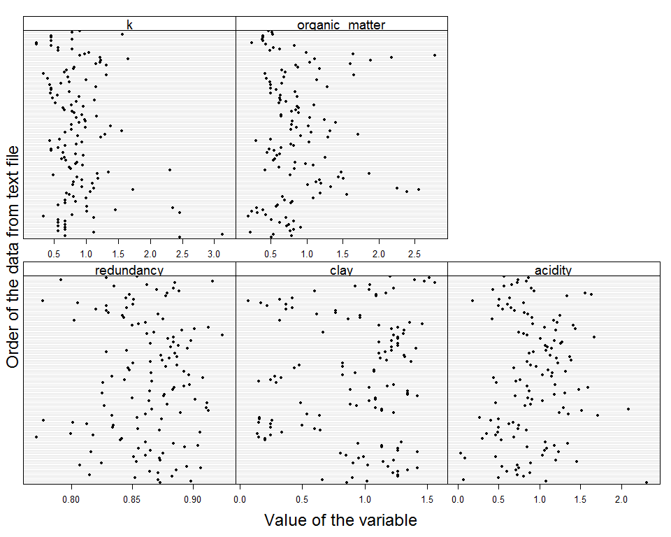
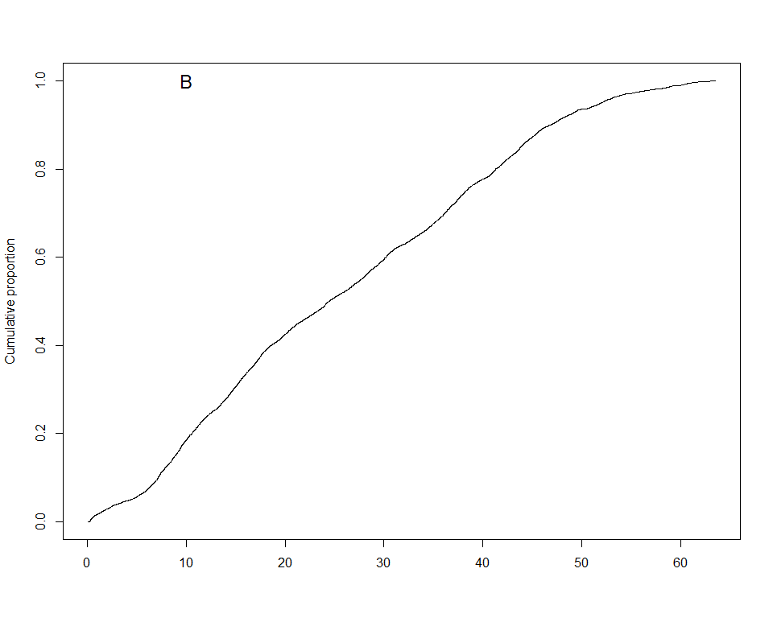
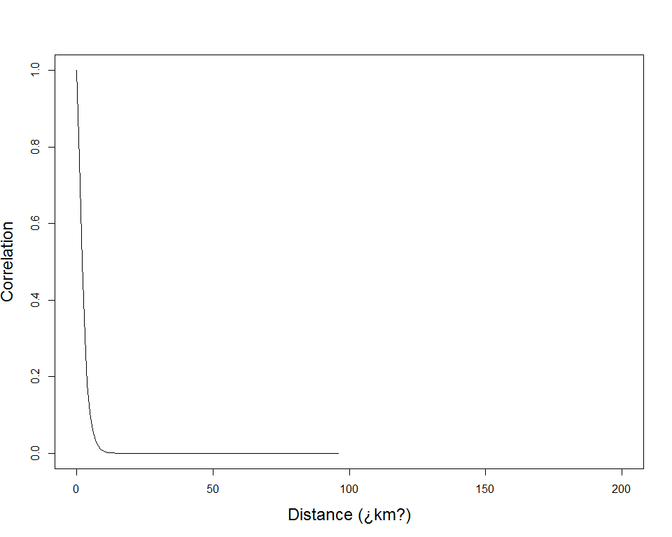

```r
#Paquetes
library(kableExtra)
library(lattice)
library(tidyverse)
library(PerformanceAnalytics)
library(janitor)
source("C:/tesis_catie/Calderon_CATIE/scripts/functions/HighstatLibV10.R")
library(ggbiplot)
library(GGally)
library(INLA)
```


#Objetivo 
Realizar un modelo linear multiple con dependencia espacial para los datos de Redundancia funcional efecto
Ref: Capitulo 12 Zuur et al.


```r
#Load data
dredun_eff <- read.csv("C:/tesis_catie/Calderon_CATIE/data/resultados_csv/data_indices_eff_redundancy.csv", header=T)
dredun_eff <- clean_names(dredun_eff) %>% 
  dplyr::select(-c(d))

dparcelas <- read.csv("C:/tesis_catie/Calderon_CATIE/data/clean/data_posicion_parcelas.csv", header = T)
dparcelas <- clean_names(dparcelas)

denv <- read.csv("C:/tesis_catie/Calderon_CATIE/data/clean/data_enviroment_worldclim_clean.csv", header = T, row.names = 1)
denv <- denv %>%
  clean_names() %>% 
    dplyr::select(-c(crtm_90_x,crtm_90_y,forest_type, slope_per,slope_deg))

#Standarize data
denvi_est <-  scale(denv,center = F, scale = T )
denvi_est <- rownames_to_column(as.data.frame(denvi_est),var= "plot")
```

#Join Data sets


```r
dfull  <- left_join(dredun_eff, dparcelas,by=c("plot") ) %>% 
  left_join(.,denvi_est, by=c("plot") )
```

```
## Warning: Column `plot` joining factor and character vector, coercing into
## character vector
```

```r
#Ordenar columnas
dfull_est <- dfull %>% dplyr::select(plot, forest_type,longitude,latitude,crtm_90_x,crtm_90_y,n,redundancy,u , q, everything()) 
glimpse(dfull_est)
```

```
## Observations: 127
## Variables: 27
## $ plot           <chr> "F10P1", "F10P2", "F10P3", "F10P4", "F11P1", "F...
## $ forest_type    <fct> P.macroloba, P.macroloba, P.macroloba, P.macrol...
## $ longitude      <dbl> -84.13907, -84.14223, -84.14690, -84.14741, -84...
## $ latitude       <dbl> 10.58515, 10.58890, 10.58497, 10.58649, 10.7037...
## $ crtm_90_x      <dbl> 484782.4, 484435.9, 483925.3, 483869.0, 479984....
## $ crtm_90_y      <dbl> 1170464, 1170880, 1170445, 1170614, 1183586, 11...
## $ n              <int> 12, 19, 13, 15, 21, 20, 17, 15, 13, 16, 15, 16,...
## $ redundancy     <dbl> 0.8725523, 0.8979476, 0.8711145, 0.8523120, 0.8...
## $ u              <dbl> 0.12744773, 0.10205244, 0.12888546, 0.14768803,...
## $ q              <dbl> 0.10335379, 0.09021181, 0.09405633, 0.09045544,...
## $ sand           <dbl> 0.8160510, 0.6767592, 0.9087578, 0.5842842, 0.5...
## $ limo           <dbl> 1.2102600, 1.0981989, 1.5458830, 1.6579441, 0.7...
## $ clay           <dbl> 0.8581029, 1.0172463, 0.6594220, 0.8978391, 1.2...
## $ p_h            <dbl> 1.0214836, 0.9562825, 1.2388205, 1.2822879, 0.9...
## $ acidity        <dbl> 2.31038300, 1.08199755, 0.07001161, 0.49962828,...
## $ ca             <dbl> 2.32213037, 0.32208520, 5.72480464, 3.53774225,...
## $ mg             <dbl> 1.7259923, 0.4432876, 3.5651645, 2.7257474, 0.2...
## $ k              <dbl> 2.4588529, 0.6705962, 3.1294491, 1.1176604, 0.5...
## $ p              <dbl> 0.6014830, 0.9623727, 0.5413347, 0.3909639, 0.9...
## $ organic_matter <dbl> 0.5100446, 0.7900463, 0.5344431, 0.2207482, 0.7...
## $ elev           <dbl> 0.3662337, 0.6278292, 0.5149301, 0.6058001, 0.1...
## $ prec           <dbl> 0.9986238, 1.0735019, 1.0435506, 1.0203384, 0.9...
## $ precdriest     <dbl> 0.9154796, 1.0164516, 0.9760628, 0.9760628, 0.5...
## $ preccv         <dbl> 1.0069702, 0.9764559, 1.0069702, 1.0069702, 1.1...
## $ temp           <dbl> 1.0078616, 0.9919898, 0.9959578, 0.9999257, 1.0...
## $ tempmin        <dbl> 1.0075683, 0.9923789, 0.9974420, 0.9974420, 1.0...
## $ tempsd         <dbl> 3.2815711, 0.9528710, 0.9577326, 0.9577326, 0.9...
```

#Data exploration
##PCA sin variables de respuesta


```r
ncol(denvi_est)
```

```
## [1] 18
```

```r
pca_envi <- prcomp(denvi_est[,2:18], scale. = TRUE)
ggbiplot(pca_envi, obs.scale = 3, var.scale = 3,
  groups = dfull_est$forest_type, ellipse = TRUE) +
  scale_color_discrete(name = '') +
  theme(legend.direction = 'horizontal', legend.position = 'top')+
  theme_grey()
```

<!-- -->


##Correlaciones Redundancy vrs Environment


```r
chart.Correlation(dfull_est[,c(8,3,4, 11:27)], histogram=TRUE, pch="+") 
```

<!-- -->

##VIFs

```r
corvif(dfull_est[,c(3,4,11:27)])
```

```
## 
## 
## Variance inflation factors
## 
##                        GVIF
## longitude      3.003471e+00
## latitude       1.730260e+01
## sand           2.809899e+07
## limo           1.915980e+06
## clay           2.641092e+07
## p_h            6.828257e+00
## acidity        3.075751e+00
## ca             1.956259e+01
## mg             2.402243e+01
## k              3.826313e+00
## p              2.402285e+00
## organic_matter 6.139815e+00
## elev           1.663644e+02
## prec           8.514604e+00
## precdriest     2.724207e+01
## preccv         1.958862e+01
## temp           1.164389e+02
## tempmin        1.680260e+02
## tempsd         1.662627e+00
```

##Covariables que se van a eliminar 


+ __tempsd__. Debido a que no tiene relacion con redundancy
+ __mg__. Debido a que no tiene relacion con redundancy
+ __ca__. Debido a que no tiene relacion con redundancy
+ __p__. Debido a que no tiene relacion con redundancy
+ __elev__. Debido a que tiene alto VIF, alta correlacion con Latitude y en el pca tiene la misma direccion que organic matter y sand 
+ __sand__. Debido a que tiene alto VIF  y en el pca tiene la misma direccion que organic matter.
+ __prec__. alta correlacion con predriest y en el pca tiene la misma direccion que prec.
+ __preccv__. Alta correlacion con predriest, en el pca tiene la misma direccion que prec y tiene poca relacion con redundancia.
+ __limo__. Tiene poca relacion con redundancia.
+ __pH__. Tiene poca relacion con redundancia.
+ __k__. Tiene poca relacion con redundancia.
+ __acidity__. Debido a que en el PCA tiene la misma direccion que clay 

####Data que se va a utilizar

```r
dredundancy_eff <- dfull_est %>% 
  dplyr::select(-c(tempsd, mg, ca, p, elev, sand, prec, preccv, tempmin, limo, p_h, u,q,k, acidity))
```

###VIFs sin variables eliminadas 

```r
ncol(dredundancy_eff)
```

```
## [1] 12
```

```r
corvif(dredundancy_eff[,c(3,4,7:12)])
```

```
## 
## 
## Variance inflation factors
## 
##                    GVIF
## longitude      1.981963
## latitude       4.902714
## n              1.186954
## redundancy     1.459488
## clay           5.449292
## organic_matter 3.288402
## precdriest     5.084354
## temp           6.188471
```

##Cleveland plot


```r
Mydotplot(dredundancy_eff[, 8:12])
```

<!-- -->


#Modelo lineal con componente espacial 

##Model Formulation
$$redundancia \sim N(\mu_i, \sigma^2)$$

$$E(redundancia)=\mu_i ,var(redundancia)=\sigma^2$$ 

$$\mu_i= \beta_1*foresttype+\beta_2*long+\beta_3*lat+\beta_4*clay+\beta_5*acidity$$  $$+\beta_6*k+\beta_7*organicmatter+\beta_8*precdriest+\beta_9*temp + \mu_i $$
$$\mu_i \sim GMRF(0, \Sigma)$$

$\mu_i$ es un random intercep el cual se asume que está correlacionado espacialmente con media 0 y con una matriz de covarianza $\Sigma$ 


##Defining the mesh 


```r
dredundancy_eff$crtm_90_x <- dredundancy_eff$crtm_90_x /1000

dredundancy_eff$crtm_90_y <- dredundancy_eff$crtm_90_y/1000

Loc <- cbind(dredundancy_eff$crtm_90_x, dredundancy_eff$crtm_90_y)
head(Loc)
```

```
##          [,1]     [,2]
## [1,] 484.7824 1170.464
## [2,] 484.4359 1170.880
## [3,] 483.9253 1170.445
## [4,] 483.8690 1170.614
## [5,] 479.9841 1183.586
## [6,] 480.0020 1183.473
```

```r
D <- dist(Loc)
hist(D, 
     freq = TRUE,
     main = "",
     ylab = "Frequency")
```

<!-- -->


```r
plot(x = sort(D), 
     y = (1:length(D))/length(D), 
     type = "l",
     xlab = "",
     ylab = "Cumulative proportion")
text(10, 1, "B", cex = 1.5)
```

<!-- -->


```r
##requiring necessary packages:
#library(sp)  # vector data
#library(rgeos)  # geometry ops
#library(sp) 
#library(raster)
#
## WGS84 -------------------------------------------------------------------
##Create spatial object:
#lonlat <- cbind(dredundancy_eff$longitude, dredundancy_eff$latitude)
##Create a SpatialPoints object:
#pts <- SpatialPoints(lonlat)
#crdref <- CRS('+proj=longlat +datum=WGS84')
#pts <- SpatialPoints(lonlat, proj4string=crdref)
#
## make spatial data frame
#ptsdf <- SpatialPointsDataFrame(pts,data = dredundancy_eff )
#
#dist <- pointDistance(pts, lonlat=TRUE)
#

# CRTM05 ------------------------------------------------------------------
#lonlat2 <- cbind(dprueba$crtm_90_x, dprueba$crtm_90_y)
##Create a SpatialPoints object:
#pts2 <- SpatialPoints(lonlat2)
#
## make spatial data frame
#ptsdf2 <- SpatialPointsDataFrame(pts2,data = dprueba )
#
#dist2 <- pointDistance(pts2, lonlat=FALSE)
#
#View(dist)
#View(dist2)
```


```r
#Coordenadas CRTM05
head(Loc)
```

```
##          [,1]     [,2]
## [1,] 484.7824 1170.464
## [2,] 484.4359 1170.880
## [3,] 483.9253 1170.445
## [4,] 483.8690 1170.614
## [5,] 479.9841 1183.586
## [6,] 480.0020 1183.473
```

```r
#mesh1 <- inla.mesh.2d(Loc,
#                      #The smaller the values, equal to more triangles 
#                      max.edge = c(1,1),
#                     cutoff = 0)

mesh2 <- inla.mesh.2d(Loc,
                      #The smaller the values, equal to more triangles 
                      max.edge = c(10,10),
                      cutoff = 0)

#mesh3 <- inla.mesh.2d(Loc,
#                      #The smaller the values, equal to more triangles 
#                      max.edge = c(50,50),
#                      cutoff = 0)

#mesh4 <- inla.mesh.2d(Loc,
#                      #The smaller the values, equal to more triangles 
#                      max.edge = c(75,75),
#                      cutoff = 0)
#mesh5 <- inla.mesh.2d(Loc,
#                      #The smaller the values, equal to more triangles 
#                      max.edge = c(25,50),
#                      cutoff = 0)
#
#mesh6 <- inla.mesh.2d(Loc,
#                      #The smaller the values, equal to more triangles 
#                      max.edge = c(50,80),
#                      cutoff = 0)
#
#mesh7 <- inla.mesh.2d(Loc,
#                      #The smaller the values, equal to more triangles 
#                      max.edge = c(100,120),
#                      cutoff = 0)
#
#mesh8 <- inla.mesh.2d(Loc,
#                      #The smaller the values, equal to more triangles 
#                      max.edge = c(100,100),
#                      cutoff = 0)
#
#mesh9 <- inla.mesh.2d(Loc,
#                      #The smaller the values, equal to more triangles 
#                      max.edge = c(150,150),
#                      cutoff = 0)

#El libro recomienda trabajar con una mesh de entre 700 a 800
mesh2$n
```

```
## [1] 722
```

```r
plot(mesh2, asp = 1);points(Loc, col = 2, pch = 16, cex = 1)
```

<!-- -->


```r
#Specify a boundary area so that all sampling locations are within this boundary area 
bound <- inla.nonconvex.hull(Loc)
mesh10 <- inla.mesh.2d(boundary = bound,
                       max.edge = 2,
                       cutoff = 0)

mesh10$n
```

```
## [1] 2035
```

```r
plot(mesh10, asp = 1);points(Loc, col = 2, pch = 16, cex = 1)
```

<!-- -->


```r
A2 <- inla.spde.make.A(mesh2, loc = Loc)
dim(A2)
```

```
## [1] 127 722
```

##Define the SPDE


```r
spde <- inla.spde2.matern(mesh2, alpha = 2)
```

##Define the spatial field

```r
w_index <- inla.spde.make.index(
  name = "w",
  n.spde = spde$n.spde,
  n.group = 1,
  n.repl = 1
)

str(w_index)
```

```
## List of 3
##  $ w      : int [1:722] 1 2 3 4 5 6 7 8 9 10 ...
##  $ w.group: int [1:722] 1 1 1 1 1 1 1 1 1 1 ...
##  $ w.repl : int [1:722] 1 1 1 1 1 1 1 1 1 1 ...
```

##Define the stack


###Covariates


```r
xm <- model.matrix(~ -1 + forest_type * clay  *
                          organic_matter *precdriest * temp, 
                   
                   data = dredundancy_eff)

N <- nrow(dredundancy_eff)

colnames(xm)
```

```
##  [1] "forest_typeFoothills"                                      
##  [2] "forest_typeP.macroloba"                                    
##  [3] "forest_typeQ.paraensis"                                    
##  [4] "clay"                                                      
##  [5] "organic_matter"                                            
##  [6] "precdriest"                                                
##  [7] "temp"                                                      
##  [8] "forest_typeP.macroloba:clay"                               
##  [9] "forest_typeQ.paraensis:clay"                               
## [10] "forest_typeP.macroloba:organic_matter"                     
## [11] "forest_typeQ.paraensis:organic_matter"                     
## [12] "clay:organic_matter"                                       
## [13] "forest_typeP.macroloba:precdriest"                         
## [14] "forest_typeQ.paraensis:precdriest"                         
## [15] "clay:precdriest"                                           
## [16] "organic_matter:precdriest"                                 
## [17] "forest_typeP.macroloba:temp"                               
## [18] "forest_typeQ.paraensis:temp"                               
## [19] "clay:temp"                                                 
## [20] "organic_matter:temp"                                       
## [21] "precdriest:temp"                                           
## [22] "forest_typeP.macroloba:clay:organic_matter"                
## [23] "forest_typeQ.paraensis:clay:organic_matter"                
## [24] "forest_typeP.macroloba:clay:precdriest"                    
## [25] "forest_typeQ.paraensis:clay:precdriest"                    
## [26] "forest_typeP.macroloba:organic_matter:precdriest"          
## [27] "forest_typeQ.paraensis:organic_matter:precdriest"          
## [28] "clay:organic_matter:precdriest"                            
## [29] "forest_typeP.macroloba:clay:temp"                          
## [30] "forest_typeQ.paraensis:clay:temp"                          
## [31] "forest_typeP.macroloba:organic_matter:temp"                
## [32] "forest_typeQ.paraensis:organic_matter:temp"                
## [33] "clay:organic_matter:temp"                                  
## [34] "forest_typeP.macroloba:precdriest:temp"                    
## [35] "forest_typeQ.paraensis:precdriest:temp"                    
## [36] "clay:precdriest:temp"                                      
## [37] "organic_matter:precdriest:temp"                            
## [38] "forest_typeP.macroloba:clay:organic_matter:precdriest"     
## [39] "forest_typeQ.paraensis:clay:organic_matter:precdriest"     
## [40] "forest_typeP.macroloba:clay:organic_matter:temp"           
## [41] "forest_typeQ.paraensis:clay:organic_matter:temp"           
## [42] "forest_typeP.macroloba:clay:precdriest:temp"               
## [43] "forest_typeQ.paraensis:clay:precdriest:temp"               
## [44] "forest_typeP.macroloba:organic_matter:precdriest:temp"     
## [45] "forest_typeQ.paraensis:organic_matter:precdriest:temp"     
## [46] "clay:organic_matter:precdriest:temp"                       
## [47] "forest_typeP.macroloba:clay:organic_matter:precdriest:temp"
## [48] "forest_typeQ.paraensis:clay:organic_matter:precdriest:temp"
```

```r
#En esta parte se tienen que incluir interacciones no solo main effects
X <- data.frame(Foothills   =    xm[,1],
                P.macroloba =    xm[,2],
                Q.paraensis =    xm[,3],
                clay        =    xm[,4],
                organic_matter = xm[,5],
                precdriest  =    xm[,6],
                temp        =    xm[,7],
                
                #2way interactions
                P.macroloba_clay = xm[,8],
                Q.paraensis_clay = xm[,9],
                P.macroloba_organic_matter = xm[,10],
                Q.paraensis_organic_matter = xm[,11],
                clay_organic_matter = xm[,12],
                P.macroloba_precdriest = xm[,13],
                Q.paraensis_precdriest = xm[,14],
                clay_precdriest = xm[,15],
                organic_matter_precdriest = xm[,16],
                P.macroloba_temp = xm[,17],
                Q.paraensis_temp = xm[,18],
                clay_temp = xm[,19],
                organic_matter_temp = xm[,20],
                precdriest_temp = xm[,21],
                
                #3way interactions
                P.macroloba_clay_organic_matter = xm[,22],
                Q.paraensis_clay_organic_matter = xm[,23],
                P.macroloba_clay_precdriest = xm[,24],
                Q.paraensis_clay_precdriest = xm[,25],
                P.macroloba_organic_matter_precdriest = xm[,26],
                Q.paraensis_organic_matter_precdriest = xm[,27],
                clay_organic_matter_precdriest = xm[,28],
                P.macroloba_clay_temp = xm[,29],
                Q.paraensis_clay_temp = xm[,30],
                P.macroloba_organic_matter_temp = xm[,31],
                Q.paraensis_organic_matter_temp = xm[,32],
                clay_organic_matter_temp = xm[,33],
                P.macroloba_precdriest_temp = xm[,34],
                Q.paraensis_precdriest_temp = xm[,35],
                clay_precdriest_temp = xm[,36],
                organic_matter_precdriest_temp = xm[,37],
                
                #4way interactions
                P.macroloba_clay_organic_matter_precdriest = xm[,38],
                Q.paraensis_clay_organic_matter_precdriest = xm[,39],
                P.macroloba_clay_organic_matter_temp = xm[,40],
                Q.paraensis_clay_organic_matter_temp = xm[,41],
                P.macroloba_clay_precdriest_temp = xm[,42],
                Q.paraensis_clay_precdriest_temp = xm[,43],
                P.macroloba_organic_matter_precdriest_temp = xm[,44],
                Q.paraensis_organic_matter_precdriest_temp = xm[,45],
                clay_organic_matter_precdriest_temp = xm[,46],
                
                #5way interactions
                P.macroloba_clay_organic_matter_precdriest_temp = xm[,47],
                Q.paraensis_clay_organic_matter_precdriest_temp = xm[,48]
                       
                
)
```

###Stack fit

```r
stackfit <- inla.stack(
  tag = "Fit",
  
  data = list(y = dredundancy_eff$redundancy),
  
  A = list(1,1, A2),
  
  effects = list(
    
  Intercept = rep(1,N),
    
  X = X,
    
  w = w_index))
```


##Define the formula for the spatial model


```r
                Foothills       
                P.macroloba     
                Q.paraensis     
                clay            
                organic_matter 
                precdriest  
                temp        
                
                #2way interactions
                P.macroloba_clay 
                Q.paraensis_clay 
                P.macroloba_organic_matter 
                Q.paraensis_organic_matter 
                clay_organic_matter 
                P.macroloba_precdriest 
                Q.paraensis_precdriest 
                clay_precdriest 
                organic_matter_precdriest 
                P.macroloba_temp 
                Q.paraensis_temp 
                clay_temp 
                organic_matter_temp 
                precdriest_temp 
                
                #3way interactions
                P.macroloba_clay_organic_matter 
                Q.paraensis_clay_organic_matter 
                P.macroloba_clay_precdriest 
                Q.paraensis_clay_precdriest 
                P.macroloba_organic_matter_precdriest
                Q.paraensis_organic_matter_precdriest
                clay_organic_matter_precdriest 
                P.macroloba_clay_temp
                Q.paraensis_clay_temp
                P.macroloba_organic_matter_temp 
                Q.paraensis_organic_matter_temp 
                clay_organic_matter_temp 
                P.macroloba_precdriest_temp
                Q.paraensis_precdriest_temp
                clay_precdriest_temp
                organic_matter_precdriest_temp 
                
                #4way interactions
                P.macroloba_clay_organic_matter_precdriest 
                Q.paraensis_clay_organic_matter_precdriest 
                P.macroloba_clay_organic_matter_temp
                Q.paraensis_clay_organic_matter_temp
                P.macroloba_clay_precdriest_temp
                Q.paraensis_clay_precdriest_temp
                P.macroloba_organic_matter_precdriest_temp 
                Q.paraensis_organic_matter_precdriest_temp 
                clay_organic_matter_precdriest_temp 
                
                #5way interactions
                P.macroloba_clay_organic_matter_precdriest_temp
                Q.paraensis_clay_organic_matter_precdriest_temp
```


```r
#Modelo sin dependencia espacial

M2 <- y ~ -1 + Intercept +  Foothills + P.macroloba + Q.paraensis + clay + organic_matter +
                         precdriest + temp
```


```r
#Modelo sin covariables y con dependencia espacial 

SM1 <- y ~ -1 + Intercept + f(w, model = spde)
```


```r
#Modelo con covariables y dependencia espacial
SM2 <- y ~ -1 + Intercept + Foothills + P.macroloba + Q.paraensis + clay +
                          organic_matter +
                         precdriest + temp + f(w, model = spde)
```


```r
#Modelo con dependencia espacial y full interacciones 
SM3 <- y ~ -1 + Intercept + 
  
                Foothills     +  
                P.macroloba   +  
                Q.paraensis   +  
                clay          +  
                organic_matter + 
                precdriest  +
                temp          +
  
                
                #2way interactions
                P.macroloba_clay +
                Q.paraensis_clay +
                P.macroloba_organic_matter +
                Q.paraensis_organic_matter +
                clay_organic_matter +
                P.macroloba_precdriest +
                Q.paraensis_precdriest +
                clay_precdriest +
                organic_matter_precdriest +
                P.macroloba_temp +
                Q.paraensis_temp +
                clay_temp +
                organic_matter_temp +
                precdriest_temp +
                
                #3way interactions
                P.macroloba_clay_organic_matter +
                Q.paraensis_clay_organic_matter +
                P.macroloba_clay_precdriest +
                Q.paraensis_clay_precdriest +
                P.macroloba_organic_matter_precdriest+
                Q.paraensis_organic_matter_precdriest+
                clay_organic_matter_precdriest +
                P.macroloba_clay_temp+
                Q.paraensis_clay_temp+
                P.macroloba_organic_matter_temp +
                Q.paraensis_organic_matter_temp +
                clay_organic_matter_temp +
                P.macroloba_precdriest_temp+
                Q.paraensis_precdriest_temp+
                clay_precdriest_temp+
                organic_matter_precdriest_temp +
               
                #4way interactions
                P.macroloba_clay_organic_matter_precdriest +
                Q.paraensis_clay_organic_matter_precdriest +
                P.macroloba_clay_organic_matter_temp+
                Q.paraensis_clay_organic_matter_temp+
                P.macroloba_clay_precdriest_temp+
                Q.paraensis_clay_precdriest_temp+
                P.macroloba_organic_matter_precdriest_temp +
                Q.paraensis_organic_matter_precdriest_temp +
                clay_organic_matter_precdriest_temp +
                
                #5way interactions
                P.macroloba_clay_organic_matter_precdriest_temp+
                Q.paraensis_clay_organic_matter_precdriest_temp + 
                f(w, model = spde)
```


```r
#Modelo con dependencia espacial  y 2way interacciones 
SM3a <- y ~ -1 + Intercept + 
  
                Foothills     +  
                P.macroloba   +  
                Q.paraensis   +  
                clay          +  
                organic_matter + 
                precdriest  +
                temp          +
                
                #2way interactions
                P.macroloba_clay +
                Q.paraensis_clay +
                P.macroloba_organic_matter +
                Q.paraensis_organic_matter +
                clay_organic_matter +
                P.macroloba_precdriest +
                Q.paraensis_precdriest +
                clay_precdriest +
                organic_matter_precdriest +
                P.macroloba_temp +
                Q.paraensis_temp +
                clay_temp +
                organic_matter_temp +
                precdriest_temp +
   f(w, model = spde)
```


```r
#Modelo con dependencia espacial, 2way y 3way interacciones. 
SM3b <- y ~ -1 + Intercept + 
                
                Foothills     +  
                P.macroloba   +  
                Q.paraensis   +  
                clay          +  
                organic_matter + 
                precdriest  +
                temp          +
  
   #2way interactions
                P.macroloba_clay +
                Q.paraensis_clay +
                P.macroloba_organic_matter +
                Q.paraensis_organic_matter +
                clay_organic_matter +
                P.macroloba_precdriest +
                Q.paraensis_precdriest +
                clay_precdriest +
                organic_matter_precdriest +
                P.macroloba_temp +
                Q.paraensis_temp +
                clay_temp +
                organic_matter_temp +
                precdriest_temp +
                
   #3way interactions
                P.macroloba_clay_organic_matter +
                Q.paraensis_clay_organic_matter +
                P.macroloba_clay_precdriest +
                Q.paraensis_clay_precdriest +
                P.macroloba_organic_matter_precdriest+
                Q.paraensis_organic_matter_precdriest+
                clay_organic_matter_precdriest +
                P.macroloba_clay_temp+
                Q.paraensis_clay_temp+
                P.macroloba_organic_matter_temp +
                Q.paraensis_organic_matter_temp +
                clay_organic_matter_temp +
                P.macroloba_precdriest_temp+
                Q.paraensis_precdriest_temp+
                clay_precdriest_temp+
                organic_matter_precdriest_temp +
 
  f(w, model = spde)
```


```r
#Modelo con covariables con 2way,3way, 4way interactions y dependencia espacial

SM3c <- y ~ -1 + Intercept + 
  
                Foothills     +  
                P.macroloba   +  
                Q.paraensis   +  
                clay          +  
                organic_matter + 
                precdriest  +
                temp          +
  
                
                #2way interactions
                P.macroloba_clay +
                Q.paraensis_clay +
                P.macroloba_organic_matter +
                Q.paraensis_organic_matter +
                clay_organic_matter +
                P.macroloba_precdriest +
                Q.paraensis_precdriest +
                clay_precdriest +
                organic_matter_precdriest +
                P.macroloba_temp +
                Q.paraensis_temp +
                clay_temp +
                organic_matter_temp +
                precdriest_temp +
                
                #3way interactions
                P.macroloba_clay_organic_matter +
                Q.paraensis_clay_organic_matter +
                P.macroloba_clay_precdriest +
                Q.paraensis_clay_precdriest +
                P.macroloba_organic_matter_precdriest+
                Q.paraensis_organic_matter_precdriest+
                clay_organic_matter_precdriest +
                P.macroloba_clay_temp+
                Q.paraensis_clay_temp+
                P.macroloba_organic_matter_temp +
                Q.paraensis_organic_matter_temp +
                clay_organic_matter_temp +
                P.macroloba_precdriest_temp+
                Q.paraensis_precdriest_temp+
                clay_precdriest_temp+
                organic_matter_precdriest_temp +
               
                #4way interactions
                P.macroloba_clay_organic_matter_precdriest +
                Q.paraensis_clay_organic_matter_precdriest +
                P.macroloba_clay_organic_matter_temp+
                Q.paraensis_clay_organic_matter_temp+
                P.macroloba_clay_precdriest_temp+
                Q.paraensis_clay_precdriest_temp+
                P.macroloba_organic_matter_precdriest_temp +
                Q.paraensis_organic_matter_precdriest_temp +
                clay_organic_matter_precdriest_temp +
   f(w, model = spde)
```


##Execute the spacial model

```r
#Modelo sin dependencia espacial
M2 <- inla(M2,
             family = "gaussian",
             
             data = inla.stack.data(stackfit),
             
             control.compute = list(
               dic = TRUE,
               waic = TRUE),
             
             control.predictor = list(
               A = inla.stack.A(stackfit)))


#Modelo sin covariables y dependencia espacial               

SM1 <- inla(SM1,
             family = "gaussian",
             
             data = inla.stack.data(stackfit),
             
             control.compute = list(
               dic = TRUE,
               waic = TRUE),
             
             control.predictor = list(
               A = inla.stack.A(stackfit)))


#Modelo con covariables y dependencia espacial               
SM2 <- inla(SM2,
             family = "gaussian",
             
             data = inla.stack.data(stackfit),
             
             control.compute = list(
               dic = TRUE,
               waic = TRUE),
             
             control.predictor = list(
               A = inla.stack.A(stackfit)))

#Modelo con covariables con full interacciones y dependencia espacial               
SM3 <- inla(SM3,
             family = "gaussian",
             
             data = inla.stack.data(stackfit),
             
             control.compute = list(
               dic = TRUE,
               waic = TRUE),
             
             control.predictor = list(
               A = inla.stack.A(stackfit)))

#Modelo con covariables con 2way interactions y dependencia espacial
SM3a <- inla(SM3a,
             family = "gaussian",
             
             data = inla.stack.data(stackfit),
             
             control.compute = list(
               dic = TRUE,
               waic = TRUE),
             
             control.predictor = list(
               A = inla.stack.A(stackfit)))

#Modelo con covariables con 2way y 3way interactions y dependencia espacial
SM3b <- inla(SM3b,
             family = "gaussian",
             
             data = inla.stack.data(stackfit),
             
             control.compute = list(
               dic = TRUE,
               waic = TRUE),
             
             control.predictor = list(
               A = inla.stack.A(stackfit)))

#Modelo con covariables con 2way,3way, 4way interactions y dependencia espacial
SM3c <- inla(SM3c,
             family = "gaussian",
             
             data = inla.stack.data(stackfit),
             
             control.compute = list(
               dic = TRUE,
               waic = TRUE),
             
             control.predictor = list(
               A = inla.stack.A(stackfit)))
```

##Compare models


```r
dic  <- c(M2$dic$dic,
          SM1$dic$dic, 
          SM2$dic$dic,
          SM3$dic$dic,
          SM3a$dic$dic,
          SM3b$dic$dic,
          SM3c$dic$dic)


waic <- c(M2$waic$waic, 
          SM1$waic$waic,
          SM2$waic$waic,
          SM3$waic$waic,
          SM3a$waic$waic,
          SM3b$waic$waic,
          SM3c$waic$waic)


Z.out     <- cbind(dic, waic)
rownames(Z.out) <- c("Gaussian lm ",
                     "Gaussian lm sin covariables sin interaccion + SPDE",
                     "Gaussian lm con covariables sin interaccion + SPDE",
                     "Gaussian lm con covariables con interaccion + SPDE",
                     "Gaussian lm con covariables con 2way interactions + SPDE",
                     "Gaussian lm con covariables con 2way interactions + 3way interactions + SPDE",
                     "Gaussian lm con covariables con 2way interactions + 3way interactions + 4way interactions + SPDE")
Z.out
```

```
##                                                                                                        dic
## Gaussian lm                                                                                      -552.9070
## Gaussian lm sin covariables sin interaccion + SPDE                                               -577.9304
## Gaussian lm con covariables sin interaccion + SPDE                                               -576.2374
## Gaussian lm con covariables con interaccion + SPDE                                               -553.8774
## Gaussian lm con covariables con 2way interactions + SPDE                                         -579.6466
## Gaussian lm con covariables con 2way interactions + 3way interactions + SPDE                     -556.6456
## Gaussian lm con covariables con 2way interactions + 3way interactions + 4way interactions + SPDE -554.2390
##                                                                                                       waic
## Gaussian lm                                                                                      -551.9116
## Gaussian lm sin covariables sin interaccion + SPDE                                               -575.6032
## Gaussian lm con covariables sin interaccion + SPDE                                               -572.8625
## Gaussian lm con covariables con interaccion + SPDE                                               -555.8269
## Gaussian lm con covariables con 2way interactions + SPDE                                         -577.5325
## Gaussian lm con covariables con 2way interactions + 3way interactions + SPDE                     -555.2871
## Gaussian lm con covariables con 2way interactions + 3way interactions + 4way interactions + SPDE -555.9500
```


El modelo con todas las covariables y 2way interactions es el mejor (SM3a)

##¿Cual modelo con 2way interactions es el mejor?


```r
#Modelo con dependencia espacial con todas las 2way interacciones 
SM3a <- y ~ -1 + Intercept + 
  
                Foothills     +  
                P.macroloba   +  
                Q.paraensis   +  
                clay          +  
                organic_matter + 
                precdriest  +
                temp          +
                
                #2way interactions
                P.macroloba_clay +
                Q.paraensis_clay +
                P.macroloba_organic_matter +
                Q.paraensis_organic_matter +
                clay_organic_matter +
                P.macroloba_precdriest +
                Q.paraensis_precdriest +
                clay_precdriest +
                organic_matter_precdriest +
                P.macroloba_temp +
                Q.paraensis_temp +
                clay_temp +
                organic_matter_temp +
                precdriest_temp +

 f(w, model = spde)


#Modelo con dependencia espacial eliminando interacciones que considero no son valiosas 
SM3a_1 <- y ~ -1 + Intercept + 
  
                Foothills     +  
                P.macroloba   +  
                Q.paraensis   +  
                clay          +  
                organic_matter + 
                precdriest  +
                temp          +
                
                #2way interactions
                P.macroloba_clay +
                Q.paraensis_clay +
                P.macroloba_organic_matter +
                Q.paraensis_organic_matter +
    
                P.macroloba_precdriest +
                Q.paraensis_precdriest +
                
                organic_matter_precdriest +
                P.macroloba_temp +
                Q.paraensis_temp +
                
                organic_matter_temp +
                precdriest_temp +
 f(w, model = spde)

#Modelo con dependencia espacial eliminando interacciones con tipo de bosque
SM3a_2 <- y ~ -1 + Intercept + 
  
                Foothills     +  
                P.macroloba   +  
                Q.paraensis   +  
                clay          +  
                organic_matter + 
                precdriest  +
                temp          +
                
                #2way interactions
                clay_organic_matter +
                
                
                clay_precdriest +
                organic_matter_precdriest +
                
                
                clay_temp +
                organic_matter_temp +
                precdriest_temp +
 f(w, model = spde)

#Modelo con dependencia espacial  eliminando interacciones con clay 
SM3a_3 <- y ~ -1 + Intercept + 
  
                Foothills     +  
                P.macroloba   +  
                Q.paraensis   +  
                clay          +  
                organic_matter + 
                precdriest  +
                temp          +
                
                #2way interactions
                
                
                P.macroloba_organic_matter +
                Q.paraensis_organic_matter +
               
                P.macroloba_precdriest +
                Q.paraensis_precdriest +
                
                organic_matter_precdriest +
                P.macroloba_temp +
                Q.paraensis_temp +
                
                organic_matter_temp +
                precdriest_temp +

 f(w, model = spde)


#Modelo con dependencia espacial  eliminando interacciones con organic matter
SM3a_5 <- y ~ -1 + Intercept + 
  
                Foothills     +  
                P.macroloba   +  
                Q.paraensis   +  
                clay          +  
                organic_matter + 
                precdriest  +
                temp          +
                
                #2way interactions
                P.macroloba_clay +
                Q.paraensis_clay +
                
                
                
                P.macroloba_precdriest +
                Q.paraensis_precdriest +
                clay_precdriest +
                organic_matter_precdriest +
                P.macroloba_temp +
                Q.paraensis_temp +
                clay_temp +
                
                precdriest_temp +

 f(w, model = spde)


#Modelo con dependencia espacial eliminando interacciones con precdriest
SM3a_6 <- y ~ -1 + Intercept + 
  
                Foothills     +  
                P.macroloba   +  
                Q.paraensis   +  
                clay          +  
                organic_matter + 
                precdriest  +
                temp          +
                
                #2way interactions
                P.macroloba_clay +
                Q.paraensis_clay +
                P.macroloba_organic_matter +
                Q.paraensis_organic_matter +
                clay_organic_matter +
                
                
                
                
                P.macroloba_temp +
                Q.paraensis_temp +
                clay_temp +
                organic_matter_temp +
                

 f(w, model = spde)

#Modelo con dependencia espacial eliminando interacciones con temp
SM3a_7 <- y ~ -1 + Intercept + 
  
                Foothills     +  
                P.macroloba   +  
                Q.paraensis   +  
                clay          +  
                organic_matter + 
                precdriest  +
                temp          +
                
                #2way interactions
                P.macroloba_clay +
                Q.paraensis_clay +
                P.macroloba_organic_matter +
                Q.paraensis_organic_matter +
                clay_organic_matter +
                P.macroloba_precdriest +
                Q.paraensis_precdriest +
                clay_precdriest +
                organic_matter_precdriest +
 f(w, model = spde)


#Modelo con dependencia espacial eliminando interacciones  clay y organic matter (caracteristicas de parcela)
SM3a_8 <- y ~ -1 + Intercept + 
  
                Foothills     +  
                P.macroloba   +  
                Q.paraensis   +  
                clay          +  
                organic_matter + 
                precdriest  +
                temp          +
                
                #2way interactions
                
            
              
                P.macroloba_precdriest +
                Q.paraensis_precdriest +
                
                
                P.macroloba_temp +
                Q.paraensis_temp +
                
                precdriest_temp +

 f(w, model = spde)


#Modelo con dependencia espacial eliminando interacciones con  temp y precdriest (caracteristicas de clima)
SM3a_9 <- y ~ -1 + Intercept + 
  
                Foothills     +  
                P.macroloba   +  
                Q.paraensis   +  
                clay          +  
                organic_matter + 
                precdriest  +
                temp          +
                
                #2way interactions
                P.macroloba_clay +
                Q.paraensis_clay +
                P.macroloba_organic_matter +
                Q.paraensis_organic_matter +
                clay_organic_matter +
                P.macroloba_precdriest +
                Q.paraensis_precdriest +
                clay_precdriest +
                organic_matter_precdriest +
                P.macroloba_temp +
                Q.paraensis_temp +
                clay_temp +
                organic_matter_temp +
                precdriest_temp +
  f(w, model = spde)
```


```r
#Modelo con covariables con 2way interactions y dependencia espacial
SM3a <- inla(SM3a,
             family = "gaussian",
             
             data = inla.stack.data(stackfit),
             
             control.compute = list(
               dic = TRUE,
               waic = TRUE),
             
             control.predictor = list(
               A = inla.stack.A(stackfit)))

#Modelo con dependencia espacial eliminando interacciones que considero no son valiosas 
SM3a_1 <- inla(SM3a_1,
             family = "gaussian",
             
             data = inla.stack.data(stackfit),
             
             control.compute = list(
               dic = TRUE,
               waic = TRUE),
             
             control.predictor = list(
               A = inla.stack.A(stackfit)))


#Modelo con dependencia espacial eliminando interacciones con tipo de bosque
SM3a_2 <- inla(SM3a_2,
             family = "gaussian",
             
             data = inla.stack.data(stackfit),
             
             control.compute = list(
               dic = TRUE,
               waic = TRUE),
             
             control.predictor = list(
               A = inla.stack.A(stackfit)))

#Modelo con dependencia espacial  eliminando interacciones con clay 
SM3a_3 <- inla(SM3a_3,
             family = "gaussian",
             
             data = inla.stack.data(stackfit),
             
             control.compute = list(
               dic = TRUE,
               waic = TRUE),
             
             control.predictor = list(
               A = inla.stack.A(stackfit)))


#Modelo con dependencia espacial  eliminando interacciones con organic matter
SM3a_5 <- inla(SM3a_5,
             family = "gaussian",
             
             data = inla.stack.data(stackfit),
             
             control.compute = list(
               dic = TRUE,
               waic = TRUE),
             
             control.predictor = list(
               A = inla.stack.A(stackfit)))

#Modelo con dependencia espacial  eliminando interacciones con precdriest
SM3a_6 <- inla(SM3a_6,
             family = "gaussian",
             
             data = inla.stack.data(stackfit),
             
             control.compute = list(
               dic = TRUE,
               waic = TRUE),
             
             control.predictor = list(
               A = inla.stack.A(stackfit)))
#Modelo con dependencia espacial  eliminando interacciones con temp
SM3a_7 <- inla(SM3a_7,
             family = "gaussian",
             
             data = inla.stack.data(stackfit),
             
             control.compute = list(
               dic = TRUE,
               waic = TRUE),
             
             control.predictor = list(
               A = inla.stack.A(stackfit)))

#Modelo con dependencia espacial eliminando interacciones  clay y organic matter (caracteristicas de parcela)
SM3a_8  <- inla(SM3a_8,
             family = "gaussian",
             
             data = inla.stack.data(stackfit),
             
             control.compute = list(
               dic = TRUE,
               waic = TRUE),
             
             control.predictor = list(
               A = inla.stack.A(stackfit)))
#Modelo con dependencia espacial eliminando interacciones con  temp y precdriest (caracteristicas de clima)
SM3a_9 <-  inla(SM3a_9,
             family = "gaussian",
             
             data = inla.stack.data(stackfit),
             
             control.compute = list(
               dic = TRUE,
               waic = TRUE),
             
             control.predictor = list(
               A = inla.stack.A(stackfit)))
```


```r
dic  <- c(SM3a$dic$dic,
          SM3a_1$dic$dic,
          SM3a_2$dic$dic,
          SM3a_3$dic$dic,
          SM3a_5$dic$dic,
          SM3a_6$dic$dic,
          SM3a_7$dic$dic,
          SM3a_8$dic$dic,
          SM3a_9$dic$dic
          )


waic <- c(SM3a$waic$waic,
          SM3a_1$waic$waic,
          SM3a_2$waic$waic,
          SM3a_3$waic$waic,
          SM3a_5$waic$waic,
          SM3a_6$waic$waic,
          SM3a_7$waic$waic,
          SM3a_8$waic$waic,
          SM3a_9$waic$waic
          )


Z.out     <- cbind(dic, waic)
rownames(Z.out) <- c("SM3a",
                     "SM3a_1",
                     "SM3a_2",
                     "SM3a_3",
                     "SM3a_5",
                     "SM3a_6",
                     "SM3a_7",
                     "SM3a_8",
                     "SM3a_9"
                     )
Z.out
```

```
##              dic      waic
## SM3a   -579.6466 -577.5325
## SM3a_1 -583.9819 -581.4672
## SM3a_2 -570.3151 -567.3806
## SM3a_3 -583.1126 -580.0620
## SM3a_5 -584.3545 -582.1503
## SM3a_6 -577.7152 -574.8921
## SM3a_7 -579.2442 -576.5755
## SM3a_8 -574.9779 -570.6040
## SM3a_9 -579.6466 -577.5325
```


##Results

```r
#Modelo sin componente espacial
M2$summary.fixed[, c("mean", "0.025quant", "0.975quant")]
```

```
##                        mean    0.025quant  0.975quant
## Intercept       0.522299371 -30.521111487 31.53980351
## Foothills       0.162284077 -30.880697042 31.17935870
## P.macroloba     0.184109051 -30.858885289 31.20119689
## Q.paraensis     0.175906071 -30.867092010 31.19299765
## clay            0.009935954  -0.018789210  0.03863580
## organic_matter -0.001353564  -0.018346132  0.01562404
## precdriest      0.022987140  -0.006090048  0.05203870
## temp            0.132599833  -0.108240177  0.37322784
```

```r
#Modelo con covariables y componente espacial
SM2$summary.fixed[, c("mean", "0.025quant", "0.975quant")]
```

```
##                        mean    0.025quant  0.975quant
## Intercept       0.547357101 -30.496081152 31.56488822
## Foothills       0.172019701 -30.870869289 31.18900189
## P.macroloba     0.190201668 -30.852703316 31.20719985
## Q.paraensis     0.185152767 -30.857755645 31.20215431
## clay            0.012772172  -0.018246251  0.04373302
## organic_matter -0.005058601  -0.022718214  0.01252281
## precdriest      0.034358226  -0.009350501  0.08123150
## temp            0.088466824  -0.190001411  0.36458301
```

```r
#Modelo con interacciones y componente espacial
SM3$summary.fixed[, c("mean", "0.025quant", "0.975quant")]
```

```
##                                                         mean 0.025quant
## Intercept                                        -8.32642999 -42.267928
## Foothills                                         0.02109071 -33.014783
## P.macroloba                                      -3.68470252 -39.475681
## Q.paraensis                                      -4.66396203 -42.495667
## clay                                              3.75929279 -17.440581
## organic_matter                                    3.79089839  -3.684937
## precdriest                                        6.31385105  -8.128361
## temp                                             11.21927511  -6.319691
## P.macroloba_clay                                  5.80836534 -18.249197
## Q.paraensis_clay                                  6.64572429 -18.181194
## P.macroloba_organic_matter                        0.85875474 -26.191965
## Q.paraensis_organic_matter                        3.72753150 -22.144149
## clay_organic_matter                              -0.60706292 -13.714703
## P.macroloba_precdriest                            7.98964094 -15.076067
## Q.paraensis_precdriest                           -5.44680099 -32.763474
## clay_precdriest                                  -1.28649659 -20.172010
## organic_matter_precdriest                        -2.04705994  -8.582469
## P.macroloba_temp                                  1.34617379 -22.096957
## Q.paraensis_temp                                  2.40030204 -25.807947
## clay_temp                                        -6.29209861 -28.661906
## organic_matter_temp                              -4.76713891 -13.021470
## precdriest_temp                                  -8.02694025 -23.859444
## P.macroloba_clay_organic_matter                  11.54936509 -17.016944
## Q.paraensis_clay_organic_matter                  -8.79653503 -34.795722
## P.macroloba_clay_precdriest                      -9.84191658 -31.715584
## Q.paraensis_clay_precdriest                       0.45268424 -23.783384
## P.macroloba_organic_matter_precdriest            -7.23849959 -30.954160
## Q.paraensis_organic_matter_precdriest             5.19826974 -17.191537
## clay_organic_matter_precdriest                   -1.71628686 -17.332622
## P.macroloba_clay_temp                            -3.04069418 -26.584006
## Q.paraensis_clay_temp                            -3.94125907 -28.636061
## P.macroloba_organic_matter_temp                   0.34015797 -26.616281
## Q.paraensis_organic_matter_temp                  -2.47697469 -27.798987
## clay_organic_matter_temp                          1.62838450 -12.498905
## P.macroloba_precdriest_temp                      -6.05731182 -28.933228
## Q.paraensis_precdriest_temp                       7.16364691 -20.374799
## clay_precdriest_temp                              3.39040581 -16.554610
## organic_matter_precdriest_temp                    2.82537397  -4.212863
## P.macroloba_clay_organic_matter_precdriest       -3.29814819 -28.709210
## Q.paraensis_clay_organic_matter_precdriest        2.41241846 -23.879486
## P.macroloba_clay_organic_matter_temp            -12.41094739 -39.863783
## Q.paraensis_clay_organic_matter_temp              7.40983064 -18.227679
## P.macroloba_clay_precdriest_temp                  7.58266941 -14.075080
## Q.paraensis_clay_precdriest_temp                 -2.52592402 -26.881119
## P.macroloba_organic_matter_precdriest_temp        6.34039820 -17.656355
## Q.paraensis_organic_matter_precdriest_temp       -6.05703071 -28.257712
## clay_organic_matter_precdriest_temp               0.92404005 -15.136463
## P.macroloba_clay_organic_matter_precdriest_temp   3.89103262 -20.802642
## Q.paraensis_clay_organic_matter_precdriest_temp  -1.43169836 -27.313880
##                                                 0.975quant
## Intercept                                        25.592718
## Foothills                                        33.021168
## P.macroloba                                      32.099114
## Q.paraensis                                      33.137305
## clay                                             24.895921
## organic_matter                                   11.315673
## precdriest                                       20.891231
## temp                                             28.868161
## P.macroloba_clay                                 29.751862
## Q.paraensis_clay                                 31.436418
## P.macroloba_organic_matter                       27.909567
## Q.paraensis_organic_matter                       29.571859
## clay_organic_matter                              12.514462
## P.macroloba_precdriest                           30.835759
## Q.paraensis_precdriest                           21.906234
## clay_precdriest                                  17.622099
## organic_matter_precdriest                         4.452833
## P.macroloba_temp                                 24.634157
## Q.paraensis_temp                                 30.562501
## clay_temp                                        16.107052
## organic_matter_temp                               3.417291
## precdriest_temp                                   7.631781
## P.macroloba_clay_organic_matter                  40.035036
## Q.paraensis_clay_organic_matter                  17.229874
## P.macroloba_clay_precdriest                      12.149346
## Q.paraensis_clay_precdriest                      24.682408
## P.macroloba_organic_matter_precdriest            16.480845
## Q.paraensis_organic_matter_precdriest            27.574839
## clay_organic_matter_precdriest                   13.844596
## P.macroloba_clay_temp                            20.559186
## Q.paraensis_clay_temp                            20.748834
## P.macroloba_organic_matter_temp                  27.253796
## Q.paraensis_organic_matter_temp                  22.828785
## clay_organic_matter_temp                         15.711414
## P.macroloba_precdriest_temp                      17.000461
## Q.paraensis_precdriest_temp                      34.625831
## clay_precdriest_temp                             23.280599
## organic_matter_precdriest_temp                    9.893242
## P.macroloba_clay_organic_matter_precdriest       22.130801
## Q.paraensis_clay_organic_matter_precdriest       28.616869
## P.macroloba_clay_organic_matter_temp             15.075431
## Q.paraensis_clay_organic_matter_temp             32.980351
## P.macroloba_clay_precdriest_temp                 29.111033
## Q.paraensis_clay_precdriest_temp                 21.794844
## P.macroloba_organic_matter_precdriest_temp       30.292711
## Q.paraensis_organic_matter_precdriest_temp       16.126395
## clay_organic_matter_precdriest_temp              17.015934
## P.macroloba_clay_organic_matter_precdriest_temp  28.527796
## Q.paraensis_clay_organic_matter_precdriest_temp  24.494072
```

```r
#Modelo con 2war interacciones y componente espacial
SM3a$summary.fixed[, c("mean", "0.025quant", "0.975quant")]
```

```
##                                    mean    0.025quant  0.975quant
## Intercept                  -0.508129909 -31.586902234 30.54470690
## Foothills                   0.351719754 -30.703065091 31.38058655
## P.macroloba                -0.229527321 -31.296174442 30.81116004
## Q.paraensis                -0.630397307 -31.696250838 30.40953674
## clay                        0.160895091  -1.490472867  1.81054804
## organic_matter              0.398706005  -0.262992110  1.06024797
## precdriest                  0.520714483  -0.629538569  1.67419247
## temp                        1.271906736  -0.775232704  3.31680182
## P.macroloba_clay           -0.019201762  -0.139196949  0.10000174
## Q.paraensis_clay           -0.035309871  -0.212124024  0.14140087
## P.macroloba_organic_matter  0.060378400  -0.035633381  0.15619410
## Q.paraensis_organic_matter  0.076455845  -0.064122492  0.21686810
## clay_organic_matter         0.009876483  -0.075142475  0.09462009
## P.macroloba_precdriest      0.059196844  -0.219708427  0.33419615
## Q.paraensis_precdriest      0.098909791  -0.162941181  0.35708798
## clay_precdriest             0.107861804  -0.096730727  0.31224587
## organic_matter_precdriest   0.131740634  -0.009655031  0.27330780
## P.macroloba_temp            0.483619942  -1.194178075  2.19091078
## Q.paraensis_temp            0.840703843  -0.805125426  2.47538743
## clay_temp                  -0.232957716  -1.874772479  1.40730181
## organic_matter_temp        -0.593410622  -1.383721595  0.19496665
## precdriest_temp            -0.753702561  -1.989008866  0.47877223
```

```r
#Modelo con 2way interacciones, sin organic_matter y componente espacial
SM3a_5$summary.fixed[, c("mean", "0.025quant", "0.975quant")]
```

```
##                                  mean   0.025quant  0.975quant
## Intercept                  0.02342300 -31.04096310 31.06186691
## Foothills                  0.70405967 -30.34618107 31.72839067
## P.macroloba               -0.18379522 -31.24554411 30.85198604
## Q.paraensis               -0.49685447 -31.55904027 30.53942742
## clay                       0.09384697  -1.26981926  1.45645126
## organic_matter            -0.07661777  -0.18123362  0.02758724
## precdriest                 0.48045910  -0.58061524  1.54818759
## temp                       0.19561748  -1.20688689  1.58355023
## P.macroloba_clay          -0.09179377  -0.17269920 -0.01096440
## Q.paraensis_clay          -0.12336104  -0.20640502 -0.04001224
## P.macroloba_precdriest     0.10097537  -0.16794232  0.37175492
## Q.paraensis_precdriest     0.12864944  -0.12523954  0.38374106
## clay_precdriest            0.02279729  -0.15261869  0.19735043
## organic_matter_precdriest  0.06869342  -0.03166244  0.16903120
## P.macroloba_temp           0.85055847  -0.61600340  2.36398567
## Q.paraensis_temp           1.16113662  -0.36567524  2.68100119
## clay_temp                 -0.01205740  -1.33958336  1.31329898
## precdriest_temp           -0.61117039  -1.78237826  0.55028909
```

##Hyperpameters

```r
spfi_w <- inla.spde2.result(inla = SM2,
                            name = "w",
                            spde = spde,
                            do.transfer = TRUE)


kappa <- inla.emarginal(function(x) x,
                        spfi_w$marginals.kappa[[1]])
                        
sigmau <- inla.emarginal(function(x) sqrt(x),
                         spfi_w$marginals.variance.nominal[[1]])

r <- inla.emarginal(function(x) x, 
                    spfi_w$marginals.range.nominal[[1]])

#Posterior mean kappa
kappa
```

```
## [1] 0.6186496
```

```r
#Posterior mean sigma_mu
sigmau
```

```
## [1] 0.01632018
```

```r
#Posterior mean r
r
```

```
## [1] 7.18363
```

##Matérn correlation values

```r
#Show correlation structure
D     <- as.matrix(dist(mesh2$loc[,1:2]))
d.vec <- seq(0, max(D), length = 100)      
Cor.M <- (kappa * d.vec) * besselK(kappa * d.vec, 1) 
Cor.M[1] <- 1

plot(x = d.vec, 
     y = Cor.M, 
     pch = 16, 
     type = "l", 
     cex.lab = 1.5,
     xlab = "Distance (¿km?)", 
     ylab = "Correlation",
     xlim = c(0, 200))
```

<!-- -->

##Interpolation

```r
w_pm <- SM2$summary.random$w$mean

w_proj <- inla.mesh.projector(mesh2)

w_pm100_100 <- inla.mesh.project(w_proj,w_pm)
```


```r
grid <- expand.grid(x = w_proj$x, 
                    y = w_proj$y)

grid$z <- as.vector(w_pm100_100) 

library(grid)   

head(grid)  
```

```
##          x        y  z
## 1 453.5633 1113.201 NA
## 2 454.2586 1113.201 NA
## 3 454.9539 1113.201 NA
## 4 455.6491 1113.201 NA
## 5 456.3444 1113.201 NA
## 6 457.0397 1113.201 NA
```

```r
levelplot(z ~ x * y,
          data = grid, 
          aspect = "iso",
          scales = list(draw = TRUE),
          xlab = list( cex = 1.5),
          ylab = list( cex = 1.5),
          main = list("Posterior mean spatial random field", cex = 1.5),
          panel=function(...){
            panel.levelplot(...)
            grid.points(x = dredundancy_eff$crtm_90_x, 
                        y = dredundancy_eff$crtm_90_y, 
                        pch = 1,
                        size = unit(0.5, "char"))}  )
```

<!-- -->

