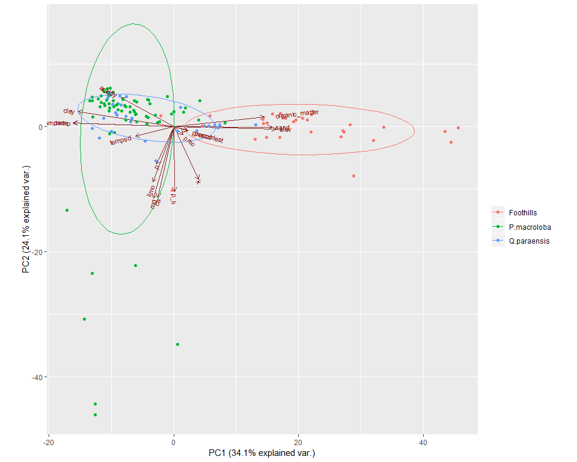
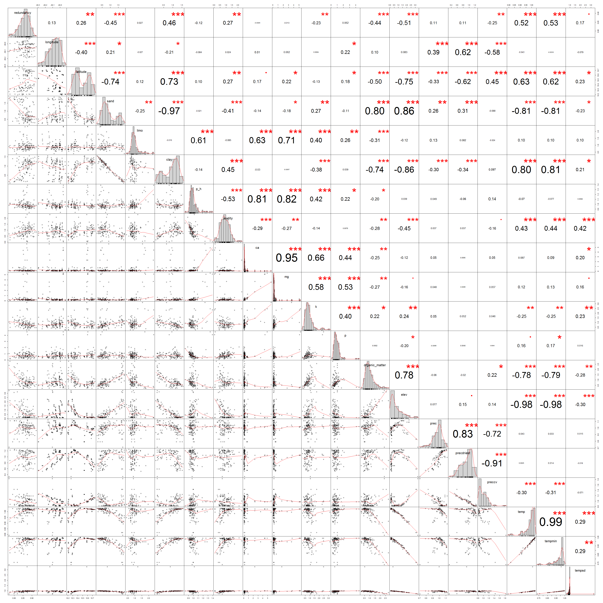

```r
#Paquetes
library(kableExtra)
library(lattice)
library(tidyverse)
library(PerformanceAnalytics)
library(janitor)
source("C:/tesis_catie/Calderon_CATIE/scripts/functions/HighstatLibV10.R")
library(ggbiplot)
library(GGally)
library(INLA)
```


#Objetivo 
Realizar un modelo linear multiple con dependencia espacial para los datos de Redundancia funcional efecto
Ref: Capitulo 12 Zuur et al.


```r
#Load data
dredun_eff <- read.csv("C:/tesis_catie/Calderon_CATIE/data/resultados_csv/data_indices_eff_redundancy.csv", header=T)
dredun_eff <- clean_names(dredun_eff) %>% 
  dplyr::select(-c(d))

dparcelas <- read.csv("C:/tesis_catie/Calderon_CATIE/data/clean/data_posicion_parcelas.csv", header = T)
dparcelas <- clean_names(dparcelas)

denv <- read.csv("C:/tesis_catie/Calderon_CATIE/data/clean/data_enviroment_worldclim_clean.csv", header = T, row.names = 1)
denv <- denv %>%
  clean_names() %>% 
    dplyr::select(-c(crtm_90_x,crtm_90_y,forest_type, slope_per,slope_deg))

#Standarize data
denvi_est <-  scale(denv,center = F, scale = T )
denvi_est <- rownames_to_column(as.data.frame(denvi_est),var= "plot")
```

#Join Data sets


```r
dfull  <- left_join(dredun_eff, dparcelas,by=c("plot") ) %>% 
  left_join(.,denvi_est, by=c("plot") )
```

```
## Warning: Column `plot` joining factor and character vector, coercing into
## character vector
```

```r
#Ordenar columnas
dfull_est <- dfull %>% dplyr::select(plot, forest_type,longitude,latitude,crtm_90_x,crtm_90_y,n,redundancy,u , q, everything()) 
glimpse(dfull_est)
```

```
## Observations: 127
## Variables: 27
## $ plot           <chr> "F10P1", "F10P2", "F10P3", "F10P4", "F11P1", "F...
## $ forest_type    <fct> P.macroloba, P.macroloba, P.macroloba, P.macrol...
## $ longitude      <dbl> -84.13907, -84.14223, -84.14690, -84.14741, -84...
## $ latitude       <dbl> 10.58515, 10.58890, 10.58497, 10.58649, 10.7037...
## $ crtm_90_x      <dbl> 484782.4, 484435.9, 483925.3, 483869.0, 479984....
## $ crtm_90_y      <dbl> 1170464, 1170880, 1170445, 1170614, 1183586, 11...
## $ n              <int> 12, 19, 13, 15, 21, 20, 17, 15, 13, 16, 15, 16,...
## $ redundancy     <dbl> 0.8725523, 0.8979476, 0.8711145, 0.8523120, 0.8...
## $ u              <dbl> 0.12744773, 0.10205244, 0.12888546, 0.14768803,...
## $ q              <dbl> 0.10335379, 0.09021181, 0.09405633, 0.09045544,...
## $ sand           <dbl> 0.8160510, 0.6767592, 0.9087578, 0.5842842, 0.5...
## $ limo           <dbl> 1.2102600, 1.0981989, 1.5458830, 1.6579441, 0.7...
## $ clay           <dbl> 0.8581029, 1.0172463, 0.6594220, 0.8978391, 1.2...
## $ p_h            <dbl> 1.0214836, 0.9562825, 1.2388205, 1.2822879, 0.9...
## $ acidity        <dbl> 2.31038300, 1.08199755, 0.07001161, 0.49962828,...
## $ ca             <dbl> 2.32213037, 0.32208520, 5.72480464, 3.53774225,...
## $ mg             <dbl> 1.7259923, 0.4432876, 3.5651645, 2.7257474, 0.2...
## $ k              <dbl> 2.4588529, 0.6705962, 3.1294491, 1.1176604, 0.5...
## $ p              <dbl> 0.6014830, 0.9623727, 0.5413347, 0.3909639, 0.9...
## $ organic_matter <dbl> 0.5100446, 0.7900463, 0.5344431, 0.2207482, 0.7...
## $ elev           <dbl> 0.3662337, 0.6278292, 0.5149301, 0.6058001, 0.1...
## $ prec           <dbl> 0.9986238, 1.0735019, 1.0435506, 1.0203384, 0.9...
## $ precdriest     <dbl> 0.9154796, 1.0164516, 0.9760628, 0.9760628, 0.5...
## $ preccv         <dbl> 1.0069702, 0.9764559, 1.0069702, 1.0069702, 1.1...
## $ temp           <dbl> 1.0078616, 0.9919898, 0.9959578, 0.9999257, 1.0...
## $ tempmin        <dbl> 1.0075683, 0.9923789, 0.9974420, 0.9974420, 1.0...
## $ tempsd         <dbl> 3.2815711, 0.9528710, 0.9577326, 0.9577326, 0.9...
```

#Data exploration
##PCA sin variables de respuesta


```r
ncol(denvi_est)
```

```
## [1] 18
```

```r
pca_envi <- prcomp(denvi_est[,2:18], scale. = TRUE)
ggbiplot(pca_envi, obs.scale = 3, var.scale = 3,
  groups = dfull_est$forest_type, ellipse = TRUE) +
  scale_color_discrete(name = '') +
  theme(legend.direction = 'horizontal', legend.position = 'top')+
  theme_grey()
```

<!-- -->


##Correlaciones Redundancy vrs Environment


```r
chart.Correlation(dfull_est[,c(8,3,4, 11:27)], histogram=TRUE, pch="+") 
```

<!-- -->

##VIFs

```r
corvif(dfull_est[,c(3,4,11:27)])
```

```
## 
## 
## Variance inflation factors
## 
##                        GVIF
## longitude      3.003471e+00
## latitude       1.730260e+01
## sand           2.809900e+07
## limo           1.915980e+06
## clay           2.641092e+07
## p_h            6.828257e+00
## acidity        3.075751e+00
## ca             1.956259e+01
## mg             2.402243e+01
## k              3.826313e+00
## p              2.402285e+00
## organic_matter 6.139815e+00
## elev           1.663644e+02
## prec           8.514604e+00
## precdriest     2.724207e+01
## preccv         1.958862e+01
## temp           1.164389e+02
## tempmin        1.680260e+02
## tempsd         1.662627e+00
```

##Covariables que se van a eliminar 


+ __tempsd__. Debido a que no tiene relacion con redundancy
+ __mg__. Debido a que no tiene relacion con redundancy
+ __ca__. Debido a que no tiene relacion con redundancy
+ __p__. Debido a que no tiene relacion con redundancy
+ __elev__. Debido a que tiene alto VIF, alta correlacion con Latitude y en el pca tiene la misma direccion que organic matter y sand 
+ __sand__. Debido a que tiene alto VIF  y en el pca tiene la misma direccion que organic matter.
+ __prec__. alta correlacion con predriest y en el pca tiene la misma direccion que prec.
+ __preccv__. Alta correlacion con predriest, en el pca tiene la misma direccion que prec y tiene poca relacion con redundancia.
+ __limo__. Tiene poca relacion con redundancia.
+ __pH__. Tiene poca relacion con redundancia.


####Data que se va a utilizar

```r
dredundancy_eff <- dfull_est %>% 
  dplyr::select(-c(tempsd, mg, ca, p, elev, sand, prec, preccv, tempmin, limo, p_h, u,q ))
```

###VIFs sin variables eliminadas 

```r
ncol(dredundancy_eff)
```

```
## [1] 14
```

```r
corvif(dredundancy_eff[,c(3,4,7:12)])
```

```
## 
## 
## Variance inflation factors
## 
##                    GVIF
## longitude      1.353303
## latitude       2.678600
## n              1.140763
## redundancy     1.407724
## clay           5.229203
## acidity        1.364315
## k              1.350685
## organic_matter 2.379280
```

##Cleveland plot


```r
Mydotplot(dredundancy_eff[, 8:12])
```

<!-- -->

# Modelo lineal sin componente espacial    

##Model Formulation
$$redundancia \sim N(\mu_i, \sigma^2)$$

$$E(redundancia)=\mu_i ,var(redundancia)=\sigma^2$$

$$\mu_i= \beta_1*foresttype+\beta_2*long+\beta_3*lat+\beta_4*clay+\beta_5*acidity$$  $$+\beta_6*k+\beta_7*organicmatter+\beta_8*precdriest+\beta_9*temp  $$

  

##Codigo INLA para modelo lineal sin componente espacial


```r
library(INLA)

#Modelo 1
m1 <- inla(redundancy ~  forest_type + clay + acidity +
                         k + organic_matter +
                         precdriest + temp,  
                         
                         
             #Interacciones
             #           forest_type:clay + forest_type:acidity +
             #           forest_type:k +
             #           forest_type:organic_matter +
             #           forest_type:organic_matter + 
             #           forest_type:precdriest +
             #           forest_type:temp,  
             
           family = "gaussian",
           control.predictor = list(compute= TRUE),
           control.compute = list(dic = TRUE, 
                                  waic = TRUE),
           data = dredundancy_eff)
           
           
m2 <- inla(redundancy ~  forest_type + clay + acidity +
                         k + organic_matter +
                         precdriest + temp +             
             #Interacciones de bosque
                        forest_type:clay + 
                        forest_type:acidity +
                        forest_type:k +
                        forest_type:organic_matter +
                        forest_type:precdriest +
                        forest_type:temp,  
             
           family = "gaussian",
           control.predictor = list(compute= TRUE),
           control.compute = list(dic = TRUE, 
                                  waic = TRUE),
           data = dredundancy_eff
                      
)


m3 <- inla(redundancy ~  forest_type + clay + acidity +
                         k + organic_matter +
                         precdriest + temp +             
             #Interacciones de bosque
                        forest_type:clay + 
                        forest_type:acidity +
                        forest_type:k +
                        forest_type:organic_matter +
                        forest_type:precdriest +
                        forest_type:temp +
             
             #Interacciones clay
                        clay:acidity+
                        clay:k +
                        clay:organic_matter +
                        clay: precdriest +
                        clay: temp, 
                        
             
           family = "gaussian",
           control.predictor = list(compute= TRUE),
           control.compute = list(dic = TRUE, 
                                  waic = TRUE),
           data = dredundancy_eff
                      
)


m4 <- inla(redundancy ~  forest_type + clay + acidity +
                         k + organic_matter +
                         precdriest + temp +             
             #Interacciones de bosque
                        forest_type:clay + 
                        forest_type:acidity +
                        forest_type:k +
                        forest_type:organic_matter +
                        forest_type:precdriest +
                        forest_type:temp +
             
             #Interacciones clay
                        clay:acidity+
                        clay:k +
                        clay:organic_matter +
                        clay: precdriest +
                        clay: temp + 
                        
             #Interacciones acidity
                        acidity:k +
                        acidity:organic_matter +
                        acidity: precdriest +
                        acidity: temp,
             
           family = "gaussian",
           control.predictor = list(compute= TRUE),
           control.compute = list(dic = TRUE, 
                                  waic = TRUE),
           data = dredundancy_eff
                      
)

m5 <- inla(redundancy ~  forest_type + clay + acidity +
                         k + organic_matter +
                         precdriest + temp +             
             #Interacciones de bosque
                        forest_type:clay + 
                        forest_type:acidity +
                        forest_type:k +
                        forest_type:organic_matter +
                        forest_type:precdriest +
                        forest_type:temp +
             
             #Interacciones clay
                        clay:acidity+
                        clay:k +
                        clay:organic_matter +
                        clay: precdriest +
                        clay: temp + 
                        
             #Interacciones acidity
                        acidity:k +
                        acidity:organic_matter +
                        acidity: precdriest +
                        acidity: temp +

            #Interacciones k
                        k:organic_matter +
                        k: precdriest +
                        k: temp,

                        
           family = "gaussian",
           control.predictor = list(compute= TRUE),
           control.compute = list(dic = TRUE, 
                                  waic = TRUE),
           data = dredundancy_eff
                      
)


m6 <- inla(redundancy ~  forest_type + clay + acidity +
                         k + organic_matter +
                         precdriest + temp +             
             #Interacciones de bosque
                        forest_type:clay + 
                        forest_type:acidity +
                        forest_type:k +
                        forest_type:organic_matter +
                        forest_type:precdriest +
                        forest_type:temp +
             
             #Interacciones clay
                        clay:acidity+
                        clay:k +
                        clay:organic_matter +
                        clay: precdriest +
                        clay: temp + 
                        
             #Interacciones acidity
                        acidity:k +
                        acidity:organic_matter +
                        acidity: precdriest +
                        acidity: temp +

            #Interacciones k
                        k:organic_matter +
                        k: precdriest +
                        k: temp +
             
             #Interacciones organic_matter
                        organic_matter: precdriest +
                        organic_matter: temp,

           

                        
           family = "gaussian",
           control.predictor = list(compute= TRUE),
           control.compute = list(dic = TRUE, 
                                  waic = TRUE),
           data = dredundancy_eff
                      
)


m7 <- inla(redundancy ~  forest_type + clay + acidity +
                         k + organic_matter +
                         precdriest + temp +             
             #Interacciones de bosque
                        forest_type:clay + 
                        forest_type:acidity +
                        forest_type:k +
                        forest_type:organic_matter +
                        forest_type:precdriest +
                        forest_type:temp +
             
             #Interacciones clay
                        clay:acidity+
                        clay:k +
                        clay:organic_matter +
                        clay: precdriest +
                        clay: temp + 
                        
             #Interacciones acidity
                        acidity:k +
                        acidity:organic_matter +
                        acidity: precdriest +
                        acidity: temp +

            #Interacciones k
                        k:organic_matter +
                        k: precdriest +
                        k: temp +
             
             #Interacciones organic_matter
                        organic_matter: precdriest +
                        organic_matter: temp +
              
             #Interacciones precdriest
                        temp: precdriest,
           
           family = "gaussian",
           control.predictor = list(compute= TRUE),
           control.compute = list(dic = TRUE, 
                                  waic = TRUE),
           data = dredundancy_eff
                      
)
```

##Compare models


```r
m_dic  <- c(m1$dic$dic, m2$dic$dic,  m3$dic$dic, m4$dic$dic, m5$dic$dic, m6$dic$dic,m7$dic$dic)
m_waic <- c(m1$waic$waic, m2$waic$waic, m3$waic$waic, m4$waic$waic,m5$waic$waic, m6$waic$waic,m7$waic$waic)
Z.out     <- cbind(m_dic, m_waic)
rownames(Z.out) <- c("Gaussian lm",  
                     "Gaussian lm + interacciones por bosque",
                     "Gaussian lm + interacciones por bosque, clay",
                     "Gaussian lm + interacciones por bosque, clay, acidity",
                     "Gaussian lm + interacciones por bosque, clay, acidity, k",
                     "Gaussian lm + interacciones por bosque, clay, acidity, k, organic matter",
                     "Gaussian lm + interacciones por bosque, clay, acidity, k, organic matter, precdriest"
                     )
Z.out
```

```
##                                                                                          m_dic
## Gaussian lm                                                                          -550.6347
## Gaussian lm + interacciones por bosque                                               -543.3182
## Gaussian lm + interacciones por bosque, clay                                         -543.6661
## Gaussian lm + interacciones por bosque, clay, acidity                                -535.0956
## Gaussian lm + interacciones por bosque, clay, acidity, k                             -531.7410
## Gaussian lm + interacciones por bosque, clay, acidity, k, organic matter             -533.0274
## Gaussian lm + interacciones por bosque, clay, acidity, k, organic matter, precdriest -534.2235
##                                                                                         m_waic
## Gaussian lm                                                                          -549.7811
## Gaussian lm + interacciones por bosque                                               -540.6988
## Gaussian lm + interacciones por bosque, clay                                         -540.3982
## Gaussian lm + interacciones por bosque, clay, acidity                                -532.6456
## Gaussian lm + interacciones por bosque, clay, acidity, k                             -528.6813
## Gaussian lm + interacciones por bosque, clay, acidity, k, organic matter             -531.3887
## Gaussian lm + interacciones por bosque, clay, acidity, k, organic matter, precdriest -533.0913
```


```r
m_dic  <- c(m1$dic$dic, m3$dic$dic)
m_waic <- c(m1$waic$waic, m3$waic$waic)
Z.out     <- cbind(m_dic, m_waic)
rownames(Z.out) <- c("Gaussian lm",  
                     "Gaussian lm + interacciones por bosque"
                     )
Z.out
```

```
##                                            m_dic    m_waic
## Gaussian lm                            -550.6347 -549.7811
## Gaussian lm + interacciones por bosque -543.6661 -540.3982
```


```r
beta1 <- m1$summary.fixed[, c("mean", "sd", "0.025quant", "0.975quant")] 
kable(beta1,digits = 3) %>% 
  kable_styling(bootstrap_options = c("striped", "hover", "condensed"),full_width = F)
```

<table class="table table-striped table-hover table-condensed" style="width: auto !important; margin-left: auto; margin-right: auto;">
 <thead>
  <tr>
   <th style="text-align:left;">   </th>
   <th style="text-align:right;"> mean </th>
   <th style="text-align:right;"> sd </th>
   <th style="text-align:right;"> 0.025quant </th>
   <th style="text-align:right;"> 0.975quant </th>
  </tr>
 </thead>
<tbody>
  <tr>
   <td style="text-align:left;"> (Intercept) </td>
   <td style="text-align:right;"> 0.693 </td>
   <td style="text-align:right;"> 0.115 </td>
   <td style="text-align:right;"> 0.467 </td>
   <td style="text-align:right;"> 0.919 </td>
  </tr>
  <tr>
   <td style="text-align:left;"> forest_typeP.macroloba </td>
   <td style="text-align:right;"> 0.025 </td>
   <td style="text-align:right;"> 0.011 </td>
   <td style="text-align:right;"> 0.004 </td>
   <td style="text-align:right;"> 0.046 </td>
  </tr>
  <tr>
   <td style="text-align:left;"> forest_typeQ.paraensis </td>
   <td style="text-align:right;"> 0.015 </td>
   <td style="text-align:right;"> 0.011 </td>
   <td style="text-align:right;"> -0.006 </td>
   <td style="text-align:right;"> 0.036 </td>
  </tr>
  <tr>
   <td style="text-align:left;"> clay </td>
   <td style="text-align:right;"> -0.001 </td>
   <td style="text-align:right;"> 0.017 </td>
   <td style="text-align:right;"> -0.035 </td>
   <td style="text-align:right;"> 0.032 </td>
  </tr>
  <tr>
   <td style="text-align:left;"> acidity </td>
   <td style="text-align:right;"> 0.003 </td>
   <td style="text-align:right;"> 0.007 </td>
   <td style="text-align:right;"> -0.011 </td>
   <td style="text-align:right;"> 0.018 </td>
  </tr>
  <tr>
   <td style="text-align:left;"> k </td>
   <td style="text-align:right;"> -0.008 </td>
   <td style="text-align:right;"> 0.006 </td>
   <td style="text-align:right;"> -0.020 </td>
   <td style="text-align:right;"> 0.004 </td>
  </tr>
  <tr>
   <td style="text-align:left;"> organic_matter </td>
   <td style="text-align:right;"> -0.004 </td>
   <td style="text-align:right;"> 0.009 </td>
   <td style="text-align:right;"> -0.021 </td>
   <td style="text-align:right;"> 0.014 </td>
  </tr>
  <tr>
   <td style="text-align:left;"> precdriest </td>
   <td style="text-align:right;"> 0.016 </td>
   <td style="text-align:right;"> 0.016 </td>
   <td style="text-align:right;"> -0.015 </td>
   <td style="text-align:right;"> 0.047 </td>
  </tr>
  <tr>
   <td style="text-align:left;"> temp </td>
   <td style="text-align:right;"> 0.145 </td>
   <td style="text-align:right;"> 0.124 </td>
   <td style="text-align:right;"> -0.099 </td>
   <td style="text-align:right;"> 0.389 </td>
  </tr>
</tbody>
</table>


##$\tau$


```r
tau <- m1$marginals.hyperpar$`Precision for the Gaussian observations`
```

###$\sigma$

```r
sigma <- inla.emarginal(function(x)(1/sqrt(x)), tau)
sigma
```

```
## [1] 0.02635153
```


##Model validation


```r
fit1 <- m1$summary.fitted.values[,"mean"]
e1 <- dredundancy_eff$redundancy - fit1
```

#Modelo lineal con componente espacial sin interacciones 

##Model Formulation
$$redundancia \sim N(\mu_i, \sigma^2)$$

$$E(redundancia)=\mu_i ,var(redundancia)=\sigma^2$$ 

$$\mu_i= \beta_1*foresttype+\beta_2*long+\beta_3*lat+\beta_4*clay+\beta_5*acidity$$  $$+\beta_6*k+\beta_7*organicmatter+\beta_8*precdriest+\beta_9*temp + \mu_i $$
$$\mu_i \sim GMRF(0, \Sigma)$$

$\mu_i$ es un random intercep el cual se asume que está correlacionado espacialmente con media 0 y con una matriz de covarianza $\Sigma$ 


##Defining the mesh 


```r
dredundancy_eff$crtm_90_x <- dredundancy_eff$crtm_90_x /1000

dredundancy_eff$crtm_90_y <- dredundancy_eff$crtm_90_y/1000

Loc <- cbind(dredundancy_eff$crtm_90_x, dredundancy_eff$crtm_90_y)
head(Loc)
```

```
##          [,1]     [,2]
## [1,] 484.7824 1170.464
## [2,] 484.4359 1170.880
## [3,] 483.9253 1170.445
## [4,] 483.8690 1170.614
## [5,] 479.9841 1183.586
## [6,] 480.0020 1183.473
```

```r
D <- dist(Loc)
hist(D, 
     freq = TRUE,
     main = "",
     ylab = "Frequency")
```

<!-- -->


```r
plot(x = sort(D), 
     y = (1:length(D))/length(D), 
     type = "l",
     xlab = "",
     ylab = "Cumulative proportion")
text(10, 1, "B", cex = 1.5)
```

<!-- -->


```r
##requiring necessary packages:
#library(sp)  # vector data
#library(rgeos)  # geometry ops
#library(sp) 
#library(raster)
#
## WGS84 -------------------------------------------------------------------
##Create spatial object:
#lonlat <- cbind(dredundancy_eff$longitude, dredundancy_eff$latitude)
##Create a SpatialPoints object:
#pts <- SpatialPoints(lonlat)
#crdref <- CRS('+proj=longlat +datum=WGS84')
#pts <- SpatialPoints(lonlat, proj4string=crdref)
#
## make spatial data frame
#ptsdf <- SpatialPointsDataFrame(pts,data = dredundancy_eff )
#
#dist <- pointDistance(pts, lonlat=TRUE)
#

# CRTM05 ------------------------------------------------------------------
#lonlat2 <- cbind(dprueba$crtm_90_x, dprueba$crtm_90_y)
##Create a SpatialPoints object:
#pts2 <- SpatialPoints(lonlat2)
#
## make spatial data frame
#ptsdf2 <- SpatialPointsDataFrame(pts2,data = dprueba )
#
#dist2 <- pointDistance(pts2, lonlat=FALSE)
#
#View(dist)
#View(dist2)
```


```r
#Coordenadas CRTM05
head(Loc)
```

```
##          [,1]     [,2]
## [1,] 484.7824 1170.464
## [2,] 484.4359 1170.880
## [3,] 483.9253 1170.445
## [4,] 483.8690 1170.614
## [5,] 479.9841 1183.586
## [6,] 480.0020 1183.473
```

```r
#mesh1 <- inla.mesh.2d(Loc,
#                      #The smaller the values, equal to more triangles 
#                      max.edge = c(1,1),
#                     cutoff = 0)

mesh2 <- inla.mesh.2d(Loc,
                      #The smaller the values, equal to more triangles 
                      max.edge = c(10,10),
                      cutoff = 0)

#mesh3 <- inla.mesh.2d(Loc,
#                      #The smaller the values, equal to more triangles 
#                      max.edge = c(50,50),
#                      cutoff = 0)

#mesh4 <- inla.mesh.2d(Loc,
#                      #The smaller the values, equal to more triangles 
#                      max.edge = c(75,75),
#                      cutoff = 0)
#mesh5 <- inla.mesh.2d(Loc,
#                      #The smaller the values, equal to more triangles 
#                      max.edge = c(25,50),
#                      cutoff = 0)
#
#mesh6 <- inla.mesh.2d(Loc,
#                      #The smaller the values, equal to more triangles 
#                      max.edge = c(50,80),
#                      cutoff = 0)
#
#mesh7 <- inla.mesh.2d(Loc,
#                      #The smaller the values, equal to more triangles 
#                      max.edge = c(100,120),
#                      cutoff = 0)
#
#mesh8 <- inla.mesh.2d(Loc,
#                      #The smaller the values, equal to more triangles 
#                      max.edge = c(100,100),
#                      cutoff = 0)
#
#mesh9 <- inla.mesh.2d(Loc,
#                      #The smaller the values, equal to more triangles 
#                      max.edge = c(150,150),
#                      cutoff = 0)

#El libro recomienda trabajar con una mesh de entre 700 a 800
mesh2$n
```

```
## [1] 722
```

```r
plot(mesh2, asp = 1);points(Loc, col = 2, pch = 16, cex = 1)
```

<!-- -->


```r
#Specify a boundary area so that all sampling locations are within this boundary area 
bound <- inla.nonconvex.hull(Loc)
mesh10 <- inla.mesh.2d(boundary = bound,
                       max.edge = 2,
                       cutoff = 0)

mesh10$n
```

```
## [1] 2035
```

```r
plot(mesh10, asp = 1);points(Loc, col = 2, pch = 16, cex = 1)
```

<!-- -->


```r
A2 <- inla.spde.make.A(mesh2, loc = Loc)
dim(A2)
```

```
## [1] 127 722
```

##Define the SPDE


```r
spde <- inla.spde2.matern(mesh2, alpha = 2)
```

##Define the spatial field

```r
w_index <- inla.spde.make.index(
  name = "w",
  n.spde = spde$n.spde,
  n.group = 1,
  n.repl = 1
)

str(w_index)
```

```
## List of 3
##  $ w      : int [1:722] 1 2 3 4 5 6 7 8 9 10 ...
##  $ w.group: int [1:722] 1 1 1 1 1 1 1 1 1 1 ...
##  $ w.repl : int [1:722] 1 1 1 1 1 1 1 1 1 1 ...
```

##Define the stack


###Covariates

```r
xm <- model.matrix(~ -1 + forest_type + clay + acidity +
                         k + organic_matter +
                         precdriest + temp, 
                   data = dredundancy_eff)

N <- nrow(dredundancy_eff)

colnames(xm)
```

```
## [1] "forest_typeFoothills"   "forest_typeP.macroloba"
## [3] "forest_typeQ.paraensis" "clay"                  
## [5] "acidity"                "k"                     
## [7] "organic_matter"         "precdriest"            
## [9] "temp"
```

```r
X <- data.frame(Foothills   =    xm[,1],
                P.macroloba =    xm[,2],
                Q.paraensis =    xm[,3],
                clay        =    xm[,4],
                acidity     =    xm[,5],
                k           =    xm[,6],
                organic_matter = xm[,7],
                precdriest  =    xm[,8],
                temp        =    xm[,9]
                
                
)
```

###Stack fit

```r
stackfit <- inla.stack(
  tag = "Fit",
  
  data = list(y = dredundancy_eff$redundancy),
  
  A = list(1,1, A2),
  
  effects = list(
    
  Intercept = rep(1,N),
    
  X = X,
    
  w = w_index))
```


##Define the formula for the spatial model


```r
#Modelo sin dependencia espacial
f2a <- y ~ -1 + Intercept +  Foothills + P.macroloba + Q.paraensis + clay + acidity +
                         k + organic_matter +
                         precdriest + temp
```


```r
#Modelo con dependencia espacial
f2b <- y ~ -1 + Intercept + Foothills + P.macroloba + Q.paraensis + clay + acidity +
                         k + organic_matter +
                         precdriest + temp + f(w, model = spde)
```

##Execute the spacial model

```r
#Modelo sin dependencia espacial
SM2a <- inla(f2a,
             family = "gaussian",
             
             data = inla.stack.data(stackfit),
             
             control.compute = list(
               dic = TRUE,
               waic = TRUE),
             
             control.predictor = list(
               A = inla.stack.A(stackfit)))
               
SM2b<- inla(f2b,
             family = "gaussian",
             
             data = inla.stack.data(stackfit),
             
             control.compute = list(
               dic = TRUE,
               waic = TRUE),
             
             control.predictor = list(
               A = inla.stack.A(stackfit)))
```

##Compare models


```r
dic  <- c(SM2a$dic$dic, SM2b$dic$dic)
waic <- c(SM2a$waic$waic, SM2b$waic$waic)
Z.out     <- cbind(dic, waic)
rownames(Z.out) <- c("Gaussian lm",  
                     "Gaussian lm + SPDE")
Z.out
```

```
##                          dic      waic
## Gaussian lm        -550.7945 -549.8584
## Gaussian lm + SPDE -574.1029 -570.9127
```

##Results

```r
#Modelo sin componente espacial
SM2a$summary.fixed[, c("mean", "0.025quant", "0.975quant")]
```

```
##                        mean   0.025quant   0.975quant
## Intercept       0.529724529 -30.51356719 31.547109435
## Foothills       0.163495833 -30.87935435 31.180439441
## P.macroloba     0.188072179 -30.85479202 31.205029794
## Q.paraensis     0.178175600 -30.86469204 31.195136653
## clay           -0.001177253  -0.03474417  0.032360054
## acidity         0.003339879  -0.01087443  0.017541643
## k              -0.007932445  -0.01969354  0.003818273
## organic_matter -0.003675487  -0.02138493  0.014018343
## precdriest      0.016222320  -0.01488599  0.047303194
## temp            0.145016654  -0.09912909  0.388947299
```

```r
#Modelo con componente espacial
SM2b$summary.fixed[, c("mean", "0.025quant", "0.975quant")]
```

```
##                        mean   0.025quant   0.975quant
## Intercept       0.541507513 -30.50187514 31.558982081
## Foothills       0.169818099 -30.87299367 31.186722719
## P.macroloba     0.188864735 -30.85396414 31.205786567
## Q.paraensis     0.182854327 -30.85997793 31.199779514
## clay            0.006609624  -0.02833917  0.041614080
## acidity        -0.001000564  -0.01518819  0.013174151
## k              -0.006564248  -0.01816735  0.005027812
## organic_matter -0.005286979  -0.02352283  0.012891911
## precdriest      0.030589201  -0.01398530  0.078644418
## temp            0.112414637  -0.17153002  0.394793181
```

##Hyperpameters

```r
spfi_w <- inla.spde2.result(inla = SM2b,
                            name = "w",
                            spde = spde,
                            do.transfer = TRUE)


kappa <- inla.emarginal(function(x) x,
                        spfi_w$marginals.kappa[[1]])
                        
sigmau <- inla.emarginal(function(x) sqrt(x),
                         spfi_w$marginals.variance.nominal[[1]])

r <- inla.emarginal(function(x) x, 
                    spfi_w$marginals.range.nominal[[1]])

#Posterior mean kappa
kappa
```

```
## [1] 0.6521868
```

```r
#Posterior mean sigma_mu
sigmau
```

```
## [1] 0.01643215
```

```r
#Posterior mean r
r
```

```
## [1] 6.973594
```

##Matérn correlation values

```r
#Show correlation structure
D     <- as.matrix(dist(mesh2$loc[,1:2]))
d.vec <- seq(0, max(D), length = 100)      
Cor.M <- (kappa * d.vec) * besselK(kappa * d.vec, 1) 
Cor.M[1] <- 1

plot(x = d.vec, 
     y = Cor.M, 
     pch = 16, 
     type = "l", 
     cex.lab = 1.5,
     xlab = "Distance (¿km?)", 
     ylab = "Correlation",
     xlim = c(0, 200))
```

<!-- -->

##Interpolation

```r
w_pm <- SM2b$summary.random$w$mean

w_proj <- inla.mesh.projector(mesh2)

w_pm100_100 <- inla.mesh.project(w_proj,w_pm)
```


```r
grid <- expand.grid(x = w_proj$x, 
                    y = w_proj$y)

grid$z <- as.vector(w_pm100_100) 

library(grid)   

head(grid)  
```

```
##          x        y  z
## 1 453.5633 1113.201 NA
## 2 454.2586 1113.201 NA
## 3 454.9539 1113.201 NA
## 4 455.6491 1113.201 NA
## 5 456.3444 1113.201 NA
## 6 457.0397 1113.201 NA
```

```r
levelplot(z ~ x * y,
          data = grid, 
          aspect = "iso",
          scales = list(draw = TRUE),
          xlab = list( cex = 1.5),
          ylab = list( cex = 1.5),
          main = list("Posterior mean spatial random field", cex = 1.5),
          panel=function(...){
            panel.levelplot(...)
            grid.points(x = dredundancy_eff$crtm_90_x, 
                        y = dredundancy_eff$crtm_90_y, 
                        pch = 1,
                        size = unit(0.5, "char"))}  )
```

<!-- -->

