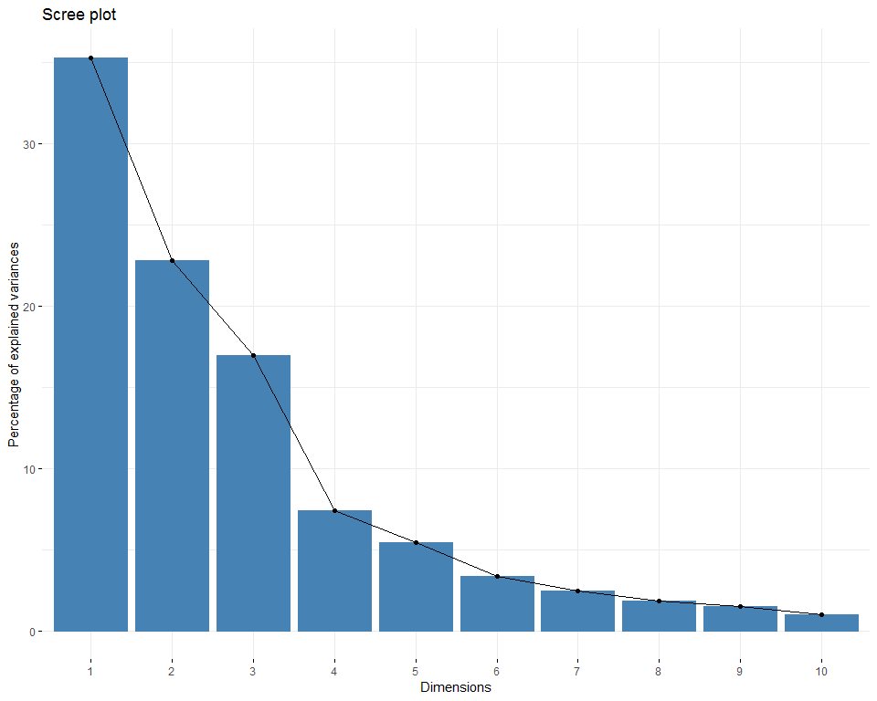
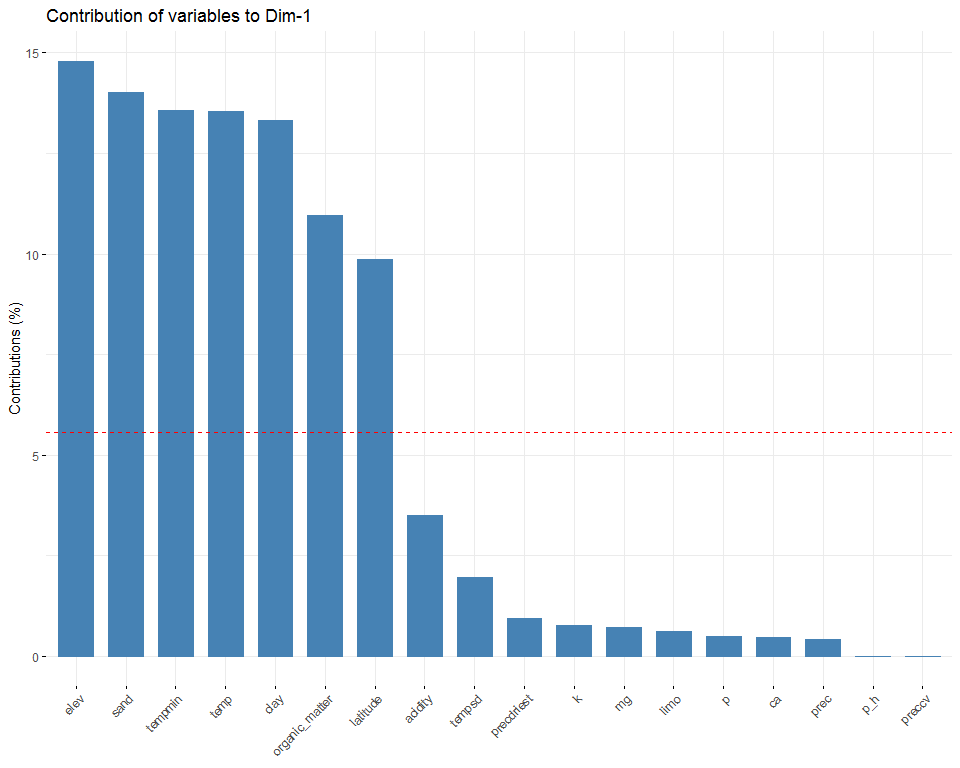
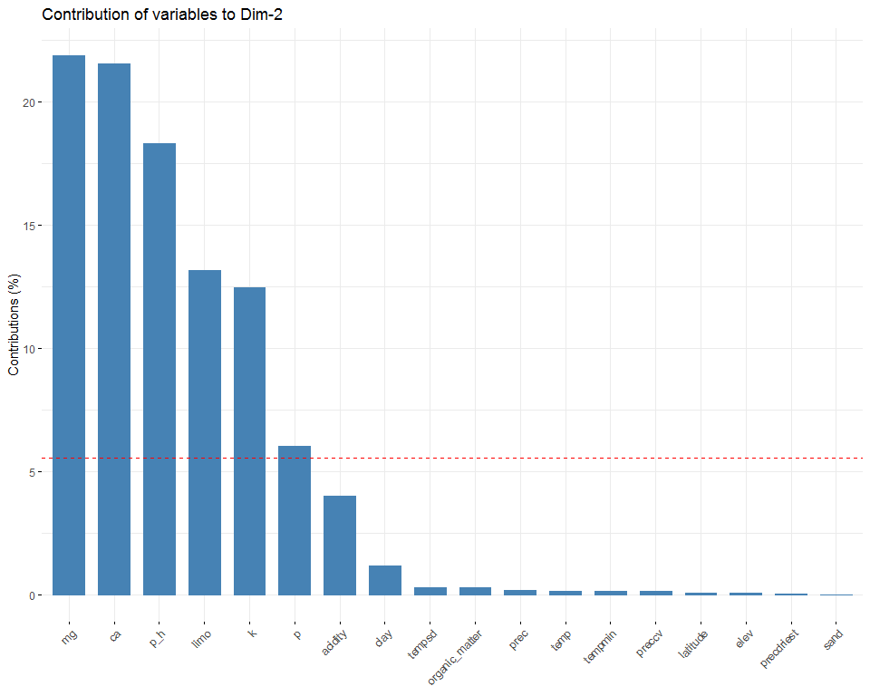
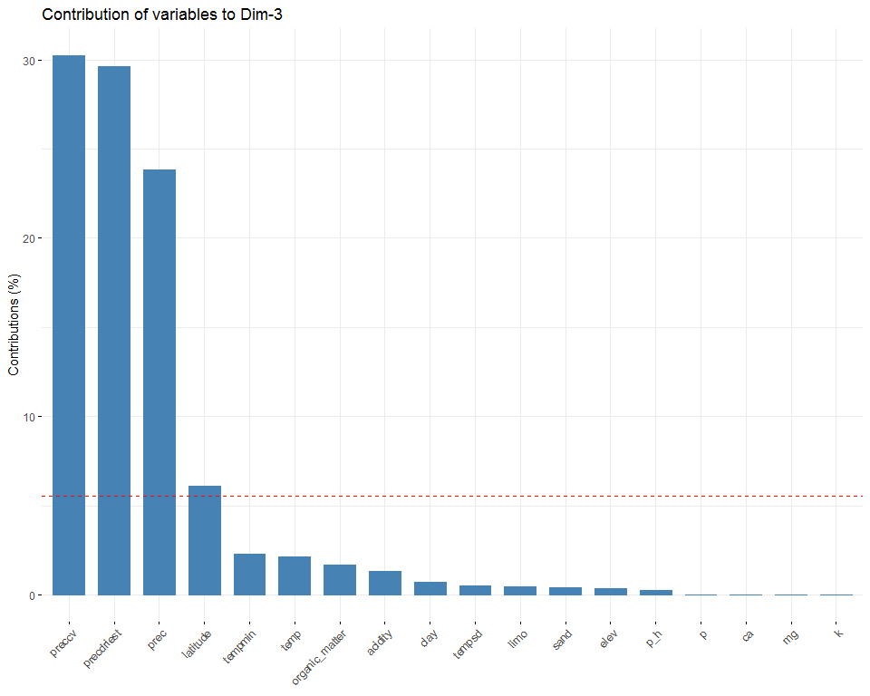
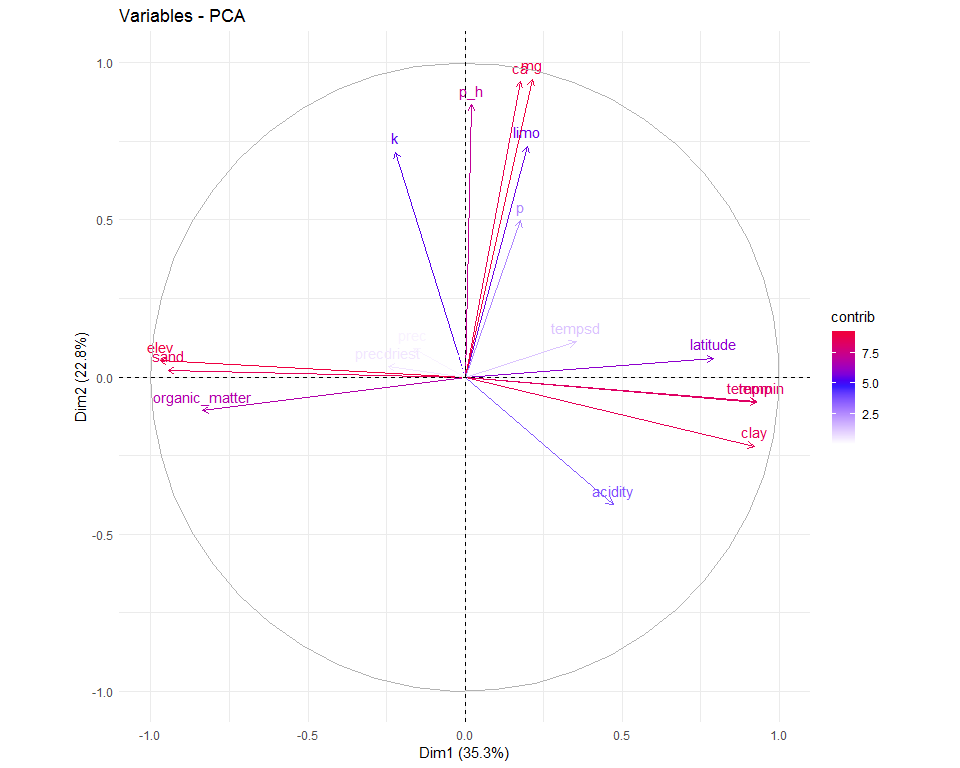
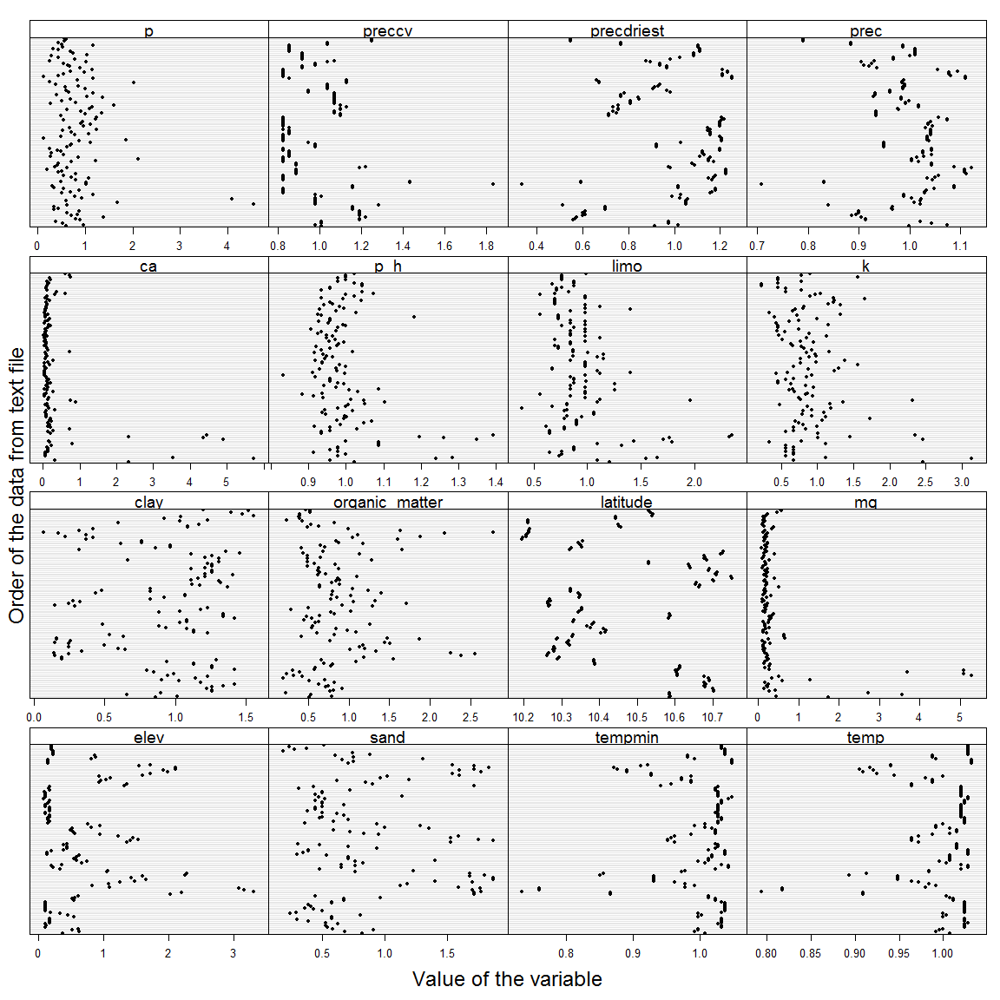

```r
#Paquetes
library(INLA)
library(GGally)
library(lattice)
library(janitor)
library(ggbiplot)
library(tidyverse)
library(FactoMineR)
library(factoextra)
library(kableExtra)
library(PerformanceAnalytics)
source("C:/tesis_catie/Calderon_CATIE/scripts/functions/HighstatLibV10.R")
```


#Load data

```r
#Load data
dredun_eff <- read.csv("C:/tesis_catie/Calderon_CATIE/data/resultados_csv/data_indices_eff_redundancy.csv", header=T)
dredun_eff <- clean_names(dredun_eff) %>% 
  dplyr::select(-c(d))

dparcelas <- read.csv("C:/tesis_catie/Calderon_CATIE/data/clean/data_posicion_parcelas.csv", header = T)
dparcelas <- clean_names(dparcelas)

denv <- read.csv("C:/tesis_catie/Calderon_CATIE/data/clean/data_enviroment_worldclim_clean.csv", header = T, row.names = 1)
denv <- denv %>%
  clean_names() %>% 
    dplyr::select(-c(crtm_90_x,crtm_90_y,forest_type, slope_per,slope_deg))
```


##Standarize data

```r
denvi_est <-  scale(denv,center = F, scale = T )
denvi_est <- rownames_to_column(as.data.frame(denvi_est),var= "plot")
```


##Join Data sets

```r
dfull  <- left_join(dredun_eff, dparcelas,by=c("plot") ) %>% 
  left_join(.,denvi_est, by=c("plot") )
```

```
## Warning: Column `plot` joining factor and character vector, coercing into
## character vector
```

```r
#Ordenar columnas
dfull_est <- dfull %>% dplyr::select(plot, forest_type,longitude,latitude,crtm_90_x,crtm_90_y,n,redundancy,u , q, everything()) 
glimpse(dfull_est)
```

```
## Observations: 127
## Variables: 28
## $ plot           <chr> "F10P1", "F10P2", "F10P3", "F10P4", "F11P1", "F...
## $ forest_type    <fct> P.macroloba, P.macroloba, P.macroloba, P.macrol...
## $ longitude      <dbl> -84.13907, -84.14223, -84.14690, -84.14741, -84...
## $ latitude       <dbl> 10.58515, 10.58890, 10.58497, 10.58649, 10.7037...
## $ crtm_90_x      <dbl> 484782.4, 484435.9, 483925.3, 483869.0, 479984....
## $ crtm_90_y      <dbl> 1170464, 1170880, 1170445, 1170614, 1183586, 11...
## $ n              <int> 12, 19, 13, 15, 21, 20, 17, 15, 13, 16, 15, 16,...
## $ redundancy     <dbl> 0.8725523, 0.8979476, 0.8711145, 0.8523120, 0.8...
## $ u              <dbl> 0.12744773, 0.10205244, 0.12888546, 0.14768803,...
## $ q              <dbl> 0.10335379, 0.09021181, 0.09405633, 0.09045544,...
## $ x              <int> 1, 2, 3, 4, 5, 6, 7, 8, 9, 10, 11, 12, 13, 14, ...
## $ sand           <dbl> 0.8160510, 0.6767592, 0.9087578, 0.5842842, 0.5...
## $ limo           <dbl> 1.2102600, 1.0981989, 1.5458830, 1.6579441, 0.7...
## $ clay           <dbl> 0.8581029, 1.0172463, 0.6594220, 0.8978391, 1.2...
## $ p_h            <dbl> 1.0214836, 0.9562825, 1.2388205, 1.2822879, 0.9...
## $ acidity        <dbl> 2.31038300, 1.08199755, 0.07001161, 0.49962828,...
## $ ca             <dbl> 2.32213037, 0.32208520, 5.72480464, 3.53774225,...
## $ mg             <dbl> 1.7259923, 0.4432876, 3.5651645, 2.7257474, 0.2...
## $ k              <dbl> 2.4588529, 0.6705962, 3.1294491, 1.1176604, 0.5...
## $ p              <dbl> 0.6014830, 0.9623727, 0.5413347, 0.3909639, 0.9...
## $ organic_matter <dbl> 0.5100446, 0.7900463, 0.5344431, 0.2207482, 0.7...
## $ elev           <dbl> 0.3662337, 0.6278292, 0.5149301, 0.6058001, 0.1...
## $ prec           <dbl> 0.9986238, 1.0735019, 1.0435506, 1.0203384, 0.9...
## $ precdriest     <dbl> 0.9154796, 1.0164516, 0.9760628, 0.9760628, 0.5...
## $ preccv         <dbl> 1.0069702, 0.9764559, 1.0069702, 1.0069702, 1.1...
## $ temp           <dbl> 1.0078616, 0.9919898, 0.9959578, 0.9999257, 1.0...
## $ tempmin        <dbl> 1.0075683, 0.9923789, 0.9974420, 0.9974420, 1.0...
## $ tempsd         <dbl> 3.2815711, 0.9528710, 0.9577326, 0.9577326, 0.9...
```


```r
#Data sets que se van a utilizar
dredundancy_eff <- dfull_est %>%
  dplyr::select(-u,-q)
  
duniqueness_eff <- dfull_est %>%
  dplyr::select(-redundancy,-q)

drao_eff <- dfull_est %>%
  dplyr::select(-u,-redundancy )
```


#PCA


```r
#Extraer PCs para analisis
pca<- dredundancy_eff %>% 
  dplyr::select(-c(n,x,redundancy, crtm_90_x, crtm_90_y, forest_type)) %>%
  column_to_rownames("plot") %>% 
  prcomp(., scale = T)

pc <- as.data.frame(pca$x[,1:3]) %>% 
  rownames_to_column("plot")

#Data con PCs
dredundancy_eff2 <- left_join(dredundancy_eff, pc ,by=c("plot")) %>% 
  dplyr::select(-x)

#Analsis de PCA con paquete FactoMineR
data_pca <- dredundancy_eff %>% 
  dplyr::select(-c(n,x,redundancy, crtm_90_x, crtm_90_y)) %>% 
  unite(plot,forest_type,plot) %>% 
  column_to_rownames("plot")

pca_envi2 <- PCA(data_pca[, 2:ncol(data_pca)], scale.unit = TRUE, graph = F)
fviz_screeplot(pca_envi2, ncp=10)
```

<!-- -->

Los 3 primeros componentes explican 75% de la variabilidad en los datos  


```r
fviz_contrib(pca_envi2, choice = "var", axes = 1)
```

<!-- -->


```r
fviz_contrib(pca_envi2, choice = "var", axes = 2)
```

<!-- -->


```r
fviz_contrib(pca_envi2, choice = "var", axes = 3)
```

<!-- -->

+ The cos2 values are used to estimate the quality of the representation
+ The closer a variable is to the circle of correlations, the better its representation on the factor map (and the more important     it is to interpret these components)
+ Variables that are closed to the center of the plot are less important for the first components.

This is helpful to highlight the most important variables in explaining the variations retained by the principal components.


```r
fviz_pca_var(pca_envi2, col.var="contrib") +
  scale_color_gradient2(low= "white", mid= "blue", high= "red", midpoint=5) + 
  theme_minimal()
```

<!-- -->


Dimension description

The function dimdesc()can be used to identify the most correlated variables with a given principal component.


```r
description <- dimdesc(pca_envi2, axes = c(1,2,3))
description$Dim.1
```

```
## $quanti
##                correlation      p.value
## tempmin          0.9287260 1.051479e-55
## temp             0.9285985 1.171051e-55
## clay             0.9206390 6.741143e-53
## latitude         0.7917149 1.575740e-28
## acidity          0.4719184 2.133432e-08
## tempsd           0.3529204 4.708723e-05
## mg               0.2147731 1.531658e-02
## limo             0.1992997 2.468019e-02
## p                0.1770417 4.645999e-02
## ca               0.1747269 4.944384e-02
## k               -0.2212147 1.244176e-02
## precdriest      -0.2452240 5.456508e-03
## organic_matter  -0.8346974 3.506452e-34
## sand            -0.9446172 2.454830e-62
## elev            -0.9699494 1.364262e-78
```

```r
description$Dim.2
```

```
## $quanti
##         correlation      p.value
## mg        0.9479649 5.530726e-64
## ca        0.9403892 2.136682e-60
## p_h       0.8668908 1.322728e-39
## limo      0.7348128 8.107679e-23
## k         0.7152647 3.493211e-21
## p         0.4976736 2.636525e-09
## clay     -0.2207542 1.263038e-02
## acidity  -0.4062273 2.151374e-06
```

```r
description$Dim.3
```

```
## $quanti
##                correlation      p.value
## precdriest       0.9509791 1.457850e-65
## prec             0.8531159 3.982701e-37
## tempmin          0.2649044 2.614498e-03
## temp             0.2562442 3.638788e-03
## acidity          0.1994147 2.459563e-02
## organic_matter  -0.2274650 1.011535e-02
## latitude        -0.4314982 4.087410e-07
## preccv          -0.9608378 1.590272e-71
```


The squared cosine shows the importance of a component for a given observation.


```r
#fviz_pca_ind(pca_envi2, col.ind="cos2") +
#scale_color_gradient2(low="white", mid="blue", 
#   high="red", midpoint=0.50) + theme_minimal()
#

fviz_contrib(pca_envi2, choice = "ind", axes = 1, xtickslab.rt = 90)
```


```r
fviz_pca_ind(pca_envi2, col.ind="contrib") +
scale_color_gradient2(low="white", mid="blue", 
                  high="red", midpoint=5) + theme_minimal()
```


```r
fviz_pca_ind(pca_envi2, col.ind="cos2") +
scale_color_gradient2(low="white", mid="blue", 
                  high="red", midpoint=.5) + theme_minimal()
```

##Outliers

```r
MyVar <- c("elev","sand", "tempmin", "temp","clay","organic_matter","latitude",  #PC1
            "mg","ca","p_h","limo","k","p",                                      #PC2
            "preccv","precdriest","prec")                                        #PC3
           
          
Mydotplot(dredundancy_eff[,MyVar])
```

<!-- -->


##Collinearity


```r
corvif(dredundancy_eff[,MyVar])
```

```
## 
## 
## Variance inflation factors
## 
##                        GVIF
## elev           1.286840e+02
## sand           2.798495e+07
## tempmin        1.624345e+02
## temp           9.631402e+01
## clay           2.630372e+07
## organic_matter 5.891239e+00
## latitude       1.703816e+01
## mg             2.218032e+01
## ca             1.811239e+01
## p_h            5.538253e+00
## limo           1.908230e+06
## k              3.285566e+00
## p              2.267636e+00
## preccv         1.782100e+01
## precdriest     2.595287e+01
## prec           8.090015e+00
```


```r
MyVar2 <- c("elev","organic_matter",                     #PC1
           "mg","p_h","limo","k","p",                    #PC2
           "preccv","prec")                              #PC3


corvif(dredundancy_eff[,MyVar2])
```

```
## 
## 
## Variance inflation factors
## 
##                    GVIF
## elev           3.737448
## organic_matter 4.030074
## mg             7.942881
## p_h            4.512475
## limo           2.214415
## k              2.058382
## p              2.043425
## preccv         2.549686
## prec           2.389215
```


```r
chart.Correlation(dfull_est[,c("redundancy", MyVar2)], histogram=TRUE, pch="+") 
```

<!-- -->


